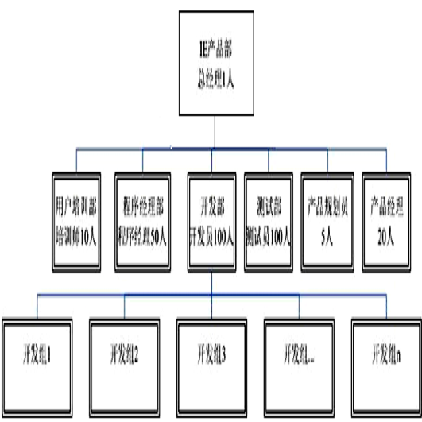
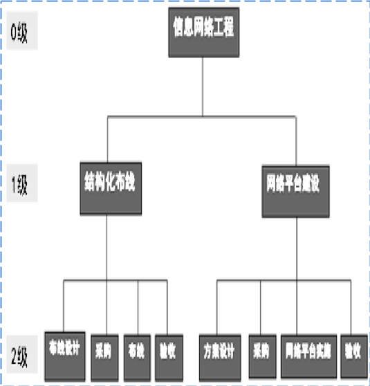
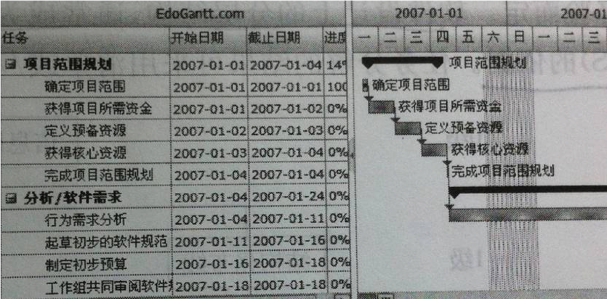
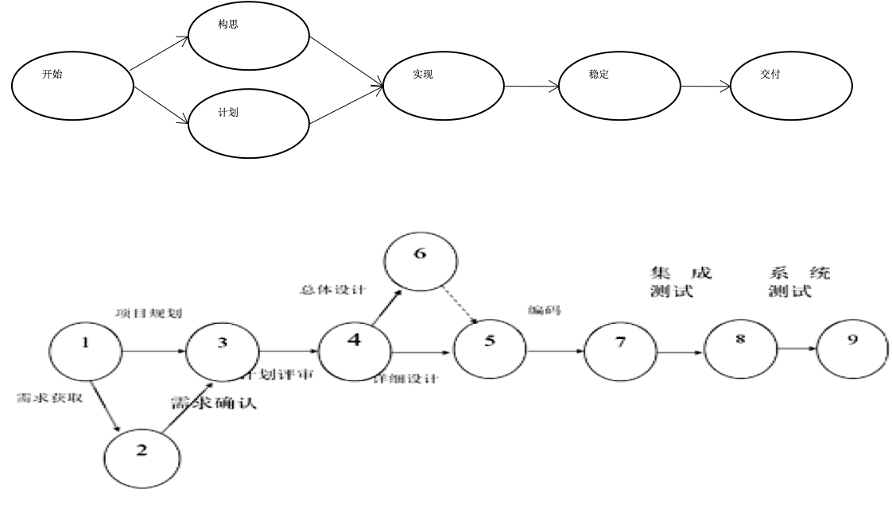
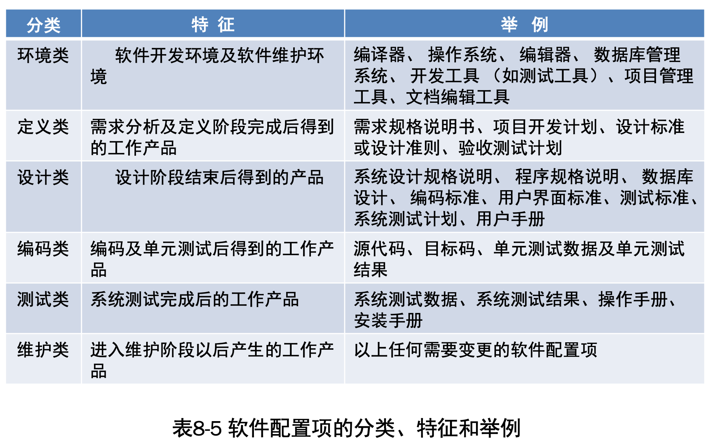
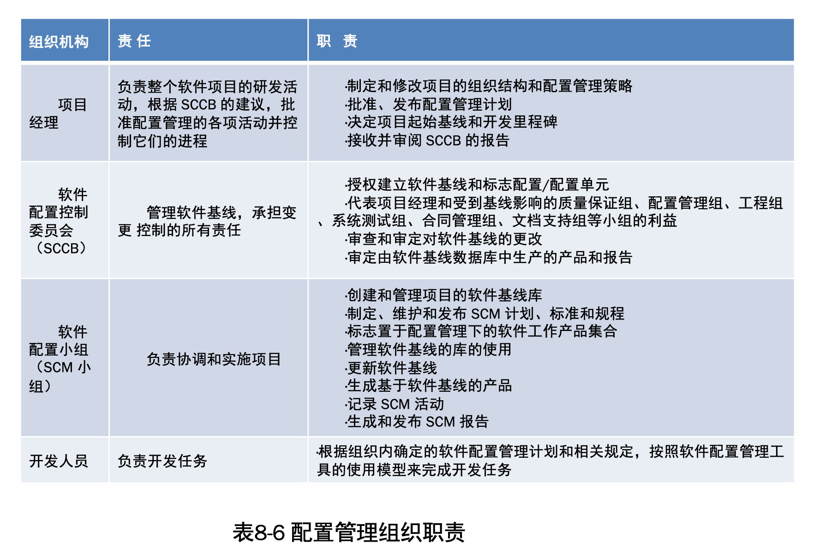

# 软件项目管理概述

## 一、软件项目管理概念及特点

### 1.1 软件项目管理的概念及目的

1. 软件项目管理是指对软件项目整个开发过程的管理，关系到工程项目的成败，对于保证软件产品的质量具有极为重要的作用。
2. 项目管理的目的是为了使软件项目能够按照预定的成本、进度、质量顺利完成，而对人员（People）、产品（ Product）、过程（Process）和项目(Project）进行分析和管理的活动。
3. 根本目的是使软件项目的整个生存周期都能在管理控制下，以预定成本按期按地的完成软件并交付使用。软件项目管理的主要职能包括以下5项：
   1. 制定计划
   2. 监理组织
   3. 配备人员
   4. 指导
   5. 检验

### 1.2 软件项目管理的主要特点

1. 智力密集不可见难度量
2. 独特产品单件生产
3. 开发复杂，自动化程度低
4. 人为因素影响大

## 二、软件项目管理过程及内容

### 2.1 软件项目管理的过程

在项目具体实施过程中，计划、执行和控制通常需要往复循环（称为核心循环），如图8-1项目管理过程及核心循环所示。 

### 2.2 软件项目管理的内容

项目管理的九大知识领域的内容，分布在项目的五大过程中，之间对应关系如表8-1所示。 

# 软件项目启动及组织

## 一、项目启动过程及任务

软件项目的启动过程是一个新项目决策立项与开始准备实施的过程。在项目启动前做好准备和实施方案至关重要。包括5个方面： 

1. 研发团队及项目干系人分析
2. 明确研发项目的目标
3. 清晰地项目范围
4. 确定项目资源需求
5. 制定项目实施计划

## 二、软件项目组织及管理

### 2.1 软件项目组织原则

组建软件项目研发团队应遵循的原则为：

1. 尽早落实责任
2. 分工明确、快捷高效
3. 职、责、权明确均衡

### 2.2 软件项目组织的模式

软件项目团队的组织有三种组织结构模式。

1. 按课题划分的模式
2. 按职能划分的模式
3. 矩阵形模式。结合前两种模式的优点，便形成了矩阵形模式

#### 【案例8-2】微软IE项目达300多人，组织机构如图8-2所示。

开发团队实行矩阵式交叉管理。纵向垂直管理与回报关系为：产品总经理→部门经理→小组长→组员。横向管理为产品特性项目组，每个项目组负责开发一个组件，有10-50人。大的项目组有时拆分成10人左右的子项目组。

主要成员：程序经理、开发工程师、测试工程师、培训师、界面设计师、Web开发工程师、可用性工程师 和产品特性项目组长等。 

             
### 3.3 软件开发组的组织形式

软件开发组的组织形式有3种。

1. 组长制小组
2. 民主制小组
3. 层次式小组

# 项目进度估算及安排

## 一、软件项目进度估算

### 1.1 软件规模与工作量估算

常用的软件规模度量单位有千行代码KLOC(Kilo-Lines Of Code)、功能点FP(Function Points)和对象点OP(Object Points）；常用的工作量度量单位有人年、人月和人日等。

- 软件规模估算
  - 千代码行（KLOC）估算法。
  - 功能点（FP）估算法。
- 工作量估算，常用的两个估算模型是：
  - CoCoMo模型
  - Putnam模型。
- 估算工具及其他方法
  - PERT估算法
  - 专家判定法
  - 经验公式法
  - 类比法

### 1.2 软件项目进度估算

主要的其他估算方式有：

1. 定额估算法
2. 经验公式法
3. PERT与CPM
             
## 二、软件项目进度安排

### 2.1 软件项目进度安排的内容

对于具体的进度安排与管理，主要包括以下几个方面。

1. 估算开发工期。对项目估计和预算可按下列步骤进行：
   1. 将待开发系统按阶段分割为若干基本活动如系统规划、  系统分析、系统设计、系统实施、系统测试、系统切换等，基本活动可再次分割为若干子活动，如系统规划可分割为调研收集、数据可行性研究、系统规划报告三项子活动。
   2. 分别估算各子活动的工期及费用预算（构造项目建设工期估计和预算分摊估计表）。
   3. 构造项目开发活动网络图通过该网络图计算得到项目的最早完成时间，即工期 。
2. 项目进度安排。

### 2.2 软件过程调整完善 

软件过程指软件研发和维护实施中的阶段、技术、方法、实践及相关产物(计划、文档、模型、代码、测试用例和手册等)的集合。过程定义了活动的时间、人员、工作内容和达到目标的路径。使用过程可增加成功机会，并能较好地预测项目结果。获得认可的元过程模型有统一过程模型RUP、敏捷过程模型等。

过程调整完善指对企业标准过程进行添加、删除和修改，使其更适于实现当前项目的目标。为了有效地使用企业制定的标准过程，需要提供一些调整完善指南，包括过程修改的条件、类型和允许的偏差。如果企业的标准过程调整指南规定某些文档是可选的，则项目经理就可在这些文档中选择适用的文档。过程调整是项目计划中首要任务，在计划评审时要特别予以重视。

### 2.3 任务分解落实

软件项目有开发任务、管理和过程改进任务，每项任务应分解给相关的项目组，再由项目组分解落实到人。任务分解既有质和量要求，又有进度和费用方面的约束；既可按功能划分，也可按流程划分，分解方法和标准依据软件过程、项目特点、项目团队约束和项目经理经验而定。软件设计上的分层结构，通常成为任务分解结构（Work Breakdown Structure，WBS）的依据。任务分解的结果可采用清单或/和图表的形式表达。

- 任务分解的结果对应一系列特定的活动，每项活动都有任务的具体目标、任务执行的人员组织、任务开始和结束时间。活动是这些元素逻辑上的统一体，有时也称活动为任务。设A、B为两种活动，则A、B 两种活动之间的关系有4种情况： 
  1. 开始→结束：表示A活动开始时，B活动结束；
  2. 开始→开始：表示A活动开始时，B活动也开始；
  3. 结束→结束：表示A活动结束时，B活动也结束；
  4. 结束→开始：表示A活动结束时，B活动开始。
- 其中，最后一种是最常见的逻辑关系，前面活动称为后面活动的前导活动，后面活动称为前面活动的后继活动。

### 2.4 安排计划的编排与优化 

为了科学地编排和清晰地表达任务安排计划，常采用下列方法。

#### 2.4.1 甘特图 

甘特图（Gantt Chart）又称横道图，如图8-4所示，是活动进度与日历表的对照图。用水平线段来表示活动的工作阶段，其中线段的长度表示完成任务所需要的时间，起点和终点分别表示任务的开始和结束时间。在甘特图中，任务的完成标准是交付相应文档和通过评审。甘特图清楚地表明了项目的计划进度，并能动态反映当前开发进展状况，其不足之处在于不能表达出各任务之间复杂的逻辑关系。 

       

#### 2.4.2 网络图 

网络图是用网络分析的方法编制的进度计划图。主要可以描述每个活动及其之间的逻辑关系。计划评审技术 PERT 和关键路径法 CPM 都采用网络图表示项目的活动。网络图有多种表示法，常用的有单代号法（优先图法，Precedence Diagram Method，PDM）和双代号法（箭线图法，Arrow Diagram Method，ADM）。单代号法用节点表示活动，用箭线指向表示活动先后逻辑关系（如图8-5）。双代号法用箭线表示活动，用箭线前后节点指向活动的前导活动和后继活动（如图8-6）。不同的表示法只是表示形式不同，实质并无大的差别。    

网络图常用术语包括：

1. 路径与关键路径。在网络图中，从始点开始，按照各活动顺序，连续不断地到达终点的一条通路称为路径。需要时间最长的路径称为关键路径。
2. 关键活动。关键路径上的活动称为关键活动。编制网络计划的基本思想就是在一个庞大的网络图中找出关键路径。对各关键活动，优先安排资源，挖掘潜力，采取相应措施，尽量压缩需要的时间；而对非关键路径上的各个活动，只要在不影响项目完工时间的条件下，抽出适当的人力、物力等资源，用在关键活动上，以达到缩短项目开发时间，合理利用资源等目的。
3. 活动持续时间。确定活动时间有两种方法：
   1. 一是“一点时间估计法”，即确定一个时间值作为完成活动需要的时间；
   2. 二是“三点时间估计法”，在未知的和难以估计的因素较多的条件下，对活动估计三种时间：乐观时间、最可能时间、悲观时间，并按公式计算活动时间：  T=（a＋4m＋b）/6 
4. 最早/晚开始时间与结束时间。
5. 活动的最早结束时间=活动最早开始时间+活动持续时间
6. 活动的最早开始时间=所有前导活动最早结束时间中最晚一个

# 软件项目管理的实施

软件项目管理的实施主要是指对软件项目管理主体内容的具体执行过程。为了完成软件项目计划，需要进行认真执行落实与实施。在项目实施中的关键是对软件项目的过程管理，主要包括软件项目的需求管理、质量管理、配置管理和风险管理等。

## 一、软件项目配置管理 

软件配置管理(SCM)是对产品进行标志、存储和控制，以维护其完整性、可追溯性及正确性而为软件开发提供的一套管理办法和活动原则。

### 1.1 软件配置项

是指软件配置管理的对象。表8-5 列出了一些可以作为软件项目配置的配置项。

### 1.2 基线

- 软件开发过程中，需求分析、设计、 测试都应在完成时建立线，由基线定义可将软件开发中所有需加以控制的配置项分为基线配置项和非基线配置项两类。
- 常用的三种基线是：功能基线、分配基线和产品基线。
- 功能基线指在软件需求分析和定义阶段结束时，经正式评审且批准的软件设计规格说明中对被开发软件的规格说明；经项目委托和承办单位签字同意的协议书或合同中，所规定的对被开发软件的规格说明；由下级申请经上级同意或直接由上级下达的项目任务书中，所规定的软件规格说明。分配基线是指在软件需求分析阶段结束时，经正式评审和批准的软件需求规格说明。产品基线是指在软件组装与系统测试阶段结束时，经正式评审和批准的有关所开发软件的全部配置项的规格说明。 

### 1.3 配置管理机构

- 配置管理的基本过程为：配置管理计划、配置项标志及跟踪、配置管理环境的建立、基线变更管理和配置状态统计等。通常，配置管理至少要包括配置管理计划、配置项标志、配置项控制、状态状况报告和配置项审核5项活动。
- 配置管理组织一般包括：项目经理、软件配置控制委员会、软件配置小组和开发人员等。各组织机构的职责如表8-6所示：

配置管理的工具分为3个级别：

1. 第一个级别为入门级工具：仅有版本控制功能。
2. 第二个级别为项目级配置管理工具：在版本管理的基础上增加变更控制、状态统计的功能。
3. 第三个级别为企业级配置管理工具：在项目级配置管理的基础上又增加了过程管理功能。

## 二、软件项目的风险管理 

软件项目的风险管理是指对软件项目可能出现的风险，进行识别、评估、预防、监控的过程。其目的是通过风险识别、风险分析和风险评价认识项目的风险，并在此基础上利用各种措施、管理方法、技术和手段对其风险进行有效的处理与控制，及时解决风险事件及后果，以最小的成本保证项目总体目标的实现。风险管理是按照风险计划对项目进行全过程的管理。       

# 软件项目监控与收尾

## 一、软件项目监控过程

- 项目监控是对项目实施情况进行跟踪、度量、检查评审并与目标对比和调控的过程。
- 软件项目监控过程 ：
- 在项目执行过程通常通过设置偏差的警戒线和底线的方法来控制项目，警戒线和底线以时间和阶段成果为标志。到达警戒线后应该执行应急措施，警戒线以上应该设置必要的解决或缓解问题的活动。底线本身是一种预测，预测可能的拖延时间。建立偏差的准则要因项目而异，对于风险高、有很大不确定性的项目，接受偏差的准则应高些。

## 二、软件项目监控内容及方法 

软件项目监控包括：范围监控、进度监控、成本监控、质量监控和风险监控等。

## 三、软件项目评审 

对软件项目进行评审是项目监控的一个主要的手段。通过项目阶段性评审，可以明确项目的执行状况，并确定管理措施。

### 3.1 评审过程及种类

项目评审包括：评审准备、评审过程和评审报告三个过程。按照评审活动的类型，可将项目评审分为5种：商务评审、技术评审、管理评审、质量评审和产品评审等。技术评审对象主要是规范和设计，而管理评审关注的是项目计划和报告。

### 3.2 评审准备

略

### 3.3 评审过程及目的 

评审过程可分为定期评审、阶段评审和事件评审。

- 阶段评审是指对计划规定的里程碑阶段点所进行的阶段性的评审。目的是检查这一重要阶段的计划实施情况，检查产品与计划的偏差，并对项目风险进行分析处理，完善、调整和细化项目计划，对下段工作作出决策及必要的修正。阶段评审通常采用会议评审形式。 
- 事件评审是指在项目进展过程中，为及时解决出现的一些较大意外事件所进行的评审。目的是通过分析事件性质和影响范围，讨论事件处理方案并判断该事件是否影响项目计划，必要时采取纠正措施，从而保证整个项目的顺利进行。 

## 四、软件项目收尾与验收

### 4.1 软件项目的收尾

通常，当软件项目通过最后的测试阶段后，就进入一个正式的收尾过程。项目收尾不仅是整个软件项目的结束，也是最后阶段各项工作的关键时期，完成项目最后的工作，整理并提交文档，兑现对用户及项目干系人的承诺，经过最后评审验收项目，总结经验教训并为以后项目提供重要财富。

### 4.2 软件项目的验收

软件项目验收的过程，主要包括以下5项：

1. 评审项目验收计划
2. 项目最终评审
3. 项目团队验收自查
4. 项目验收
5. 项目总结和资料归档