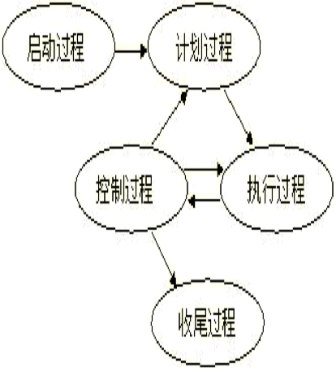
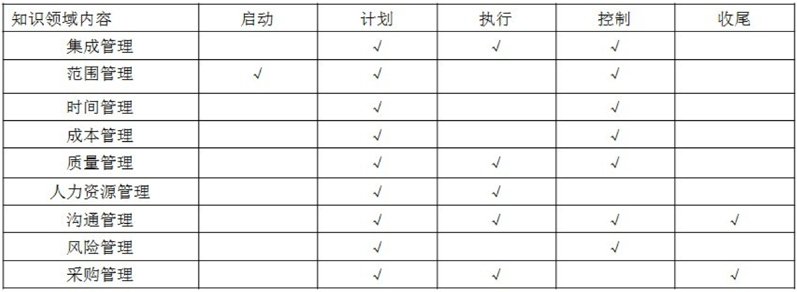

# 软件项目管理概述

## 一、软件项目管理概念及特点

### 1.1 软件项目管理的概念及目的

1. 软件项目管理是指对软件项目整个开发过程的管理，关系到工程项目的成败，对于保证软件产品的质量具有极为重要的作用。
2. 项目管理的目的是为了使软件项目能够按照预定的成本、进度、质量顺利完成，而对人员（People）、产品（ Product）、过程（Process）和项目(Project）进行分析和管理的活动。
3. 根本目的是使软件项目的整个生存周期都能在管理控制下，以预定成本按期按地的完成软件并交付使用。软件项目管理的主要职能包括以下5项：
   1. 制定计划
   2. 监理组织
   3. 配备人员
   4. 指导
   5. 检验

### 1.2 软件项目管理的主要特点

1. 智力密集不可见难度量
2. 独特产品单件生产
3. 开发复杂，自动化程度低
4. 人为因素影响大

## 二、软件项目管理过程及内容

### 2.1 软件项目管理的过程

在项目具体实施过程中，计划、执行和控制通常需要往复循环（称为核心循环），如图8-1项目管理过程及核心循环所示。 

### 2.2 软件项目管理的内容

项目管理的九大知识领域的内容，分布在项目的五大过程中，之间对应关系如表8-1所示。 

# 软件项目启动及组织

# 项目进度估算及安排

# 软件项目管理的实时

# 软件项目监控与收尾

