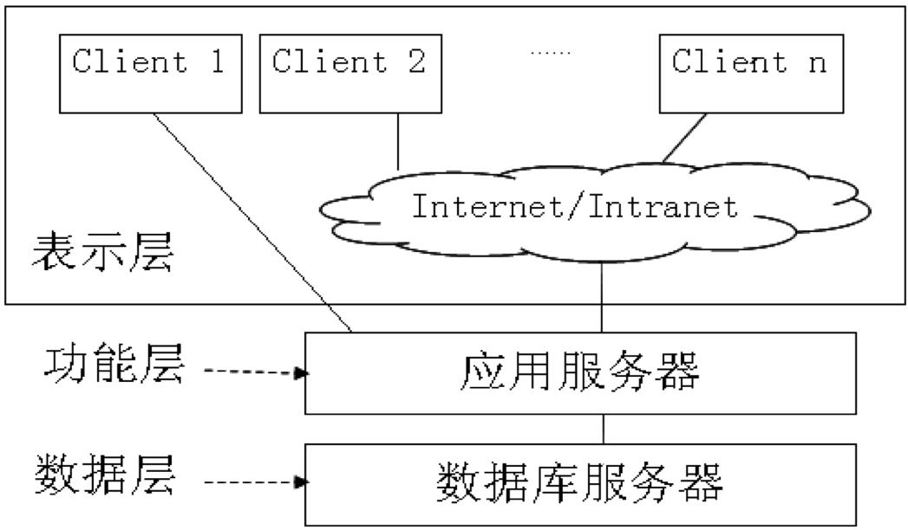
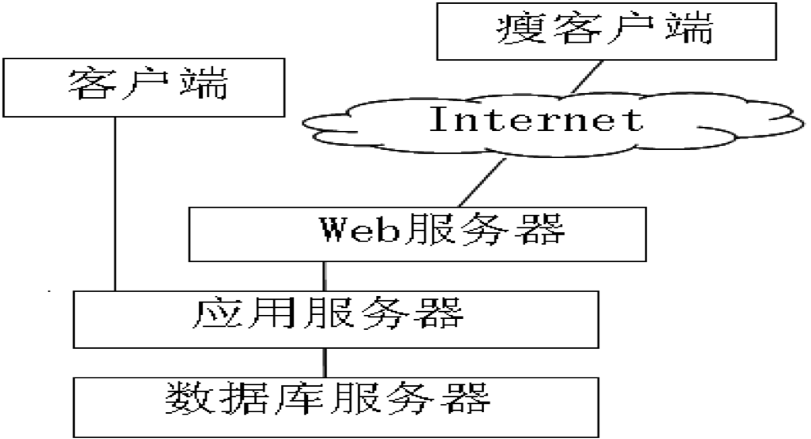

# 软件开发新技术概述

## 一、软件构建技术概述

1. 构件技术概念：构件技术是基于面向对象OO技术更高级的抽象。将底层的对象集合打包，组成功能“插件”。基于构件技术的软件开发就是将已存在的构件组装（集成）到当前软件系统的框架结构中，从而开发出新的软件产品，构件技术是软件产业化革命的必然发展趋势。
2. 构件的属性及应用：构件是可独立配置的单元，因此必须自包容。构件强调与环境和其他构件的分离，所以，构件的实现严格封装，外界没必要或没机会知道构件内部的实现细节。
3. 实现构件技术必备条件：以标准软件体系结构，保证构件间通信协议统一，实现同步和异步操作控制，突破本地空间限制，充分利用网络环境;构件有标准接口，保证系统可分解成多个功能独立的单元，用构件组装而成;构件独立于编程语言;构件提供版本兼容，来实现应用系统的扩展和更新。
4. 软件构件设计：由于软件构件依赖于开发平台环境，设计时具有特殊要求。

## 二、软件复用技术概述

### 2.1 软件复用概念及分类

- 软件复用(Software Reuse)是指在软件研发中重复利用相关软件元素的过程。是避免重复工作将已有的软件模块、技术和方法等用于建立新软件，以减少软件开发和维护等费用的过程。软件复用是提高软件研发效率和质量的一种重要技术。
- 软件复用的主要思想是：将软件作为由不同功能部分的“组件”所组成的有机体，每个组件（元素）在设计编写时可被设计成完成同类工作的通用工具。

按照不同方式，可将软件复用分为:

1. 按复用的对象分。可以分为产品复用、过程复用。
2. 按对可复用信息进行复用的方式分。可以将软件复用区 分为黑盒复用和白盒复用。 
3. 按复用的组织方式分。将复用区分为系统化的（或有计划的）复用和个别的复用。 
4. 按所应用的领域范围分。可以划分为横向复用和纵向复用。 

### 2.2 软件复用关键技术及级别 

实现软件复用的关键技术主要包括：软件组件技术、领域工程、软件构架技术、软件再工程技术、开放系统技术、软件过程、CASE技术等。 
可划分的复用级别为：代码复用、设计复用、分析的复用、软件测试信息的复用、应用程序生成器的使用、软件体系结构的复用等。

## 三、虚拟化与云计算技术概述 

### 3.1 虚拟化技术概述

- 虚拟化是将物理资源转变为逻辑上可以管理的资源，以打破物理结构间壁垒。可使虚拟世界运行在各种物理平台上，资源的管理都将按逻辑方式进行，完全实现资源的自动化分配，而虚拟化技术就是其实现的理想工具。
- 虚拟化环境需要多种技术的协调配合，服务器和操作系统的虚拟化、存储虚拟化、以及系统管理、资源管理和软件提交，与非虚拟化环境一致的应用环境。由于虚拟化技术，企业不再需要建立耗资巨大的数据中心便可实现异地备份。
- 虚拟技术主要包括：虚拟现实、虚拟显示、虚拟机、CPU虚拟化技术、文件虚拟化、桌面虚拟化技术等。

### 3.2 云计算的概念及架构

- 云计算主要通过互联网以创新的计算模式，使用户随时获得所需的计算能力和丰富的信息服务，其创新的商业模式可使用户对计算和服务，如同使用水电一样取用自由、按量付费，目标是通过互联网将各种IT资源以服务的方式提供给用户，包括计算资源、存储资源、软件开发、系统测试、系统维护和各种丰富的应用服务。
- 现在，云计算融合了以虚拟化、服务管理自动化和标准化为代表的众多创新技术。

## 四、C/S技术概述 

### 4.1 C/S技术的特点

1. 客户机/服务器C/S(Client / Server)技术，是20世纪90年代成熟起来的技术，C/S系统是基于局域网或广域网的系统。
在C/S体系结构中，应用被分成两部分：客户机（前台）负责完成与用户交互；服务器则处理低层功能。
2. C/S系统体系结构特征。主要包括：计算和处理分布在服务器和客户机之间；数据管理集中在服务器端；软件驻留在服务器和客户机。
3. C/S应用系统的特征

### 4.2 C/S技术的主要目标

略

### 4.3 两层结构C/S系统

- 第一层是客户端软件，由应用程序和相应的数据库链接程序组成，企业的业务处理过程都以客户端应用程序进行。第二层包括数据库服务器，根据客户端软件的请求进行数据库操作，然后将结果传送给客户端软件。
- 两层应用软件的开发工作主要集中在客户端，客户端软件不但要完成用户界面和数据显示的工作，还要完成一部分对商业和应用逻辑的处理工作。
- 两层结构的C/S系统，只能在各自的客户机和数据库服务器之间使用，分割了界面和数据，需要客户机管理复杂的软件，导致客户机负载加重变得“肥胖”。
- 两层 C/S系统不能进行有效的扩展，使这些系统不能支持大量用户的访问和高容量事务处理的应用。

### 4.4 多层结构的C/S系统

三层结构的C/S体系结构比二层结构增加一个应用服务器层，如图9-5所示。客户机上只安装具有用户界面和简单的数据处理功能的应用程序，负责处理与用户的交互和与应用服务器的交互。将商业和应用逻辑的处理功能移到中间层——应用服务器上，应用服务器负责处理商业和应用逻辑，接受客户端应用程序的请求，然后根据商业和应用逻辑将此请求转化为数据库请求后与数据库服务器交互，并将与数据库服务器交互的结果传送给客户端应用程序。 

三层CS体系结构图

四层CS体系结构图

C/S结构的局限性，主要包括： 

1. C/S结构的计算能力过于分散，网络中服务器和客户机的数目正发生“细胞”分裂，使得系统的管理费用以几何级数的方式增长。
2. C/S结构中数据库信息使用只限于局域网的范围内，无法利用Internet的网络资源。
3. 在C/S结构中，服务器及其软件的管理和维护都非常复杂，需要专人负责，小企业不愿购买高性能的服务器并聘用专人，所以，C/S结构不利于小企业应用和发展。  

## 五、B/S技术概述

第三层数据库服务器的任务类似于C/S模式，负责协调不同的Web服务器发出的SQL请求，并管理数据库。

### 5.1 B/S系统的特点

1. B/S系统采用B/W/D（Brower/Web服务器/Database服务器）结构。
2. B/S结构简化客户端。
3. 简化系统开发和维护。
4. 用户操作更简单。
5. B/S适用于网上信息发布，使大部分书面文件以电子文件取代，可简化行政手续，节省人力物力，提高工作效率。

- B/S系统框架设计特点。实际上，B/S系统的开发是网站开发过程。包括确定网站目标、对网站进行规划、估算成本、开发进度，估计风险、建立网站的需求模型及分析需求，之后进入工程阶段。在工程阶段与C/S系统有较大差别。B/S一般是三层结构系统，对每一层都要进行设计。此外，由于B/S是查询系统，因此导航系统设计和界面设计格外重要。
- 网站开发的主要工作并非编程，而是网页设计/制作，主要是使用制作工具进行文本、声音、图形和图片等的设计和编辑。内容设计、网页的制作和网站结构设计可并行进行。

### 5.2 B/S 和C/S的比较

从技术特性和商业特性两个方面进行比较。

1. 技术特性比较
   1. 数据安全性。
   2. 数据一致性。
   3. 数据实时性。
   4. 数据溯源性。
   5. 服务响应及时性。
   6. 网络应用限制。
2. 商业特性比较
   1. 投入成本。
   2. 硬件投资保护。
   3. 企业快速扩张支持。

# 能力成熟度集成模型

# IBM Rational软件工程体系

# 微软软件工程体系
# 敏捷软件工程体系

# 形式化方法

