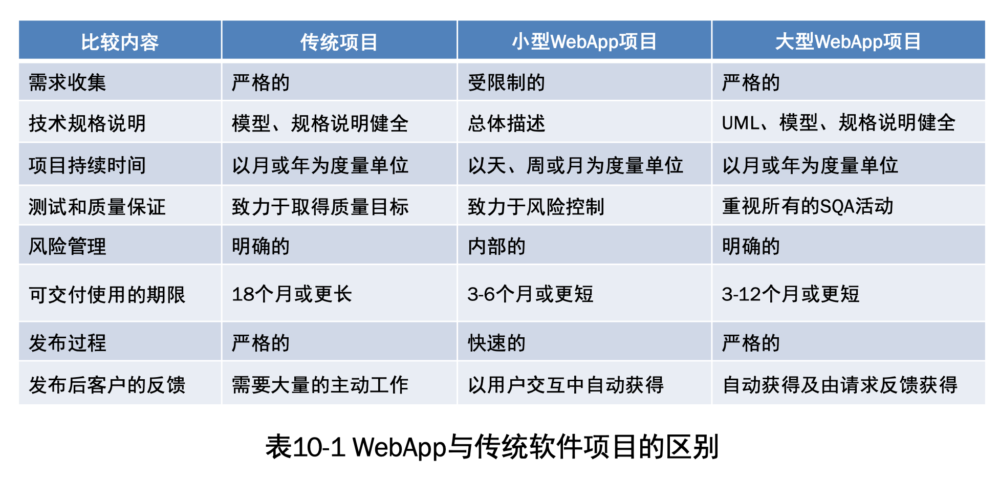
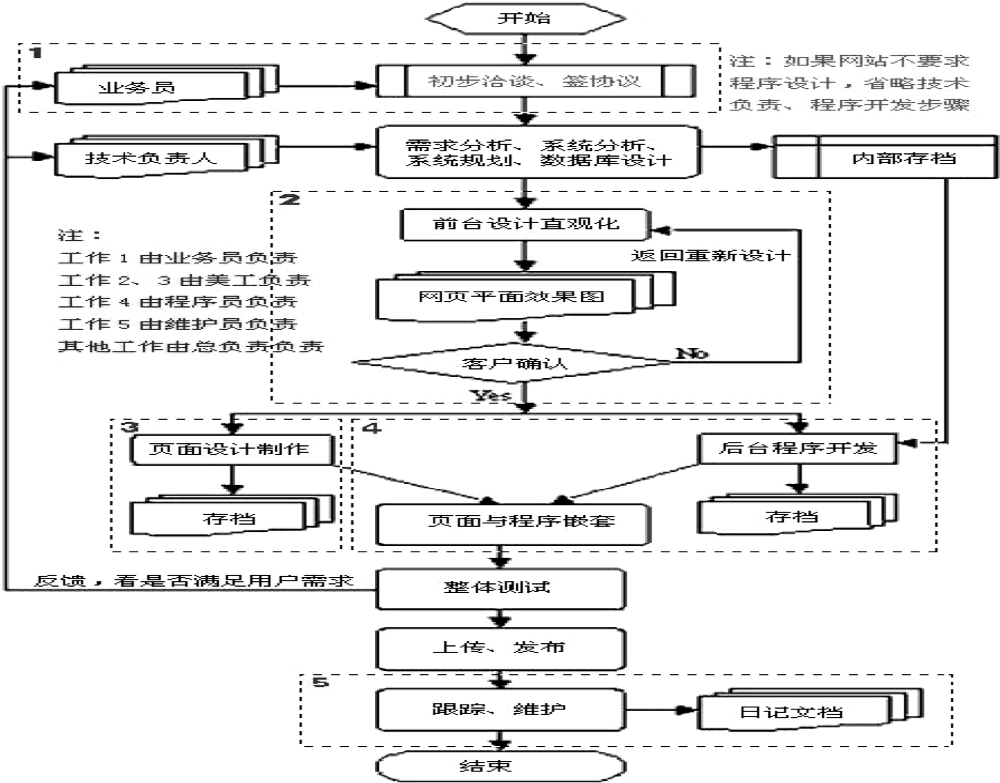
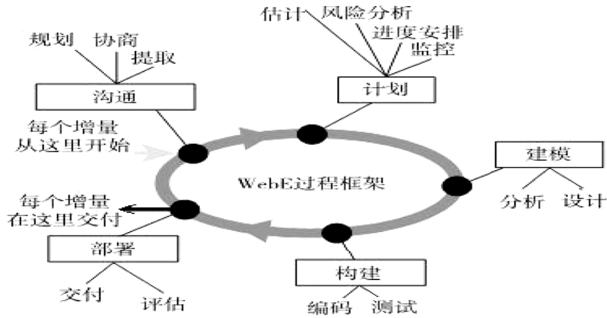
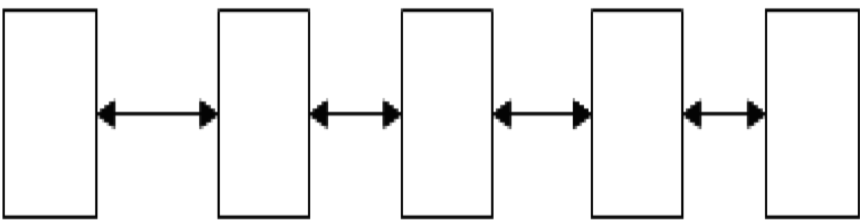
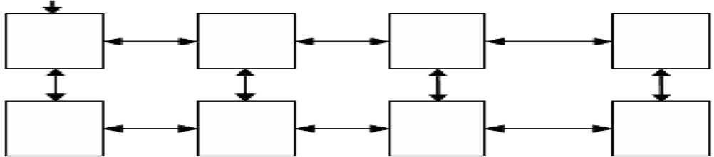
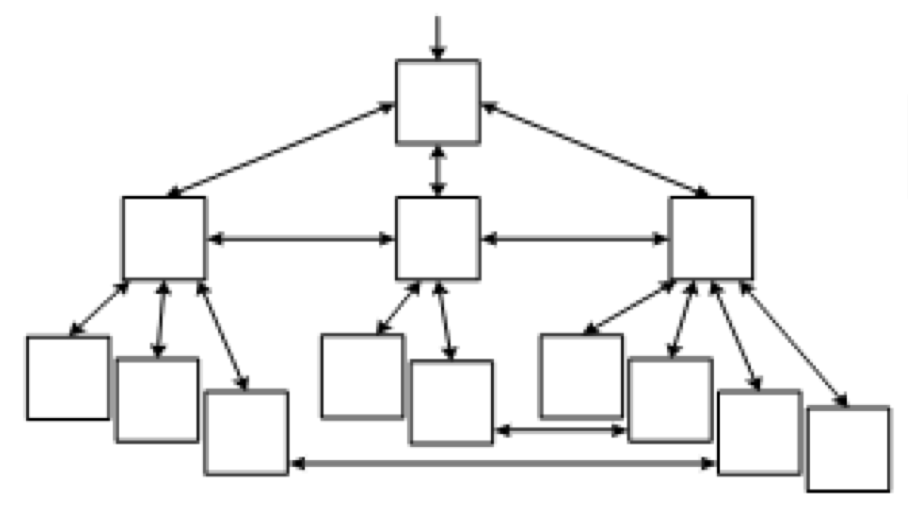
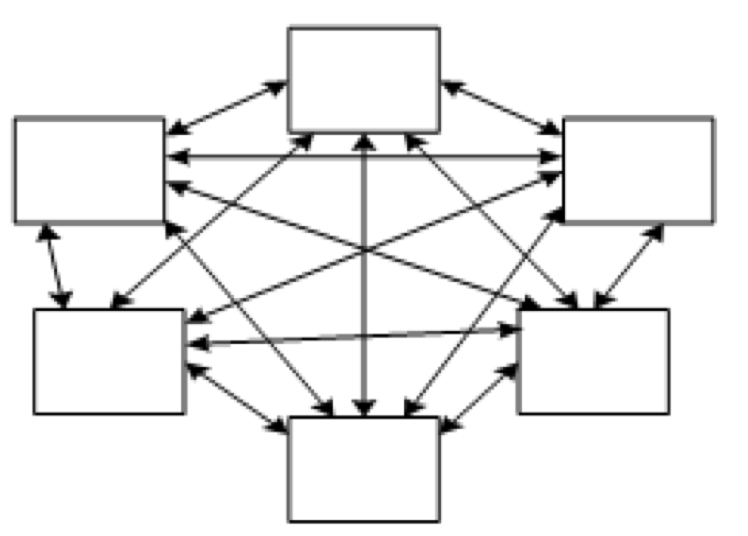
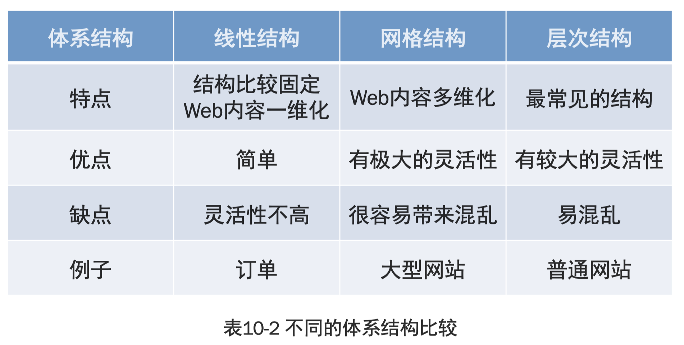
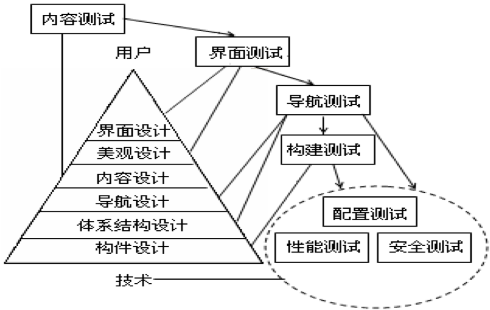

# WebApp项目开发概述

## 一、WebApp的特点及类型

### 1.1 WebE的概念及与传统项目的区别

WebE与传统软件工程的区别，主要体现在6个方面，并如表10-1所示： 

### 1.2 WebApp的特点

WebApp的特点具有以下8个方面：

1. 网络密集性（Network intensiveness）。
2. 并发性（Concurrency）。
3. 无法预测的负载量（Unpredictable load）。
4. 性能敏感性（Performance sensitive）。
5. 高可用性（High availability）。
6. 数据驱动 (Data driven)。
7. 内容敏感（Content sensitive）。
8. 持续演化(Continuous evolution)。WebApp驱动持续演化的过程的特征：
   1. 即时性。
   2. 安全性。
   3. 美观性。

WebApp的开发具有3个特点：

1. WebApp常以增量的方式进行开发
2. 经常发生变化
3. 周期较短

因此，整个WebE过程也与这些特点相适应。

## 二、WebApp开发过程及技术方法

WebApp开发过程

WebApp开发流程

## 三、WebApp需求分析

- WebApp的需求分析有3个任务：表述问题、收集需求和分析建模，在表述问题期间主要确定WebApp的目的和目标，并定义用户种类。收集需求主要通过调研等确定具体功能、内容、界面等需求，并以分析建模进行具体描述。
- 主要进行4种分析：
  1. 内容分析；
  2. 交互分析；
  3. 功能分析；
  4. 配置分析。
- 分析重点是解决3个重要问题：
  1. 表达或处理的信息内容；
  2. 为最终用户提供的功能；
  3. WebApp表达内容和执行功能时，表现的行为，可将问题的回答表示为分析模型的一部分。

WebE根据自身的特点，将分析模型分为：

1. 内容分析模型
2. 交互分析模型
3. 功能分析模型
4. 配置分析模型
5. 关系导航分析模型

## 四、WebApp设计

### 4.1 WebApp设计的目标要求

WebApp设计的目标要求，主要包括7个方面：
 
1. 简单性。
2. 一致性。
3. 相符性。
4. 健壮性。
5. 导航性。
6. 视觉吸引。
7. 兼容性。

### 4.2 WebApp的设计活动

WebApp设计可分为6种活动：构件设计、体系结构设计、导航设计、内容设计、美观设计和界面设计。每种设计都影响整体质量，可用金字塔表示，如图10-3所示。

![WebApp设计金字塔模型]](./现代软件工程10-WebApp开发综合案例/WebApp设计金字塔模型.png)
WebApp设计金字塔模型

体系结构的设计与WebApp的目标、内容、导航原则紧密相关。体系结构主要分为4种：线性结构、网格结构、层次结构和网状结构。

1. 线性结构：当内部交互可预测顺序时，Web内容串形相连，常选择线型结构。这种结构简单，但缺乏灵活性。如图10-4所示。
2. 网格结构：当WebApp内容可分类地组织成二维或更高维时，可采用网格结构，如图10-5所示。这种结构有很大灵活性，但也容易带来混乱。 
3. 层次结构：如图10-6是最常见的体系结构。其结构可设计成使控制流水平地穿过垂直分支（超文本分支）的方式。在此结构中左边展示的内容可由超文本链接其他分支的内容，实现内容快速导航。
4. 网络结构:如图10-7在很多方面类似于面向对象系统的体系结构。对结构构件（网页）进行设计，使构件可将控制传递（以超文本链接）到系统中的其他部件，使导航相对灵活。

图10-4 线性结构

图10-5 网格结构

图10-6 层次结构

图10-7 网络结构

上述4种类型的体系结构，比较如表10-2所示。

## 五、WebApp测试

# Web商品进销存信息系统 

