# WebApp项目开发概述

## 一、WebApp的特点及类型

### 1.1 WebE的概念及与传统项目的区别

WebE与传统软件工程的区别，主要体现在6个方面，并如表10-1所示： 

### 1.2 WebApp的特点

WebApp的特点具有以下8个方面：

1. 网络密集性（Network intensiveness）。
2. 并发性（Concurrency）。
3. 无法预测的负载量（Unpredictable load）。
4. 性能敏感性（Performance sensitive）。
5. 高可用性（High availability）。
6. 数据驱动 (Data driven)。
7. 内容敏感（Content sensitive）。
8. 持续演化(Continuous evolution)。WebApp驱动持续演化的过程的特征：
   1. 即时性。
   2. 安全性。
   3. 美观性。

WebApp的开发具有3个特点：

1. WebApp常以增量的方式进行开发
2. 经常发生变化
3. 周期较短

因此，整个WebE过程也与这些特点相适应。

## 二、WebApp开发过程及技术方法

WebApp开发过程

WebApp开发流程

## 三、WebApp需求分析

- WebApp的需求分析有3个任务：表述问题、收集需求和分析建模，在表述问题期间主要确定WebApp的目的和目标，并定义用户种类。收集需求主要通过调研等确定具体功能、内容、界面等需求，并以分析建模进行具体描述。
- 主要进行4种分析：
  1. 内容分析；
  2. 交互分析；
  3. 功能分析；
  4. 配置分析。
- 分析重点是解决3个重要问题：
  1. 表达或处理的信息内容；
  2. 为最终用户提供的功能；
  3. WebApp表达内容和执行功能时，表现的行为，可将问题的回答表示为分析模型的一部分。

WebE根据自身的特点，将分析模型分为：

1. 内容分析模型
2. 交互分析模型
3. 功能分析模型
4. 配置分析模型
5. 关系导航分析模型

## 四、WebApp设计

### 4.1 WebApp设计的目标要求

WebApp设计的目标要求，主要包括7个方面：
 
1. 简单性。
2. 一致性。
3. 相符性。
4. 健壮性。
5. 导航性。
6. 视觉吸引。
7. 兼容性。

### 4.2 WebApp的设计活动

WebApp设计可分为6种活动：构件设计、体系结构设计、导航设计、内容设计、美观设计和界面设计。每种设计都影响整体质量，可用金字塔表示，如图10-3所示。

![WebApp设计金字塔模型]](./现代软件工程10-WebApp开发综合案例/WebApp设计金字塔模型.png)
WebApp设计金字塔模型

体系结构的设计与WebApp的目标、内容、导航原则紧密相关。体系结构主要分为4种：线性结构、网格结构、层次结构和网状结构。

1. 线性结构：当内部交互可预测顺序时，Web内容串形相连，常选择线型结构。这种结构简单，但缺乏灵活性。如图10-4所示。
2. 网格结构：当WebApp内容可分类地组织成二维或更高维时，可采用网格结构，如图10-5所示。这种结构有很大灵活性，但也容易带来混乱。 
3. 层次结构：如图10-6是最常见的体系结构。其结构可设计成使控制流水平地穿过垂直分支（超文本分支）的方式。在此结构中左边展示的内容可由超文本链接其他分支的内容，实现内容快速导航。
4. 网络结构:如图10-7在很多方面类似于面向对象系统的体系结构。对结构构件（网页）进行设计，使构件可将控制传递（以超文本链接）到系统中的其他部件，使导航相对灵活。

图10-4 线性结构

图10-5 网格结构

图10-6 层次结构

图10-7 网络结构

上述4种类型的体系结构，比较如表10-2所示。

## 五、WebApp测试

# Web商品进销存信息系统 

## 一、系统需求分析

1. 系统开发的背景
2. 系统的可行性分析
3. 系统功能需求分析

### 1.1 C/S模式实现的库存管理系统功能需求：

- 对各原始数据表实现输入、修改、删除、添加、查询、打印等基本操作；
- 方便及时多用户地录入商品、进货、工具等入出库单数据；
- 方便查阅、核对入出库单数据，并能方便维护商品、进货、工具等入出库单原始数据；
- 以组合方式快速查阅商品、进货、工具等入出库单原始数据；
- 按一键完成对库存、按月或分日对商品、进货的统计；
- 自动产生商品或进货的实时库存；
- 以树型结构或表格方式方便查阅各类各种商品或进货的实时库存；
- 由分类统计值，反查其明细清单；
- 将主要表或查询信息按需导出到“数据表”中，支持原有手工处理要求，导出到“数据表”的数据能用于保存或排版打印等需要；
- 分级别用户管理；
- 月份设定与统计管理；
- 高级管理员的管理操作如：系统数据的备份与恢复、系统用户的维护、动态SQL命令操作、系统日志查阅等；
- 系统设计成传统的Windows多文档多窗口操作界面，要求系统具有操作方便、简捷等特点；
- 用户管理功能，包括用户登录、注册新用户、更改用户密码等功能；
- 其他你认为子系统应有的查询、统计功能；
- 要求所设计系统界面友好，功能安排合理，操作使用方便，并能进一步考虑子系统在安全性、完整性、并发控制、备份恢复等方面的功能要求。

### 1.2 B/S模式实现的网上订购系统功能需求：

- 实现网上用户的注册与登录，登录用户的管理；
- 方便查阅（如分页查询）商品及库存信息，方便商品选购；
- 实现基本的购物车功能；
- 完成订购、实现网上支付过程，并自动产生订购明细数据，产生商品
- 要求Web网页系统要运行稳定、可靠，操作简单、方便

### 1.3 库存管理系统C/S模式要求

基于以上系统涉及的处理数据，C/S模式实现的库存管理系统具体涉及到问题：

1. 方便及时多用户地录入商品、进货、工具等入出库单数据；
2. 方便查阅、核对入出库单数据，并方便维护商品、进货、工具等入出库单原始数据；
3. 以组合方式快速查阅商品、进货、工具等入出库单原始数据；
4. 按一键完成对库存、按月或分日对商品、进货的统计
5. 自动产生商品或进货的实时库存；
6. 以树型结构或表格方式方便查阅各类各种商品或进货的实时库存；
7. 由分类统计值，反查其明细清单；
8. 将主要表或查询信息按需导出到“数据表”中，支持原有手工处理要求，导出到“数据表”的数据能用于保存或排版打印等需要；
9. 分级别用户管理；
10. 月份设定与统计管理等。

### 1.4 业务流程及数据流图

在认真调查分析有关信息需求的基础上， 通过对Web订购子系统的业务流程图分析，可得到其中“网上订购”部分的数据流图，如图10-10所示。

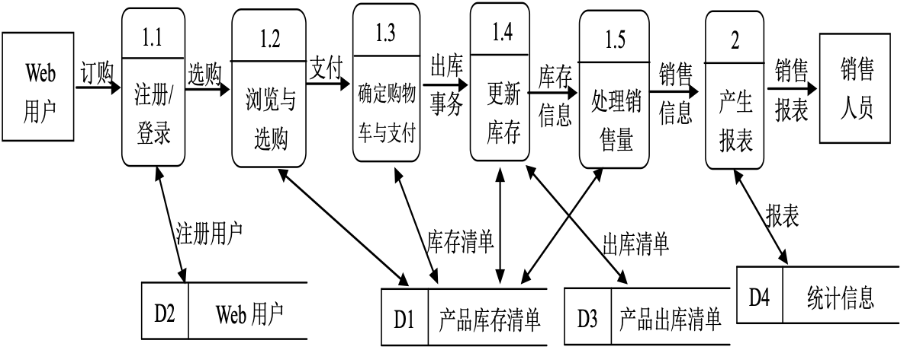

库存管理业务处理的商品库存管理子系统的业务流程图，如图10-11。从而得到数据流图。

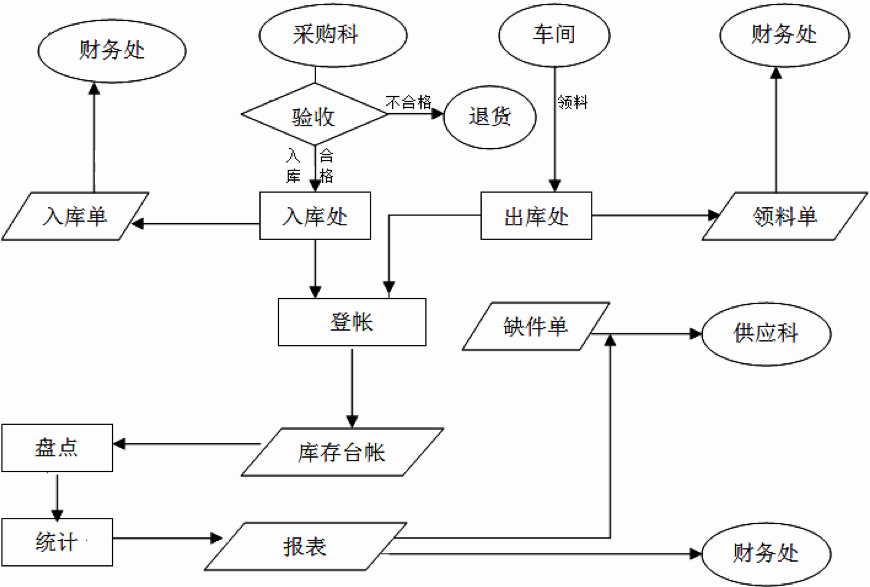

### 1.5 系统数据字典 

数据流图主要用于描述数据与处理的关系，数据字典则是系统中各类数据描述的集合，是进行详细的数据收集和数据分析所获得的主要成果。数据字典通常包括数据项、数据结构、数据流、数据存储和处理过程五个部分。

## 二、系统设计

### 2.1 数据库概念结构设计

根据实体联系分析可以画出基于Web进销存信息系统的E-R图，如图10-12所示。

由实体之间的联系，可画出各实体的E-R图，如图10-13至图10-18所示。
可建立相应关系数据表。

实体与实体间的关系E-R图，如图10-19所示。

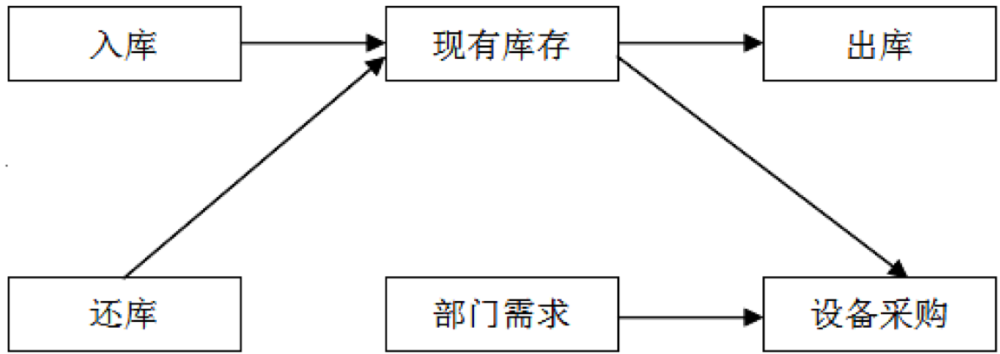

### 2.2 系统功能模块设计

1. 主要功能模块
  - 库存系统包含6个主要功能模块，即系统模块、入库业务管理模块、出库业务管理模块、退料业务管理模块（还库业务管理模块）、盘点业务管理模块（报表输出）、需求管理模块。对于每个功能模块，都包含数据录入、编辑、查询、统计、打印、应急、帮助等功能。
2. 开发步骤
  - 开发一个典型数据库应用程序，需要3个步骤：数据库设计、GUI用户界面设计和业务逻辑实现。后面将具体介绍相关步骤，GUI设计通常需要和业务逻辑交替进行。

对Web网上订购子系统的功能进行集中、分类，按照结构化程序设计的要求，可得出子系统的功能模块图如图10-20，而库存管理子系统各项功能模块如图10-21所示。

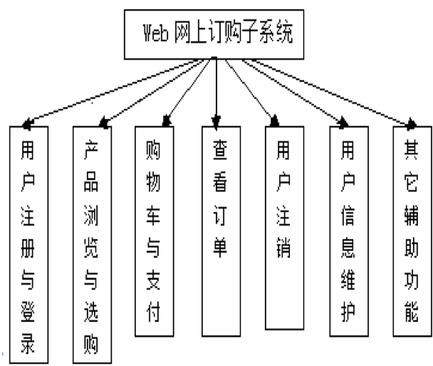
图10-20 Web网上订购子系统一级功能模块图

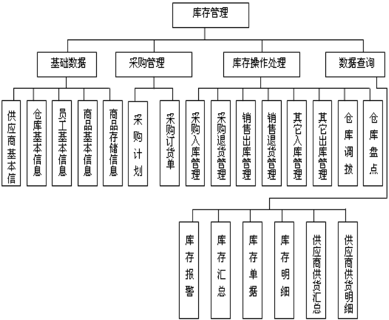
图10-21 库存管理子系统功能模块图 

### 2.3 操作流程设计

网上订购系统运行时通常可以按照如图10-22所示的操作流程进行操作。

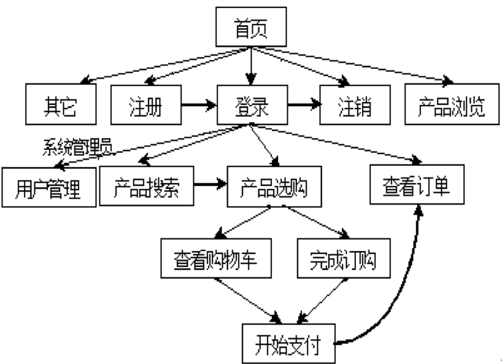
图10-22 网站操作流程示意图 

### 2.4 数据库设计

按照实体-联系图转化为关系模式的方法，本系统共使用到至少23个关系模式(含4个辅助关系)，在此只给出23个表名：

- Web订单表(weborders)
- Web订单明细表(weborderdetails)
- Web用户表(webuser)
- Web购买折扣表(webdiscount)
- Web支付方式表(Webpaydefault)
- Web即时信息表(webmessage)
- 商品年月设置表tccpny)
- 商品入出库表(tccprck)
- 商品实时库存表(tccpsskc)
- 月累计库存表(tccptj)
- 商品月区段库存表(tccpkctj)
- 月商品明细库存表(tccpkc200412)
- 进货年月设置表tcplny)
- 进货入出库表(tcplrck)
- 进货实时库存表(tcplsskc)
- 进货累计库存表(tcpltj)
- 进货月区段库存表(tcplkctj)
- 进货月区段库存表2(tcplkctj2)
- 月进货明细库存表(tcplkc200412)
- 工具库存表(tcmjkc)
- 系统用户表(users)
- 日志表(logs)
- 系统参数表(tcsyspara)

数据库库表关系图如图10-23所示。

**【注意】表索引对性能的影响以及是否采用，需要通过实际系统的运行比较进行判定。**

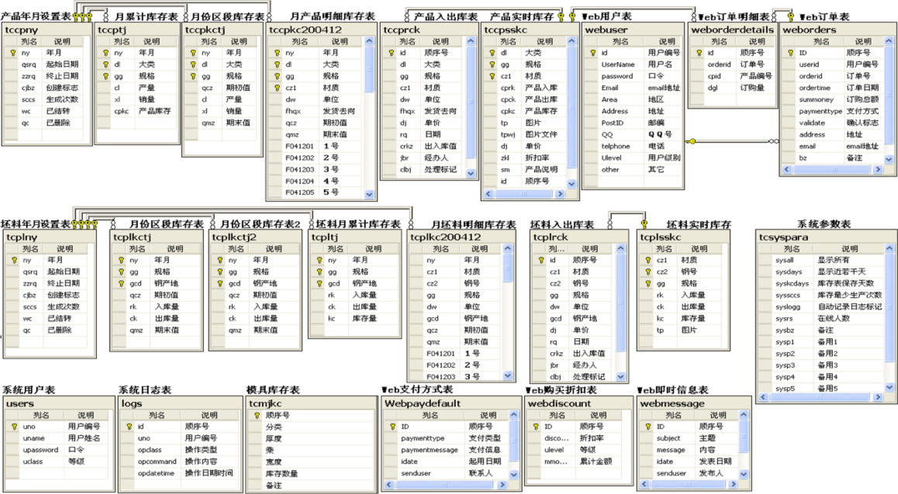

## 三、系统实现

### 3.1 主窗体及其菜单 

1. 库存管理子系统的主窗体。以库存管理子系统为例，采用了多文档界面，为此需在本系统项目中添加一个多文档窗体，命名为frmmain.在主窗体中,可加入主菜单、工具栏与状态栏等,如图10-24。
  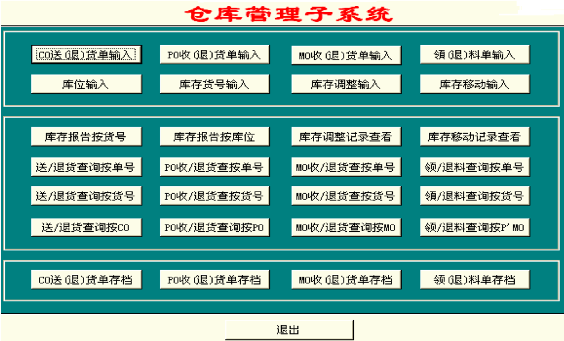
2. 主窗体的菜单。在主窗体中，单击鼠标右键，选择弹出式菜单中的“menu   editor…”命令，创建如图10-25所示的应用系统菜单结构。
  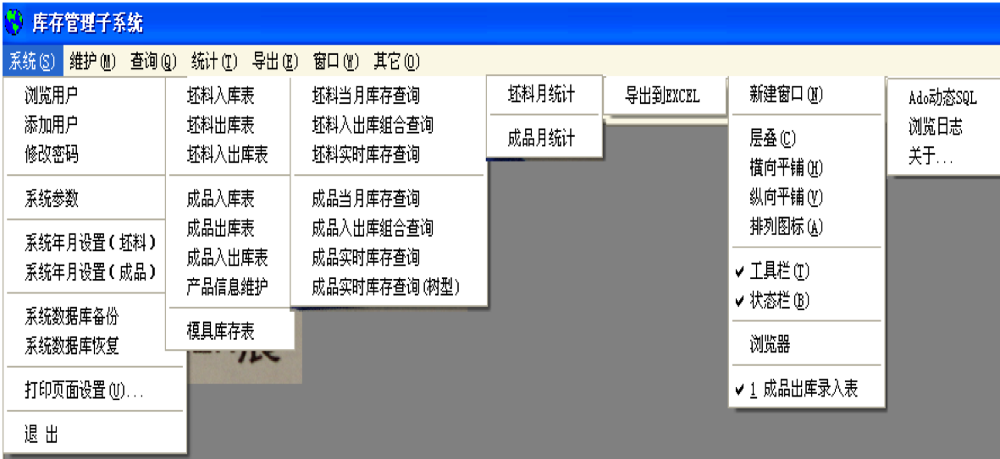

### 3.2 主要模块实现

1. 商品出库或入库录入模块。企业商品的采购入库录入窗口，其运行界面(只列出子窗口，以下同)示意图，如图10-26所示。出库或入库录入组合查询窗口如图10-27所示。
  ![商品采购入库录入窗口]](./现代软件工程10-WebApp开发综合案例/商品采购入库录入窗口.png)
  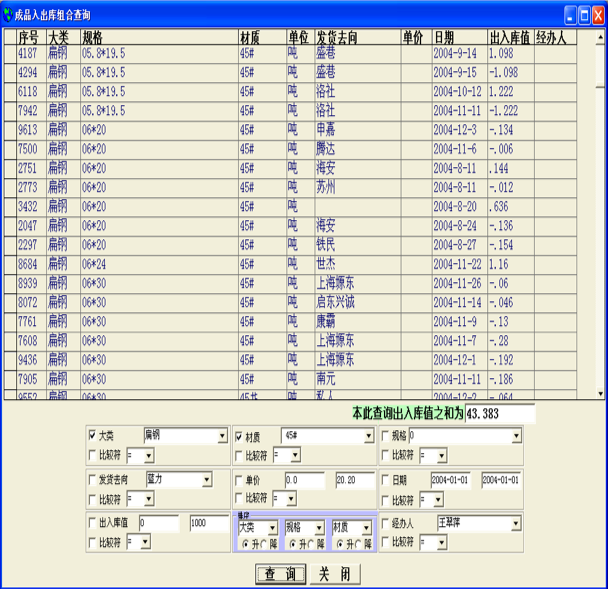
2. 商品月明细库存生成与查询模块。
   - 商品月明细库存生成与查询模块的运行界面如图10-29所示,模块实现简述：利用组合条件实现查询，能方便并快速地查找到信息。
   - 系统年月设置表控制着商品月明细库存的天数范围及对月明细库存表的创建、生成、结转、删除等管理功能，图10-28及图10-29所示的窗口简明地实现了这些功能。
  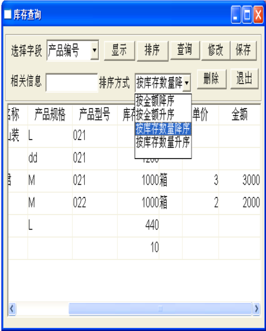
  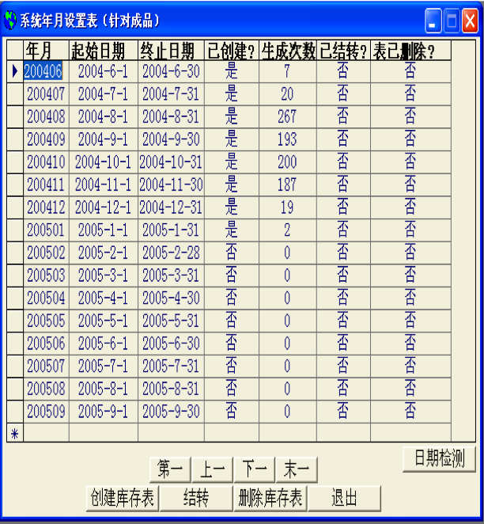
3. 商品实时库存计算与组合查询模块。
  - 商品实时库存计算与组合查询模块的运行界面如图10-30所示,模块实现简述：本功能窗体被设计成上下两部分，上部分数据网格控件显示查到的库存记录；下部分可组合6种条件。商品实时库存树形查询窗体，如图10-31所示。
  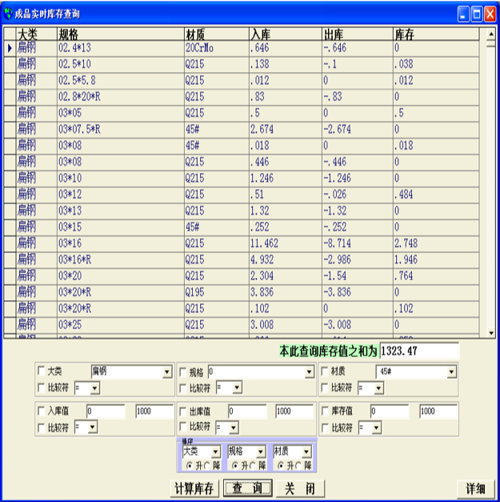
  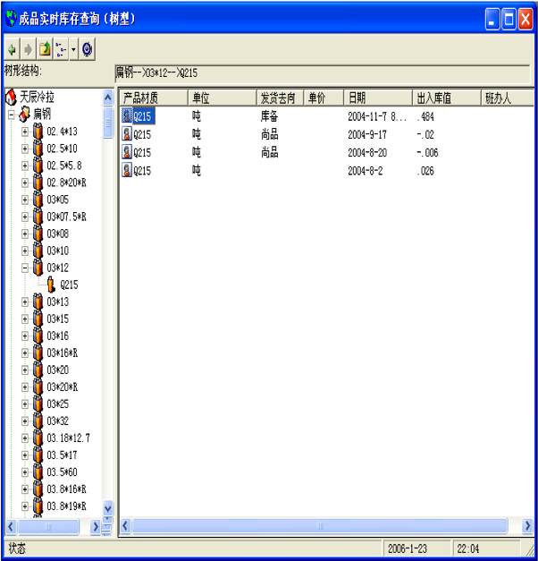
4. 商品进销存统计模块。
  - 商品进销存统计模块的运行界面如图10-32所示,模块主要实现商品进货、销售、库存和结余统计（主要包含月产量、销量及结余等）与显示，及月商品间段库存统计（主要包含期初值、生产量、销售量、销量及期末值等）与显示功能。
  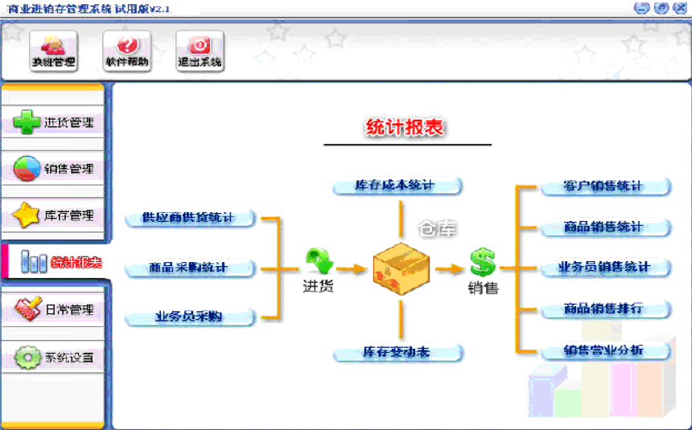