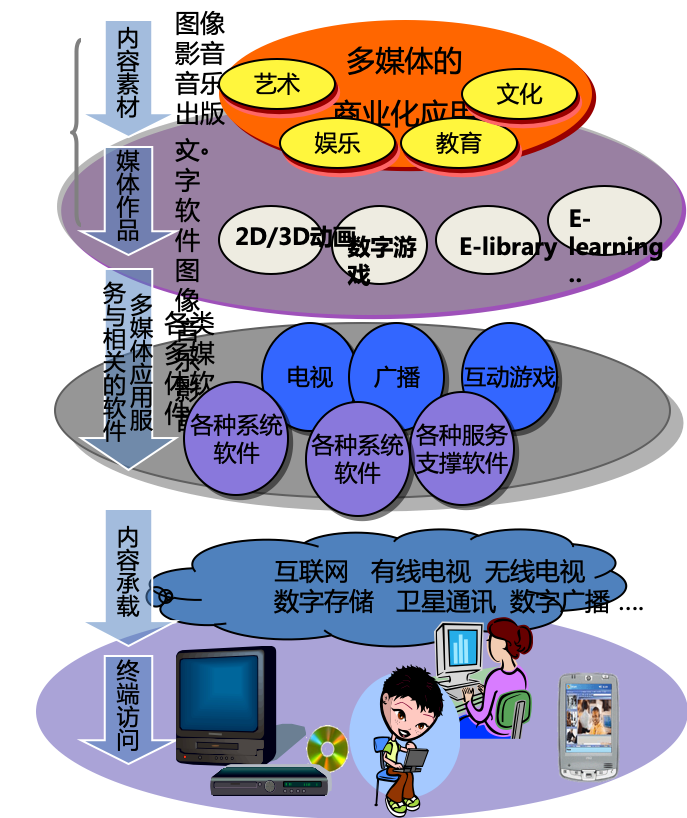
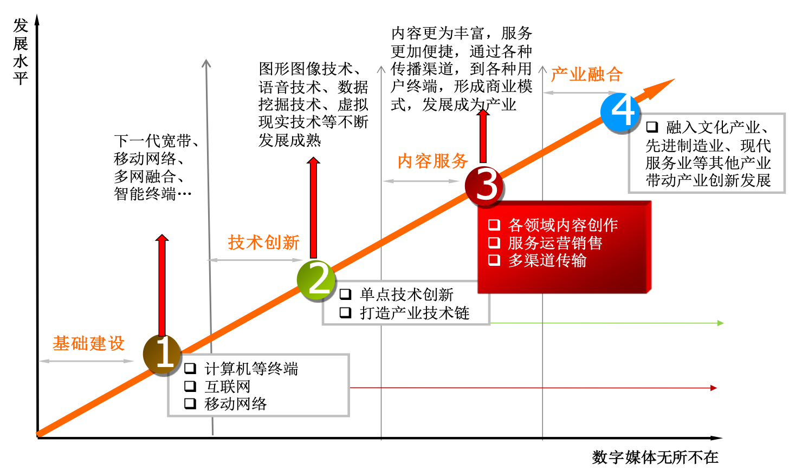
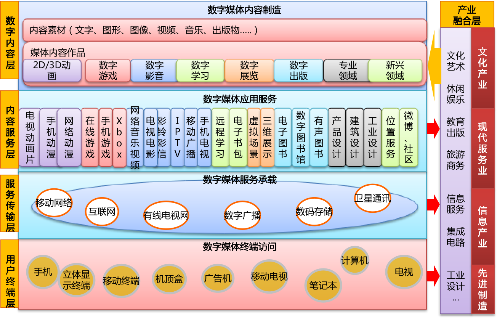
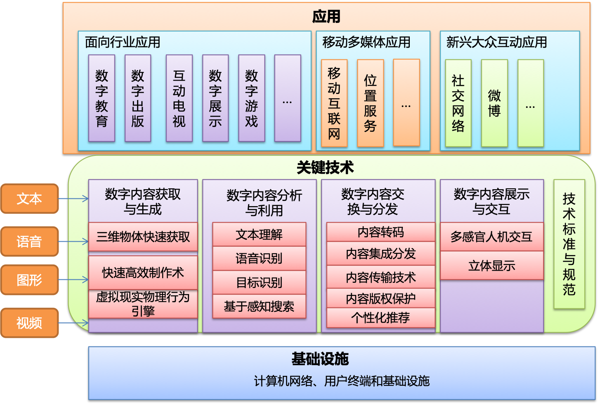

## 第一节 多媒体产业发展

### 多媒体技术和产业的概念

- 多媒体技术是综合性的集成技术，融合了计算机、通信、图像语音编码、光、电、机械和人工智能等多种技术手段。
- 多媒体技术是将数字化的内容，包括文字、音频、视频、动画等多媒体信息加工处理后，进入完善的服务体系，通过网络为主的传播载体，分发到终端和用户进行消费的全过程。 
- 具有数字化、网络化和可感知性等特点。

### 多媒体内容分类

- 数字动漫：包括2D/3D卡通动画，其产品大量应用于娱乐业以及广告领域。 
- 数字影音：运用数字化CG等制作技术，进行数字影音产品的拍摄、编辑和后期制作。 
- 数字学习：主要形态为多媒体教学产品的制作，并通过网络通信平台向学员提供更为灵活的数字化学习与培训服务。 
- 数字展示：主要是以数字化的文字，图像和影音为观众提供更具有沉浸效果的媒体展现，其中大型会展、数字博物馆等是其主要的应用场所。 
- 数字出版：包括电脑下载的网络出版、e-Book形式的网上电子阅读和按需印刷的网络出版。 
- 数字游戏：包括各种单机游戏、大型在线网络游戏和移动手机游戏等。 

### 数字媒体发展图

## 第二节 多媒体关键技术

