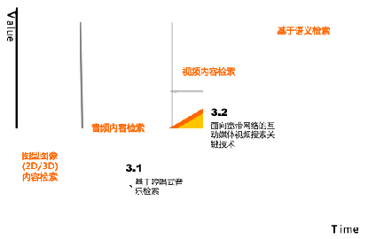
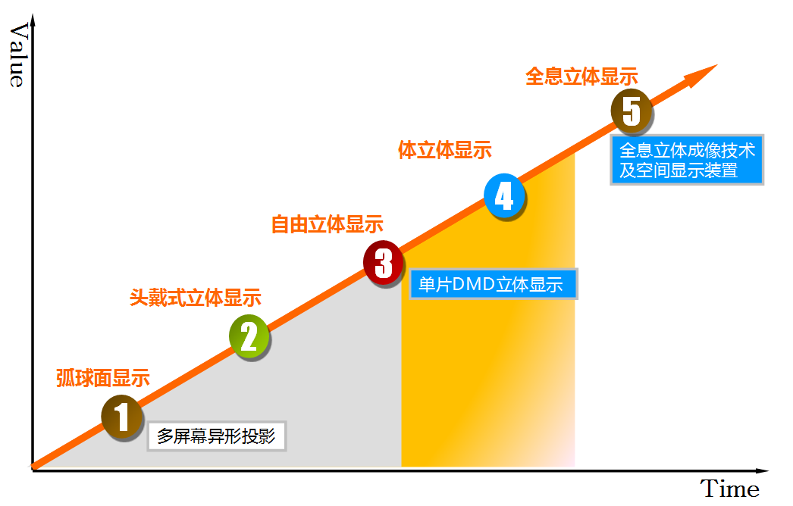
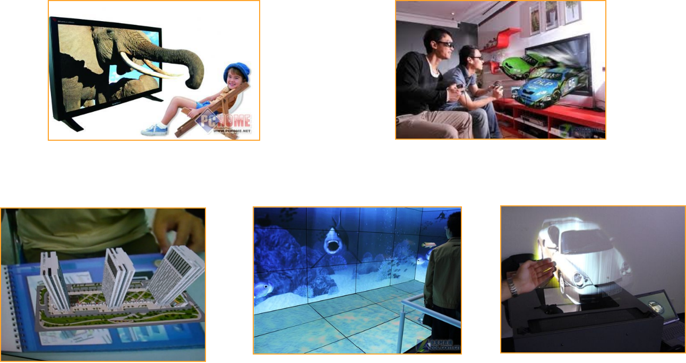
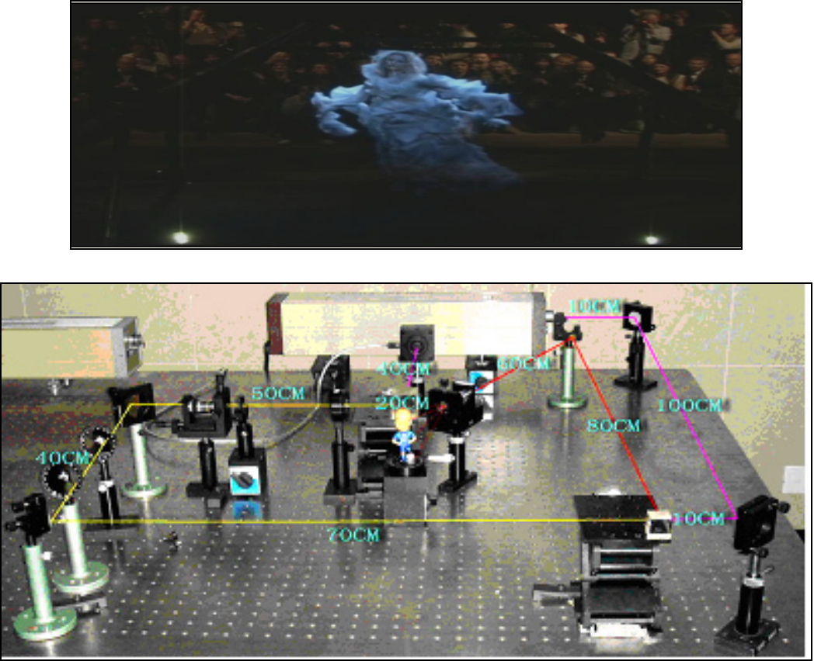

## 第一节 多媒体产业发展

### 多媒体技术和产业的概念

- 多媒体技术是综合性的集成技术，融合了计算机、通信、图像语音编码、光、电、机械和人工智能等多种技术手段。
- 多媒体技术是将数字化的内容，包括文字、音频、视频、动画等多媒体信息加工处理后，进入完善的服务体系，通过网络为主的传播载体，分发到终端和用户进行消费的全过程。 
- 具有数字化、网络化和可感知性等特点。

### 多媒体内容分类

- 数字动漫：包括2D/3D卡通动画，其产品大量应用于娱乐业以及广告领域。 
- 数字影音：运用数字化CG等制作技术，进行数字影音产品的拍摄、编辑和后期制作。 
- 数字学习：主要形态为多媒体教学产品的制作，并通过网络通信平台向学员提供更为灵活的数字化学习与培训服务。 
- 数字展示：主要是以数字化的文字，图像和影音为观众提供更具有沉浸效果的媒体展现，其中大型会展、数字博物馆等是其主要的应用场所。 
- 数字出版：包括电脑下载的网络出版、e-Book形式的网上电子阅读和按需印刷的网络出版。 
- 数字游戏：包括各种单机游戏、大型在线网络游戏和移动手机游戏等。 

### 数字媒体发展图

## 第二节 多媒体关键技术

### 图形图像技术

图形建模绘制经历了从2D向3D转换，目前比较关注的是三维物体的高效逼真的高精度输入新技术，包括一些真实物体的获取与重建，大规模复杂场景快速获取及建模技术、动态三维物体的信息获取与快速建模技术和支持动态场景高逼真再现的数据采集与处理技术。向着三维、高精度、高逼真度、快速、实时、大规模复杂对象和场景方向发展。

### 视频编码解码技术

视频编解码标准位于产业链高端，解决在网络上和移动终端传输播放视频以及对多媒体数据进行快速有效的检索，进行统一的存取等问题。视频传输中最为重要的编解码标准国际电联的H.261、H.263，运动静止图像专家组的M-JPEG，国际标准化组织运动图像专家组的MPEG系列标准MPEG2,MPEG4，MPEG7以及我国自主知识产权的AVS，掌握自主知识产权的编解码技术，建立自主的编解码标准是发展我国视音频产业的前提和基础。

### 人机交互技术

人机交互技术发展经历了从键盘、鼠标到单点和小幅面多点触控，这些技术已经十分成熟。随着展览展示技术的发展，大面积的多人多点触控技术不久将进入实际应用，基于自然语言的人机交互技术在上海已经进入自动客服和知识问答的应用服务阶段。人机交互的发展方向是以人文本，基于人类语言、视觉、表情、手势、姿态或力触觉等拟人化交互的多通道人机交互模式是研究的热点。基于情景感知的多通道融合的智能人机交互模式是未来发展的目标，人机交互的最高阶段是高级的虚拟现实。

### 立体显示技术

立体显示技术有很多种，利用大幅面异形投影给观众以真实感的体验；利用双目视差的原理给人以3D显示的感觉，例如佩戴立体眼镜，或者采用双目自由立体显示技术；体三维技术是真正能够实现动态效果的3D技术，可以实现“悬浮”在半空中的三维透视图像。体三维显示技术目前大体可分为扫描体显示和固态体显示两种。全息立体显示则是利用光波的干涉和衍射的原理实现三维图像在空间悬浮物显示，大幅面多方位是难点。 

#### 立体显示技术全息立体显示

### 虚拟现实技术

虚拟现实技术可以说是多媒体技术追求的最高境界，涵盖的研究领域非常广泛：环境建模技术、立体声合成和立体显示技术、触觉反馈技术、三维交互技术、语音识别与合成技术、系统集成技术等。为了提高虚拟现实系统的交互性、逼真性和临境感，在新型传感和感知机理、几何与物理建模新方法、高性能计算，特别是高速图形图像处理，以及人工智能、心理学等方面都有许多挑战性的问题有待解决。虚拟现实技术融入到其他重点行业进行虚拟仿真，虚拟协同工作是未来理想的工作模式。

### 增强现实技术

### 虚拟制造

