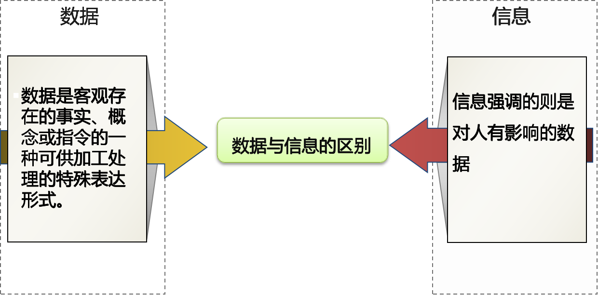
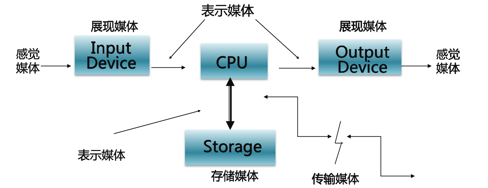
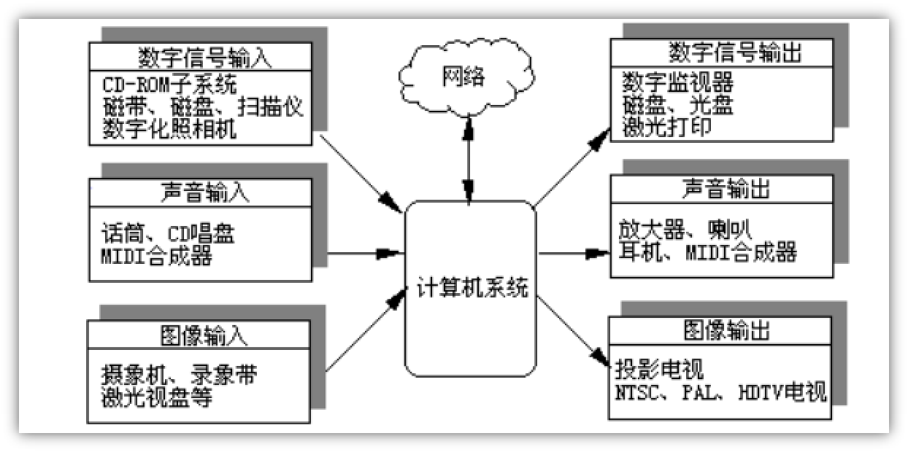

## 基本概念

数据：国际标准化组织ISO （International Standard Organization）对数据的定义如下:

- **数据定义**：数据是对事实、概念或指令的一种特殊表达形式，这种特殊的表达形式可以用人工的方式或者用自动化的装置进行通信、翻译转换或进行加工处理
- **数据分类**：数值型、非数值型（图形、图像、声音、动画、视频等）
- **信息**:
  - 是对人有用的数据，这些数据将可能影响到人们的行为与决策
  - 信息处理的目的是获取有用的信息

### 媒体

所谓媒体是信息表示和传播的载体。媒体又称媒介、媒质，它的英文是medium(单数)和media(复数)，指的是用于分发信息和展现信息的手段、方法、工具、设备或装置。在计算机领域中，能够表示信息的文字、图形、声音、图像、动画等都可以称为媒体。

#### 媒体分类

- perception medium（感觉媒体）
- representation medium（表示媒体）
- presentation medium （展现媒体）
- storage medium （存储媒体）
- transmission medium（传输媒体）

- 展现媒体：用于把感觉媒体转换成表示媒体、表示媒体转换为感觉媒体的物理设备，前者是计算机的输入设备，如键盘、扫描仪、话筒等，后者是计算机的输出设备，如显示器、打印机、音箱等。
- 表示媒体：它是为了加工、处理、存储和传输感觉媒体而人为地研究、构造出来的一种媒体。它是在计算机内部采用的特殊表示形式，即声、文、图、活动图像等的二进制编码表示。
- 感觉媒体：能使人类听觉、视觉、嗅觉、味觉和触觉器官直接产生感觉(感知信息内容)的一类媒体，如声音、文字、图画、气味等，它们是人类有效使用信息的形式。
- 存储媒体：用于存放表示媒体以便计算机随时加工处理和调用信息编码的物理实体。
- 传输媒体：用来将表示媒体从一台计算机传送到另一台计算机的通信载体。

### 离散媒体

文本、图形和静止图像等媒体。

特点：由独立于时间的元素项组成不随时间的变化而变化。

### 连续媒体

指与时间相关的、依赖于时间的媒体。

特点：由独立与时间的元素项组成不随时间变化而变化。（如声音、活动图像等）

### 多媒体

值图形、文本、图像、声音、动画、视频等信息表示的媒体

### 多媒体技术

采用计算机技术把文本、声音、图形、图像和动画、视频等多媒体综合一体化，使之建立起逻辑连接，并能对它们进行获取、压缩编码、编辑、处理、存储、传输和展示。即多媒体技术就是把声、文、图、像和计算机集成在一起的技术。

### 媒体的4大特性

- 多样化：指计算机处理媒体信息的多样化 ，使计算机所能处理的信息范围从传统的数值、文字、静止图像扩展到声音和视频信息
- 集成性：媒体种类一体化。包括两方面：一方面是指多媒体技术能将各种不同的媒体信息有机地进行同步组合，形成一个完整的多媒体信息；另一方面是指把不同的媒体设备集成在一起，形成多媒体系统
- 交互性：人、机对话，是多媒体技术的关键特征。在多媒体系统中，除了操作上控制自如之外，在媒体的综合处理上也可以随心所欲
- 实时性：声音、动态图像(视频)随时间变化

### 媒体设计的对象

- 文字与符号：各类为自和符号
- 图形与图像
  - 矢量图：通过计算而描述的矢量图形
  - 图像：用像素点描述的自然影像
- 动画：单画面矢量动画和多画面帧动画
- 视频：数字信号AVI、压缩视频信号MPG
- 音频与MIDI
  - midi音频
  - wav音频
  - mp3压缩音频
  - 视频：音频数字信号、压缩音频信号

## 多媒体系统

硬件结构：计算机；接口卡；声像输入设备；声像输出设备；软件；控制部件

### 软件结构

1. 系统软件(System Software) 
   1. 实时多任务操作系统
   2. 用户接口
2. 开发工具(Development Tools) 
   1. 创作软件
   2. 编辑软件
3. 多媒体应用软件 (Multimedia Application Software)  
   1. 定制应用软件
   2. CD-ROM 节目

### 相关技术

1. 多媒体开发技术
2. 音视频处理技术
3. 数据压缩解压缩技术
4. 多媒体数据库
5. 分布式多媒体系统
6. 多媒体网络通信
7. 大数据处理
8. 虚拟现实技术
9. 人机交互技术
10. 立体显示技术

### 多媒体技术的发展

#### 历史

1984年美国Apple公司在Macintosh上为了改善人机之间界面，首先大胆地引入位映射（Bitmap）的概念对图进行描述，并使用了窗口和图符作为用户接口

1986年3月Philips和Sony联合研制并推出了交互式紧凑光盘系统CD-I(Compact Disc Interactive)，同时它们还公布了CD-ROM文件格式，得到了同行的承认，并成为ISO国际标准

1990年11月，Microsoft和Philips等十多家厂商召开了多媒体开发者会议，会议成立了多媒体计算机市场协会，并制定了多媒体计算机MPC1.0标准

#### 现状

#### 趋势

- 多媒体通信网络环境的研究和建立，将使多媒体从单机单点向分布、协同多媒体环境发展，对该网络及其设备的研究和网上分布应用与信息服务的研究将是热点；
- 利用已较成熟的图像理解、语音识别，全文检索等技术研究多媒体基于内容的处理。开发能进行基于内容的处理系统（包括编码、创作、表现及应用；
- 多媒体标准仍是研究的重点;
- 多媒体技术将与相邻技术结合，以提供完善的人—机交互环境；
- 虚拟现实技术的研究将继续取得进展，虚拟现实与可视化技术相互补充，并与语音、图像识别、智能接口等技术相结合，建立高层次虚拟现实系统。
 
## 小结

对数据、信息、媒体、多媒体、多媒体技术、多媒体系统等作了介绍，然后分别对音频、图像、图形、动画和视频等对象进行了定义，计算机与五种媒体的关系，并引出了多媒体系统的若干技术…。

要求掌握多媒体系统的基本配置，了解多媒体的应用以及所涉及的若干技术。阐述了多媒体技术研究的范围与实现的目标，多媒体技术的发展趋势，希望对多媒体技术有个较为全面的了解。