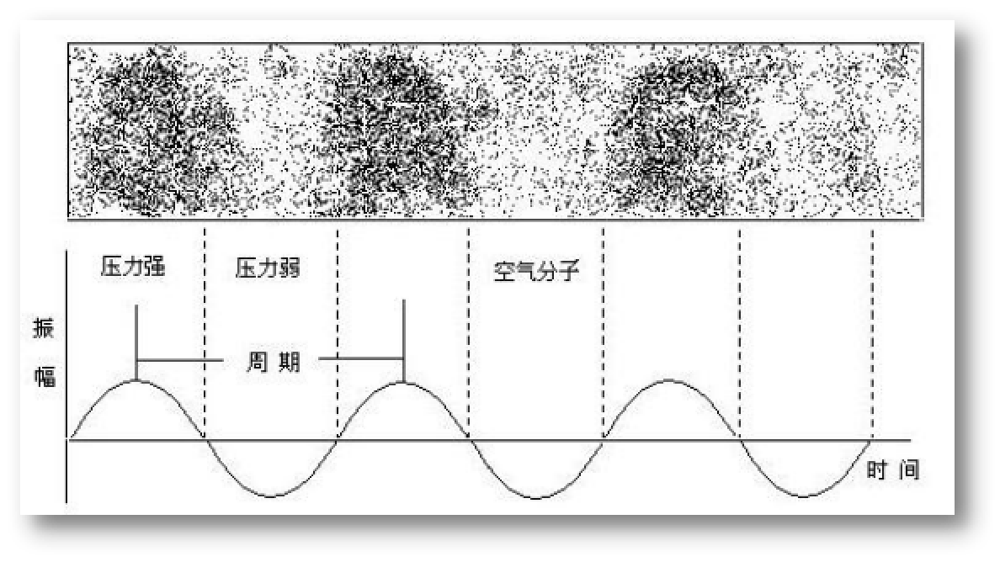
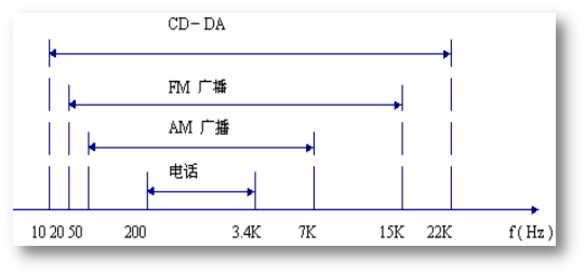
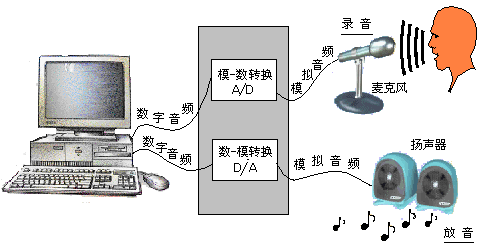

## 一、声音的特性、类型与处理

基本概念：声音的三要素即为音调、音强、银色

- 音调：与声音的频率有关，频率快则声音高，频率慢则声音低。
- 音强：又称响度，取决于声音的幅度，即振幅的大小和强弱。
- 音色：则由混入基音的泛音所决定的，每个基音又都有其固有的频率和不同音强的泛音，从而使得每个声音具有特殊的音色效果。

### 特性

1. 自然界中声音是靠空气传播的
2. 声音在空气中能引起非常小的压力变化
3. 声源引起的空气压力变化，被耳朵的耳膜所检测，产生电信号刺激大脑听觉神经，使人们能感觉到声音的存在
4. 自然界的各种声音大都具有周期性的强弱变化的特性，因而也使得输出的压力信号周期变化

### 声音信号的有关术语

- 周期：将曲线上的任一点再次出现所需时间间隔称为周期。
- 频率：
  - 一秒钟内声音由高(压力强)到低(压力低)再到高(压力强)，这样一个循环出现的次数称为频率。
  - 频率越高，声音越高，以赫兹(Hz)为其度量单位。
- 带宽：
  - 把系统能够接受的最低的听觉和最高频率之间的范围称为系统的带宽(Bandwidth）。
  - 人类能够接受的听觉带宽是从20Hz到20KHz。

### 声音信号的特性

- 声音信号联系特性：自然界的声音大多属于非周期信号，其频谱是连续谱。连续谱的成份使声音听起来饱满、生动。
- 声音信号方向感特性：声音的传播是以声波形式进行的。由于人类的耳朵能够判别出声音到达左右耳的相对时差、声音强度，所有能够判别出声音的方向以及由于空间使声音来回反射而造成声音的特殊空间效果。
- 声音信号的时效性：由于时间性，声音数据具有很强的前后相关性，因而，数据量要大得多，实时性要求也比较高。

### 声音的带宽

### 声音信号的类型

由模拟量变为数字量的过程称为模—数转换。

模拟音频(Analog audio)：模拟音频是一种连续的模拟量，以电的、磁的等形式表示。例如当我们对着麦克风讲话时，麦克风能根据它周围空压力的不同变化而输出相应连续变化的电压值，这种变化的电压值便是一种对我们讲话声音的模拟，是一种模拟量，称为模拟音频。

数字音频 (Digital audio)：数字化音频的获得是通过每隔一定的时间间隔测一次模拟音频的值(如电压)并将其数字化。这一过程称为采样，每秒钟采样的次数称为采样率。  一般地，采样率越高，记录的声音就越自然，反之，若采样率太低将失去原有声音的自然特性，这一现象称为失真。

### 声音信号的处理

1. 自然界中的声音可分为四种类型：次声、可听声、超声与特超声（1G Hz—10THz）
2. 人类的听觉能范围是20Hz—20KHz, 次声、超声与特超声均非可听声。
3. 人类的听觉能范围是20Hz—20KHz, 次声、超声与特超声均非可听声。
4. 声音的处理主要有：声音的录制、回放、压缩、传输和编辑等。

## 第二节  声音信号数字化

