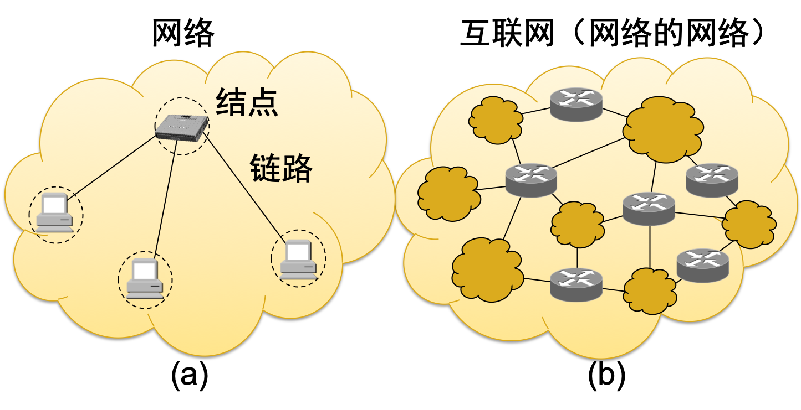
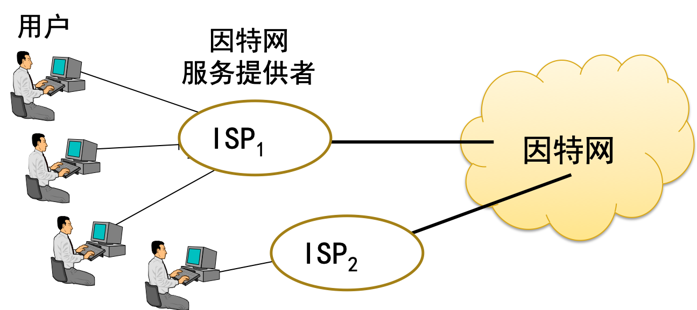
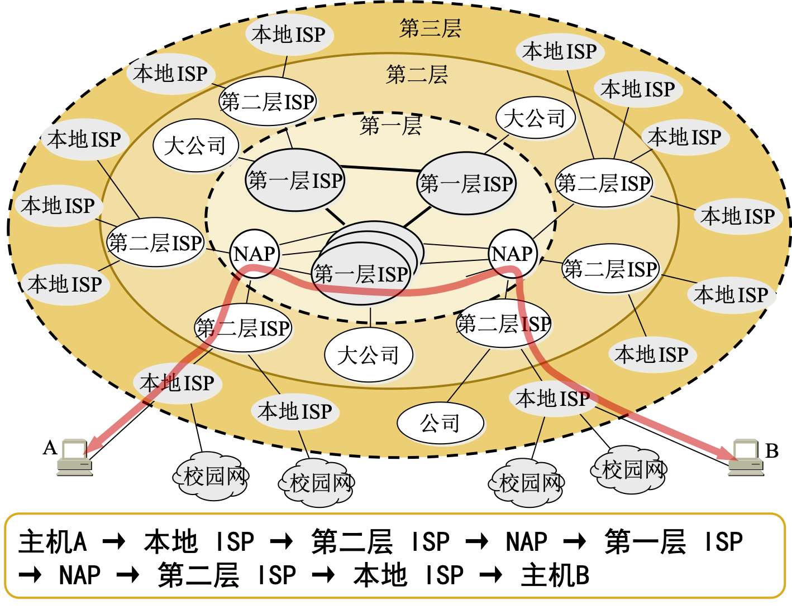
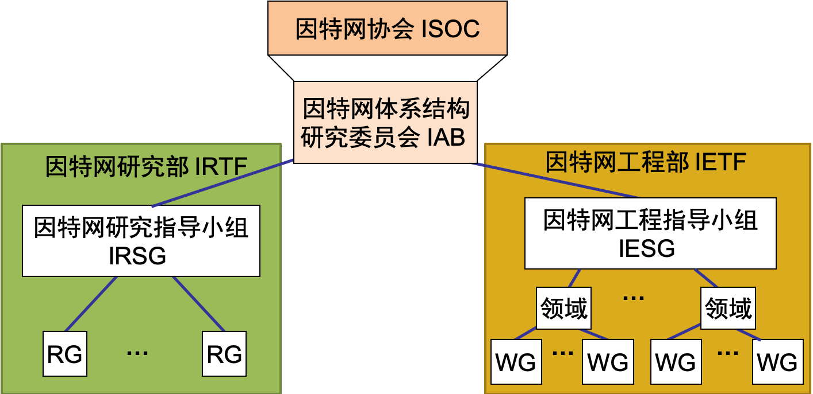
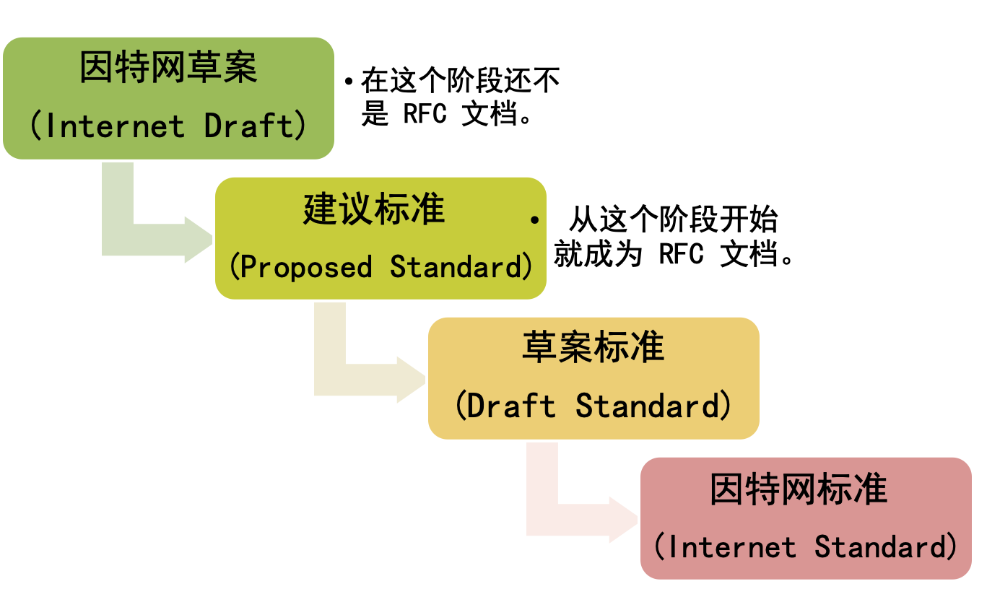
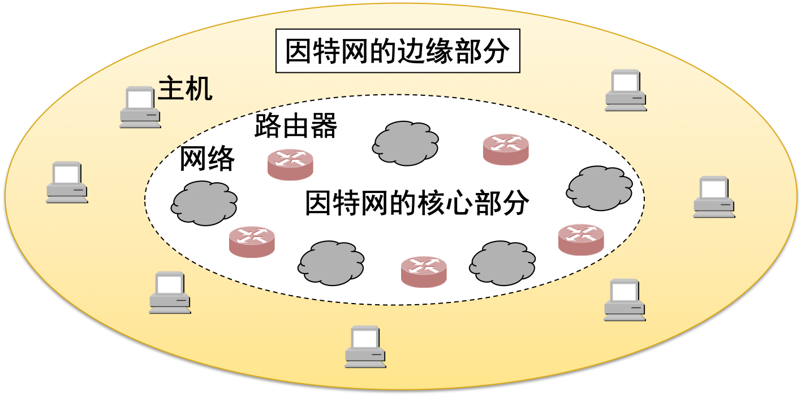

## 一、计算机网络在信息时代中的作用

21 世纪的一些重要特征就是**数字化、网络化和信息化**，它是一个**以网络为核心的信息时代**。

- 网络现已成为信息社会的命脉和发展知识经济的重要基础。
- 网络是指**“三网”**，即**电信网络、有线电视网络和计算机网络**。
- 发展最快的并起到核心作用的是**计算机网络**。    

### 因特网(Internet)的发展

进入20世纪90年代以后，以因特网为代表的计算机网络得到了飞速的发展。

已从最初的教育科研网络逐步发展成为商业网络

已成为仅次于全球电话网的世界第二大网络。

### 因特网的意义

- 因特网是自印刷术以来人类通信方面最大的变革。
- 现在人们的生活、工作、学习和交往都已离不开因特网。 

### 计算机网络向用户提供的最重要的功能 

- 连通性：计算机网络使上网用户之间都可以交换信息，好像这些用户的计算机都可以彼此直接连通一样。 
- 共享：即资源共享。可以是信息共享、软件共享，也可以是硬件共享。 

## 二、因特网概述

### 网络的网络

- 起源于美国的因特网现已发展成为世界上最大的国际性计算机互联网。 
- 网络(network)由若干结点(node)和连接这些结点的链路(link)组成。 
- 互联网是“网络的网络”(network of networks)。 
- 连接在因特网上的计算机都称为主机(host)。 

### 网络与因特网

- 网络：网络把许多计算机连接在一起。
- 因特网：因特网则把许多网络连接在一起。

### 因特网发展的三个阶段

1. 第一阶段是从单个网络ARPANET想互联网发展的过程
   - 1983年TCP/IP协议成为ARPANET上的标准协议。
   - 人们把1983年作为因特网的诞生时间。 
2. 第二阶段的特点是建成了三级结构的因特网。
   - 三级计算机网络，分为主干网、地区网和校园网（或企业网）。 
3. 第三阶段的特点是逐渐形成了多层次 ISP 结构的因特网
   - 出现了因特网服务提供者 ISP (Internet Service Provider)。

### 用户通过ISP上网

根据提供服务的覆盖面积大小以及所拥有的IP地址数目的不同，ISP也分成为不同的层次。 

### 万维网WWW的问世

因特网已经成为世界上规模最大和增长速率最快的计算机网络，没有人能够准确说出因特网究竟有多大。

因特网的迅猛发展始于 20 世纪 90 年代。由欧洲原子核研究组织 CERN 开发的万维网 WWW (World Wide Web)被广泛使用在因特网上，大大方便了广大非网络专业人员对网络的使用，成为因特网的这种指数级增长的主要驱动力。 

### 因特网的发展情况概况

||网络数|主机数|用户数|管理机构数
---|:---:|:---:|:---:|:---:
1980|10|$10^2$|$10^2$|$10^0$
1990|$10^3$|$10^5$|$10^6$|$10^1$
2000|$10^5$|$10^7$|$10^8$|$10^2$
2005|$10^6$|$10^8$|$10^9$|$10^3$

### 因特网的标准化工作

### 制定因特网的正式标准的四个阶段

## 三、因特网的组成

### 因特网的分类

从因特网的工作方式上看，可以划分为以下的两大块：

- 边缘部分：由所有连接在因特网上的主机组成。这部分是用户直接使用的，用来进行通信（传送数据、音频或视频）和资源共享。
- 核心部分：由大量网络和连接这些网络的路由器组成。这部分是为边缘部分提供服务的（提供连通性和交换）。

### 因特网的边缘部分

处在因特网边缘的部分就是连接在因特网上的所有的主机。这些主机又称为**端系统(end system)**。

> **“主机 A 和主机 B 进行通信”**，实际上是指：“运行在主机 A 上的某个程序和运行在主机 B 上的另一个程序进行通信”。
> 即“主机 A 的某个进程和主机 B 上的另一个进程进行通信”。或简称为“**计算机之间通信”** 

### 两种通讯方式

在网络边缘的端系统中运行的程序之间的通信方式通常可划分为两大类：

- 客户服务器方式（C/S方式），即Client/Server方式
- 对等方式（P2P方式），即Peer-to-Peer方式

### 因特网的核心部分

## 四、计算机网络在我国的发展

## 五、  计算机网络的类别
### 5.1  计算机网络的定义
### 5.2  几种不同类别的网络

## 六、计算机网络的性能

### 6.1  计算机网络的性能指标

## 七、计算机网络的体系结构

### 7.1  计算机网络体系结构的形成
### 7.2  协议与划分层次
### 7.3  具有五层协议的体系结构
### 7.4  实体、协议、服务和服务访问点
### 7.5  TCP/IP 的体系结构

