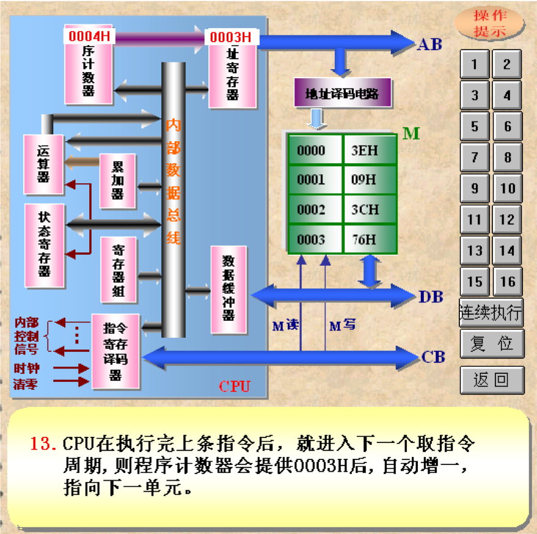

# 概述

## 一、计算机的发展

1946年2月15日世界上第一台电子计算机由美国宾夕法尼亚大学研制成功。尽管它重达30吨，占地170平方米，耗电140千瓦，用了18800多个电子管，每秒钟仅能做5000次加法.

 
### 计算机发展的四个阶段

||起止年代|主要元件|速度（次/秒）|特点与应用领域|
|---|---|---|---|---|
|第一代|1945~1958|真空管|5000～10000|体积巨大，运算速度较低，耗电量大，存储容量小。 应用领域：科学计算。|
|第二代|1958~1964|晶体管|几万～几十万|体积减小，耗电较少，运算速度较高，价格下降。 应用领域：科学计算、数据处理和事务管理、工业控制。|
|第三代|1964~1971|集成电路|几十万～几百万|体积、功耗进一步减少，可靠性及速度进一步提高。 应用领域：文字处理、企业管理、自动控制、城市交通管理等方面。|
|第四代|1971至今|超大规模集成电路|几千万～千百亿|性能大幅度提高，价格大幅度下降。 应用领域： 办公自动化、电子编辑排版、数据库管理、图像识别、语音识别、专家系统等各行各业。|

纵观计算机技术的发展历程，由于电子元器件的飞速发展，计算机性能得到了极大提高，其体积大大缩小，应用越来越普及。

### 微型计算机的发展

1. 20世纪70年代末，8位计算机开始走向16位机。
2. 20世纪80年代，微机进入32位机的发展阶段。
3. 20世纪90年代，微机进入64位机的发展阶段。
4. 21世纪初，逐步迈进64位计算时代。

### 计算机的发展概况

- 微型化：便携式、低功耗
- 巨型化：尖端科技领域的信息处理，需要超大容量、高速度
- 智能化：模拟人类大脑思维和交流方式，多种处理能力
- 系列化/标准化：便于各种计算硬、软件兼容和升级
- 网络化：网络计算机和信息高速公路
- 多机系统：大型设备、生产流水线集中管理（独立控制、故障分散、资源共享）

## 二、常用术语

- 指令:一条指令，对应着一种基本操作
- 指令系统：计算机所能执行的全部指令，就是计算机的指令系统（Instruction Set）
- 程序：在使用计算机时，必须把要解决的问题编成一条条指令。这些指令的集合就称为程序。

### 二进制电路

- 所有现代计算机都是基于二进制信息处理过程
- 二进制由两个数组成：0和1

### 字节与位

### 字长

- 位
- 字节：8位
  
- 字：2字节，16位
- 双字：4字节，32位
  

### 数量级

- u:$10^{-6}$
- M:$10^{-3}$
- K:$10^3$
- M:$10^6$
- G:$10^9$
- T:$10^{12}$

---

- $2^0=1$
- $2^1=2$
- $2^2=4$
- $2^3=8$
- $2^4=16$
- $2^5=32$
- $2^6=64$
- $2^7=128$
- $2^8=256$
- $2^9=512$
- $2^{10}=1024$

---

- $2^{10}$=Kilo
- $2^{20}$=Mega
- $2^{30}$=Giga
- $2^{40}$=Tera

---

- $2^{10}$ bytes=1KB
- $2^{20}$ bytes=1MB
- $2^{30}$ bytes=1GB
- $2^{40}$ bytes=1TB

---

- $2^{11}$ bytes=2KB
- $2^{22}$ bytes=4MB
- $2^{35}$ bytes=32GB
- $2^{47}$ bytes=128TB

---

- $2^{14}$ bits=16KB
- $2^{26}$ bits=64MB

# 微型计算机结构及工作原理

## 一、微处理器

### 微处理器及微型计算机的发展概况

- 第一代微处理器是以Intel公司1971年推出的4004，4040为代表的四位微处理机。 
- 第二代微处理器典型代表有：Intel 公司的8080、8085；Motorola公司的M6800以及Zlog公司的Z80。
- 第三代微处理器是以16位机为代表，基本上是在第二代微机的基础上发展起来的。其中Intel公司的8088。8086是在8085的基础发展起来的；M68000是Motorola公司在M6800 的基础发展起来的； 
- 第四代微处理器以Intel公司1984年10月推出的80386CPU和1989年4月推出的80486CPU为代表， 
- 第五代微处理器发展更加迅猛，1993年3月被命名为PENTIUM的微处理机面世，98年PENTIUM 2又被推向市场。

### 微处理机内部结构

### 微处理器的分类

- 根据处理数据的位数：
  - 4位
  - 8位
  - 16位
  - 32位
  - 64位
- 根据制造工艺：
  - MOS工艺的通用微处理器
  - 双极型TTL工艺的位片式微处理器

## 二、微型计算机

### 计算机组成

### 计算机的分类

- 单片型计算机
  - 智能化仪表
  - 智能化家电
  - 手持设备
- 单板型计算机
  - 专用机
- 多版型计算机
  - 工业控制机
  - 台式机
  - 工作站

## 三、微型计算机系统

## 四、指令的执行过程

# 微机系统中采用的先进技术

CISC 复杂指令集
RISC 简单指令集