# Intel系列微处理器概述

## Intel第一块CPU 4004

- 4位主理器
- 主频108kHz
- 运算速度0.06MIPs(Million Instructions Per Second, 每秒百万条指令)
- 集成晶体管2,300个
- 10微米制造工艺
- 最大寻址内存640 bytes
- 生产曰期1971年11月。

## CPU 8085

- 8位主理器
- 主频5M
- 运算速度0.37MIPs
- 集成晶体管6,500个
- 3微米制造工艺
- 最大寻址内存64KB
- 生产曰期1976年。

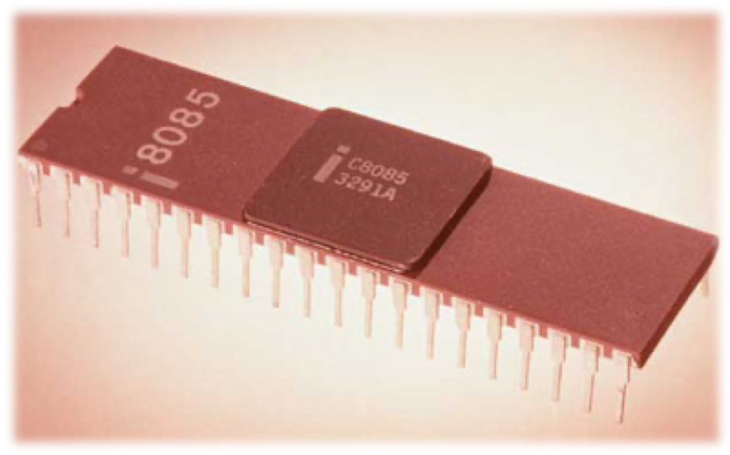

## CPU 8060

- 16位主理器
- 主频4.77/8/10MHZ
- 运算速度0.75MIPs
- 集成晶体管29,000个
- 3微米制造工艺
- 最大寻址内存1MB
- 生产曰期1978年6月。

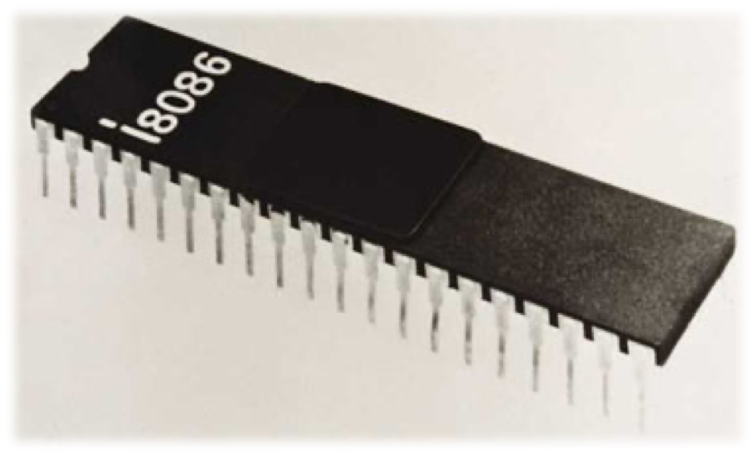

## CPU 80485DX

- 80486DX,DX2,DX4
- 32位主理器
- 主频25/33/50/66/75/100MHZ
- 总线频率33/50/66MHZ
- 运算速度20~60MIPs
- 集成晶体管1.2M个
- 1微米制造工艺
- 168针PGA
- 最大寻址内存4GB
- 缓存8/16/32/64KB
- 生产曰期1989年4月。

## Celeron(赛扬)一代

主频266/300MHZ(266/300MHz w/o L2 cache, Covington芯心 (Klamath based)
300A/333/366/400/433/466/500/533MHz w/128kB L2 cache, Mendocino核心 (Deschutes-based)
 总线频率66MHz
0.25微米制造工艺
生产曰期1998年4月)。

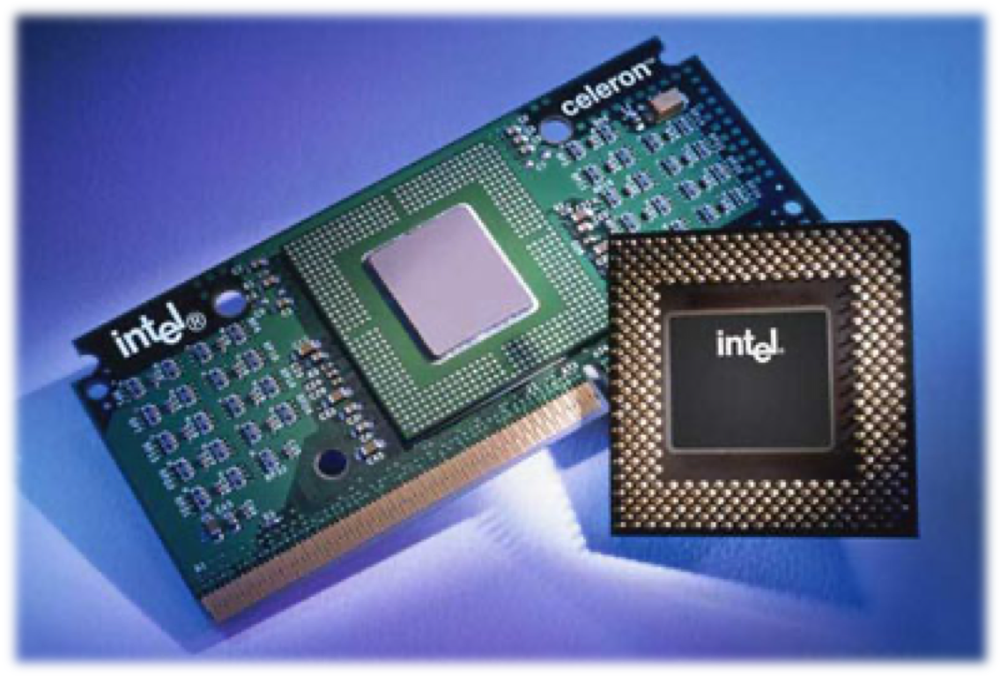

## Pentium(奔腾)4

- Pentium 4(478针),至今分为三种核心:
- Willamette核心(主频1.5G起,FSB400MHZ,0.18微米制造工艺)
- Northwood核心(主频1.6G~3.0G,FSB533MHZ,0.13微米制造工艺, 二级缓存512K)
- Prescott核心(主频2.8G起,FSB800MHZ,0.09微米制造工艺,1M二级缓存,13条全新指令集SSE3)
- 生产曰期2001年7月.

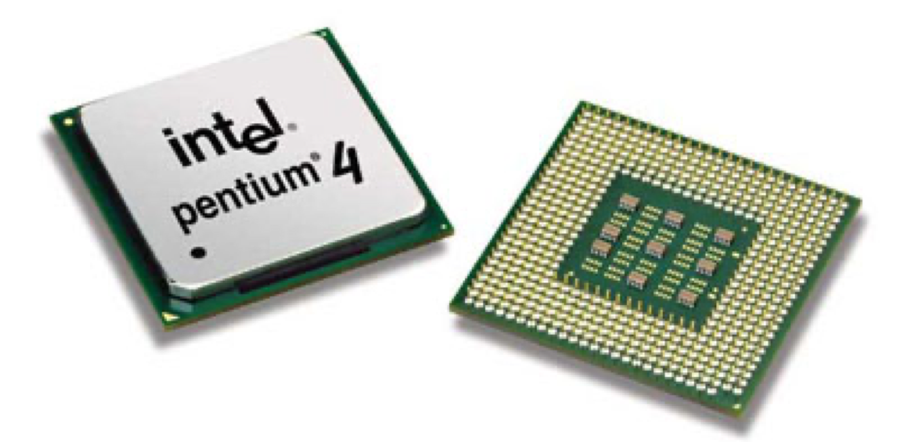

# 8086/8088微处理器

## 一、8086/8088编程结构

8086/8088由2部分组成

- 执行单元（EU，Execution Unit）
- 总线接口单元（BIU，Bus Interface Unit）

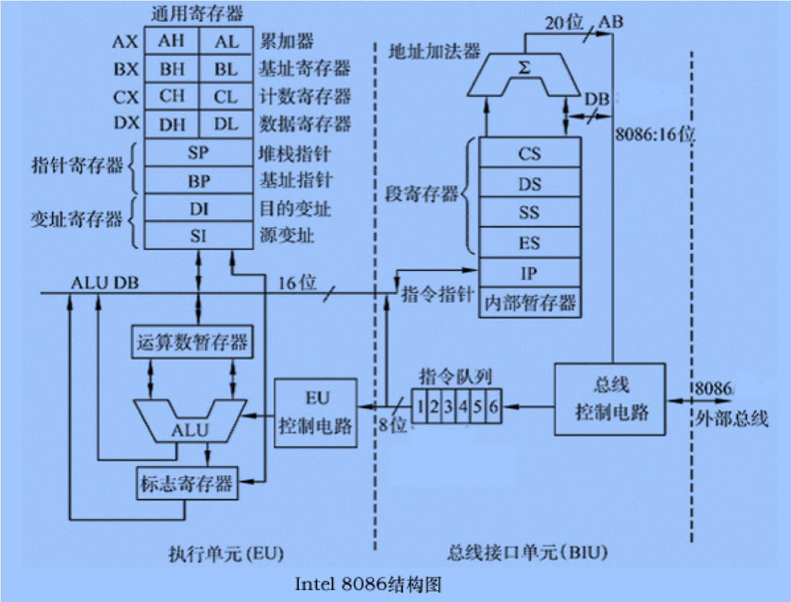

### 执行单元（EU）

主要功能是执行命令

**EU组成**

- 算数逻辑运算单元（ALU）
- 标志寄存器
- 通用寄存器组
- EU控制器

### 通用寄存器

- AX、BX、CX、DX（16位寄存器，可以当成2个8位）
- SP、BP、SI、DI

AX|AH|AL
---|---|---
BX|BH|BL
CX|CH|CL
DX|DH|DL
SI|
DI|
BP|
SP|

### 标志寄存器

- 状态标志：表示运算结果的特征
  - CF
  - PF
  - AF
  - ZF
  - SF
  - OF
- 控制标志：控制CPU的操作
  - IF
  - DF
  - TF

- 负标志SF（Sign Flag）：表示运算结果的符号，结果为负，SF=1；否则SF=0。
- 零标志ZF（Zero Flag）：当前运算结果为零，则ZF=1；否则ZF=0。
- 进位标志CF(Carry Flag)：当前运算出现进位或借位时，CF＝1；否则CF＝0。
- 辅助进位标志AF(Auxiliary Carry Flag)：当前运算第三位对第四位有进位或借位要求时，AF＝1；否则AF＝0。
- 溢出标志OF(Overflow Flag)：当前运算过程出现溢出时，OF＝1；否则OF＝0
- 奇偶校验标志位PF(Parity Flag)：PF＝1，表示本次运算结果中有偶数个“l”，PF＝0，表示本次运算结果中有奇数个“1”。
- 方向标志 DF(Direction Flag)：这是控制串操作指令用的标志。如果DF＝0，则串操作过程中地址会不断增值；反之，如果DF＝1，则串操作过程中地址会不断减值。
- 中断标志 IF(Interrupt Enable Flag)：这是控制可屏蔽中断的标志。如果IF＝0，则CPU不能对可屏蔽中断作出响应；如果IF＝1，则CPU可以接受可屏蔽中断的请求。
- 跟踪标志TF(Trap Flag)：如果TF＝1，则CPU按跟踪方式执行指令。

### 总线接口单元（BIU）

主要功能是形成访问存储器的物理地址、访问存储器并取指令暂存到指令队列中等待执行，访问存储器或I／O端口读取操作数参加EU运算或存放运算结果等

**BIU组成**

- 地址加法器
- 专用寄存器组
- 指令队列
- 总线控制电路

### 段寄存器

BIU设有4个16位段寄存器

- CS（Code Segment）：代码段寄存器中存放程序代码段起始地址的高16位。
- DS（Data Segment）：数据段寄存器中存放数据段起始地址的高16位。
- SS（Stack Segment）:堆栈段寄存器中存放堆栈段起始地址的高16位。
- ES（Extended Segment）:扩展段寄存器中存放扩展数据段起始地址的高16位。

### 指令指针寄存器 IP

IP BIU要取指令的地址

### EU和BIU的操作原则

- BIU中的指令队列有2个或2个以上字节为空时，BIU自动启动总线周期，取指填充指令队列。直至队列满，进入空闲状态。
- EU每执行完一条指令，从指令队列队首取指。系统初始化后，指令队列为空，EU等待BIU从内存取指，填充指令队列。
- EU取得指令，译码并执行指令。若指令需要取操作数或存操作结果，需访问存储器或I/O，EU向BIU发出访问总线请求。
- 当BIU接到EU的总线请求，若正忙（正在执行区指总线周期），则必须等待BIU执行完毕当前的总线周期，方能相应EU请求；若BIU空闲，则立即执行EU的申请总线的请求。
- EU执行转移、调用和返回指令时，若吓一跳指令不在指令队列中，则队列被自动清除，BIU根据本条指令执行的情况重新取指和填充指令队列。
- 空闲状态 

## 二、8086的工作模式与引脚定义

### 8086的工作模式

#### 最小模式

所谓最小模式，就是系统中只有Intel 8086一个微处理器。在这种系统中，所有的总线控制信号都直接由 Intel 8086产生，因此，系统中的总线控制逻辑电路也减到最小。

#### 最大模式

最大模式是相对最小模式而言的。最大模式用在中型规模或大型规模的8086系统中。在最大模式系统中， 部分总线控制信号由辅助电路提供，系统中除一个8086微处理器以外，还可以包含有其它一个或多个 协处理器，如8087和8089。

### 8086的引脚定义

8086是16位CPU，它采用高性能的N—沟道，耗尽型负载的硅栅工艺(HMOS)制造。由于受当时制造工艺的限制，部分管脚采用了分时复用的方式，构成了40条管脚的双列直插式封装。

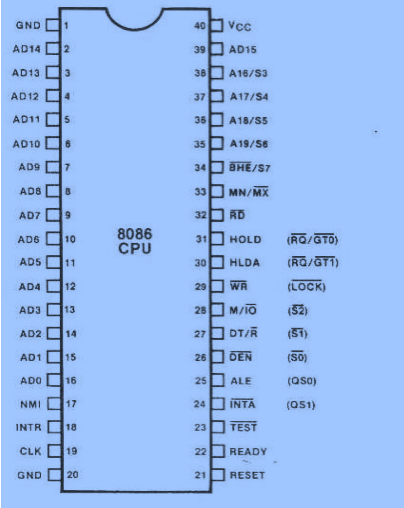

- 24-31：左侧侧最小模式；右侧最大模式
- 36：地址A16，S5 两种功能
- 33：MN/MX，低有效 0-决定最大模式；1-还是最小模式
- A-地址、S-状态、D-数据

### 三总线结构

- 数据线DB
- 控制线CD
- 地址线AB

### 最小模式下的引脚说明

#### AD15～AD0 (Address Data Bus)

- 地址/数据复用信号，双向，三态。
- 在T1状态（地址周期）AD15～AD0上为地址信号的低16位A15～A0；
- 在T2 ～ T3状态（数据周期）AD15～AD0 上是数据信号D15～D0。 

#### A19/S6～A16/S3 (Address/Status)

地址/状态复用信号，输出。在总周期的T1状态A19/S6～A16/S3上是地址的高4位。在T2～T4状态，A19/S6～A16/S3上输出状态信息。

$S_4$|$s_3|当前正在使用的段寄存器
---|---|---
0|0|ES
0|1|SS
1|0|CS或未使用任何段寄存器
1|1|DS

#### BHE# /S7 (Bus High Enable/Status)

- 数据总线高8位使能和状态复用信号，输出。在总线周期T1状态，BHE#有效，表示数据线上高8位数据有效。在T2～T4状态BHE # /S7 输出状态信息S7。S7在8086中未定义。
- 注： #代表低有效

#### RD#(Read)  

读信号， 三态输出，低电平有效，表示当前CPU正在读存储器或I／O端口。

#### WR# (Write) 

写信号，三态输出，低电平有效，表示当前CPU正在写存储器或I／O端口。

#### M／IO# (Memory／IO )

存储器或I／O端口访问信号。三态输出，M／IO#为高电平时，表示当前CPU正在访问存储器，M／IO# 为低电平时，表示当前CPU正在访问I／O端口。

#### READY

准备就绪信号。由外部输入，高电平有效，表示CPU访问的存储器或I／O端口己准备好传送数据。当READY无效时，要求CPU插入一个或多个等待周期Tw，直到READY信号有效为止。

#### INTR( Interrupt Request)

中断请求信号，由外部输入，电平触发，高电平有效。INTR有效时，表示外部设备向CPU发出中断请求，CPU在每条指令的最后一个时钟周期对INTR进行测试，一旦测试到有中断请求，并且当中断允许标志IF＝1时，则暂停执行下条指令转入中断响应周期。

#### INTA# (Interrupt Acknowledge) 

中断响应信号。向外部输出，低电平有效，表示CPU响应了外部发来的INTR信号

#### NMI( Non—Maskable Interrupt Request)

不可屏蔽中断请求信号。由外部输入，边沿触发，正跳沿有效。CPU一旦测试到NMI请求信号，待当前指令执行完就自动从中断入口地址表中找到类型2中断服务程序的入口地址，并转去执行。 

#### TEST#

测试信号。由外部输入，低电平有效。当CPU执行WAIT指令时(WAIT指令是用来使处理器与外部硬件同步)，每隔5个时钟周期对TEST进行一次测试，若测试到该信号无效，则CPU继续执行WAIT指令，即处于空闲等待状态；当CPU测到TEST输入为低电平时，则转而执行WAIT的下一条指令。由此可见，TEST对WAIT指令起到了监视的作用。

#### RESET

复位信号。由外部输入，高电平有效。RESET信号至少要保持4个时钟周期，CPU接收到该信号后，停止进行操作，并对标志寄存器(FR)、IP、DS、SS、ES及指令队列清零，而将CS设置为FFFFH。当复位信号变为低电平时，CPU从FFFF0H开始执行程序，由此可见，采用8086CPU计算机系统的启动程序就保持在开始的存储器中。

#### ALE(Address Latch Enable)

地址锁存使能信号，输出，高电平有效。用来作为地址锁存器的锁存控制信号

#### DEN# (Data Enable)

数据使能信号，输出，三态，低电平有效。用于数据总线驱动器的控制信号。

#### DT/R#(Data Transmit/Receive)

数据驱动器数据流向控制信号，输出，三态。在8086系统中，通常采用8286或8287作为数据总线的驱动器，用DT/R#信号来控制数据驱动器的数据传送方向。当DT/R#＝1时，进行数据发送；DT/R#＝0时，进行数据接收。

#### HOLD(Hold Request) 

总线请求信号。由外部输入，高电平有效器向CPU请求使用总线

#### HLDA(Hold Acknowledge) 

共享总线的处理总线请求响应信号。向外部输出，高电平有效

#### MN/MX＃(Minimum/Maximum Mode Control)

最大最小模式控制信号，输入。MN/MX＃＝1（＋5V），CPU工作在最小模式。MN/MX＃＝0（接地）， CPU则工作在最大模式。 

#### GND     地

#### VCC     电源，接＋5V

### 最大模式下的引脚说明

#### 当8086CPU工作在最大模式系统时，有8个管脚重新定义 。

- S2#、S1#、S0#（Bus Cycle Status，最小模式为M/IO#、D/TR#、DEN#）
- 总线周期状态信号，输出。这三个信号的组合表示当前总线周期的类型。在最大模式下，由这三个信号输入给总线控制器8288，用来产生存储器、I/O的读写等相关控制信号。如下表： 

S2#|S1#|S0#|CPU状态|8288命令
---|---|---|----|---
0|0|0|中断响应 |INTA#
0|0|1|读I/O端口 |IORC#
0|1|0|写I/O端口 |IOWC# AIOWC#
0|1|1|暂停 |无
1|0|0|取指令 |MRDC#
1|0|1|读存储器 |MRDC#
1|1|0|写存储器 |MWTC# AMWC#
1|1|1|无作用 |无

#### LOCK#   封锁信号

三态输出，低电平有效。LOCK有效时表示CPU不允许其它总线主控者占用总线。这个信号由软件设置。当在指令前加上LOCK前缀时，则在执行这条指令期间LOCK保持有效，即在此指令执行期间，CPU封锁其它主控者使用总线。
    
#### RQ#/GT0#，RQ#/GT1#  (Request／Grant)

总线请求信号请求／同意信号。双向，低电平有效，当该信号为输入时表示其它主控者向CPU请求使用总线；当为输出时表示CPU对总线请求的响应信号。两条线可同时与两个主控者相连，同时,RQ#/GT0#优先级高于RQ#/GT1#。

#### QS1、QS0(Instruction Queue Status，最小模式为ALE、INTA#)

指令队列状态信号，输出。QS1,QS0组合起来表示前一个时钟周期中指令队列的状态，以便从外部对芯片的测试。

QS1|QS0|编码含义
---|---|---
0|0|无操作
0|1|从队列中取第一个字节
1|0|队列已空
1|1|从队列中取后续字节

## 三、8086的时序与总线周期

### 时序概念

微处理器引脚上信号的输出，是与时间有关的。在不同的时段，各引脚上信号的输出是不相同 的。这些信号都受一个统一的时钟信号控制，也就是说，微处理器是在时钟脉冲的统一控制下，一个节拍一个节拍地工作的。

### 周期概念

**时钟周期(Clock Cycle)**：也称为T状态，是微处理器动作处理的最小时间单位。时钟周期值的大小是由系统时钟确定的

**总线周期(Bus Cycle)**：指微处理器对存储器或I/O端口完成一次读写所需要的时间。总线周期也称为机器周期

**指令周期(Instruction Cycle)**：反映了执行一条指令所需要的时间。

### 读总线时序

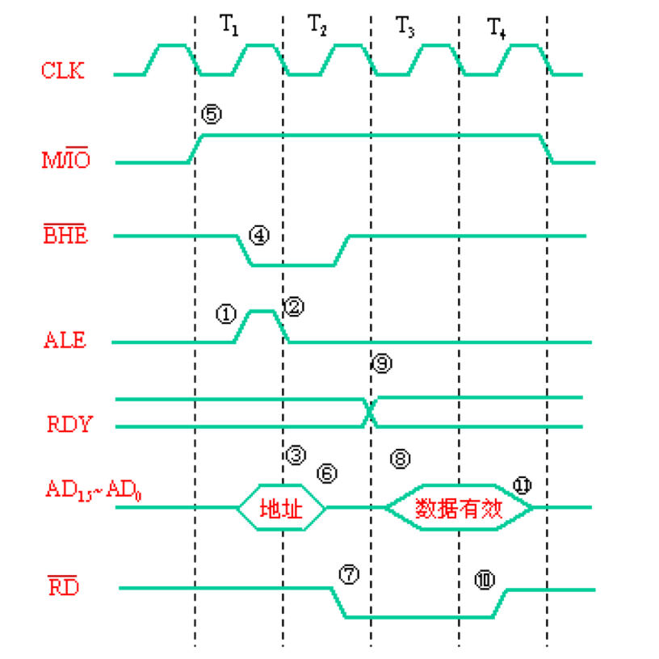

- T1：提供地址
- T2：读信号有效
- T3：数据有效
- T4：读操作结束

### 写总线周期

- T1：提供地址
- T2：写信号有效
- T3：数据有效
- T4：写操作结束

### 中断相应周期

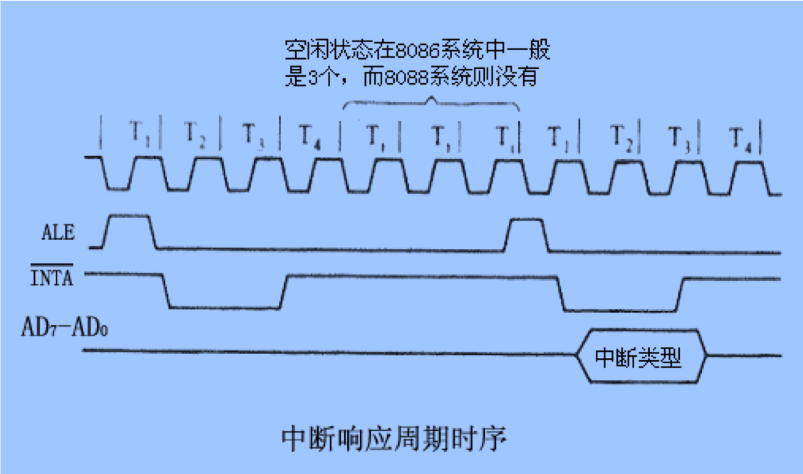

### 总线保持时序

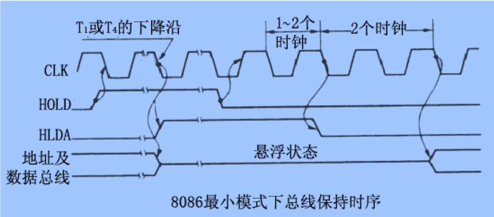

### 系统复位时序

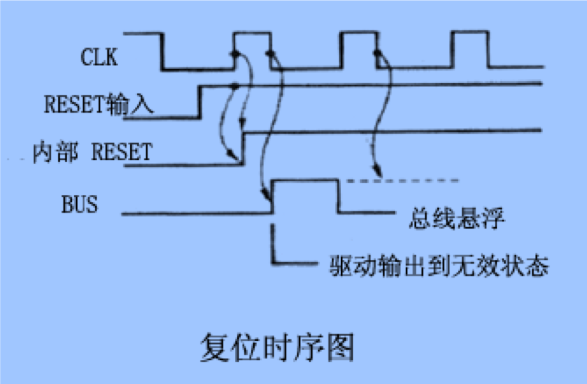

## 四、8086的系统组织

## 最小模式下的系统组织

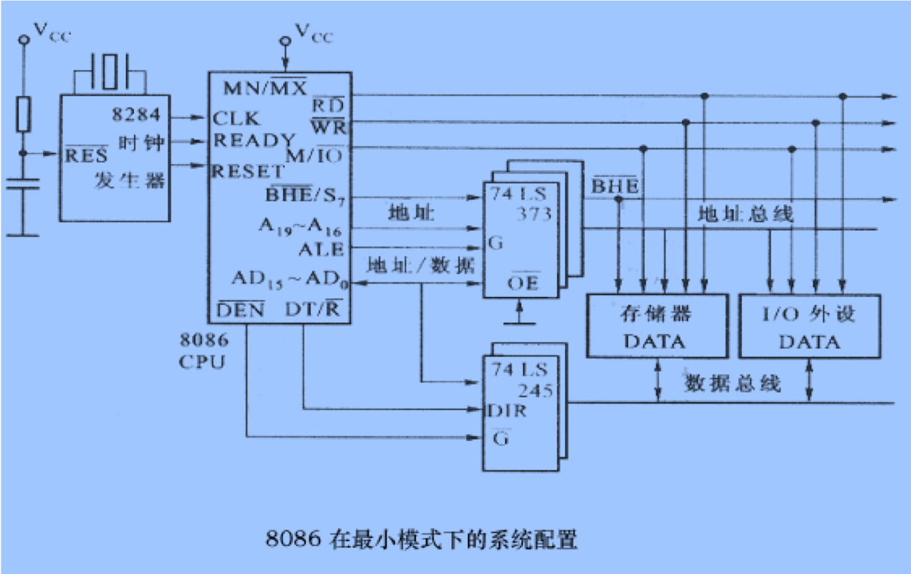

- 8086CPU：上图最大的那个
- 地址锁存缓冲器：3片74LS 373地址锁存器 8086有20位地址，一片能保存8位，20位需要3片       
- 双向数据缓冲期：数据收发器，2片74LS245对外提供16位，一片提供8位
- 8284A时钟发生器

## 最大模式下的系统组织

- 8086CPU
- 8087协处理器（可选）
- 地址锁存缓冲器
- 双向数据缓冲期
- 8284A时钟发生器
- 总线控制器8288

# 80286到pentium（奔腾）系列微处理器 

