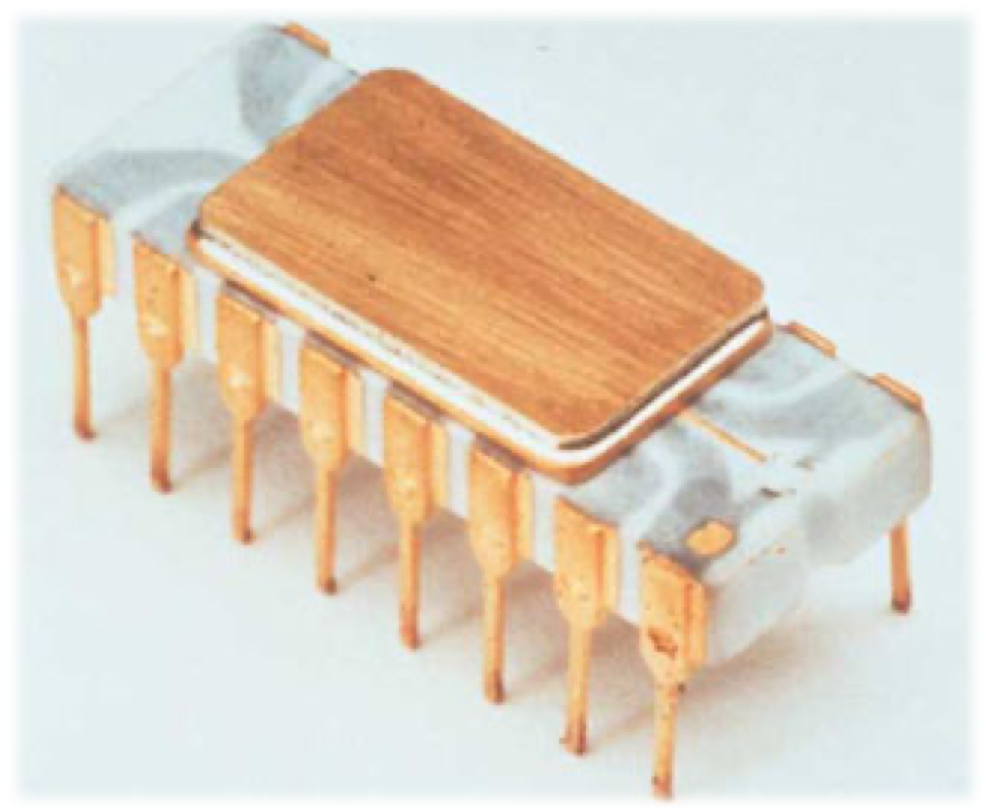

# 计算机存储器概念

## 一、计算机存储器概述

### 1.1 微信计算机中存储器的分类

### 1.2 半导体存储器的分类

### 1.3 半导体存储器的性能指标

1. 存取速度要快
2. 存储容量要打
3. 功耗要低
4. 体积要小、重量要轻
5. 可靠性要好
6. 存取操作要方便

#### 存储芯片的容量：芯片所能存储的二进制的位数

- 存储芯片容量=单元数*数据位数
- 2K*8的Intel 6116芯片容量为16Kbit/片

### 1.4 存储卡技术介绍

- CF卡
- SM卡
- MMC卡
- SD卡
- MS卡
- XD卡
- TF卡

# 半导体存储器结构与原理

## 2.1 半导体存储器的基本组成

存储体是由一系列按行/列排列的基本存储单元所组成，不同性质的半导体存储器，其基本存储单元电路有所不同。

## 2.2 随机存储器RAM

## 2.3 只读存储器ROM

## 2.4 非易失读/写存储器

# 半导体存储器接口设计

# 80x86存储器结构

