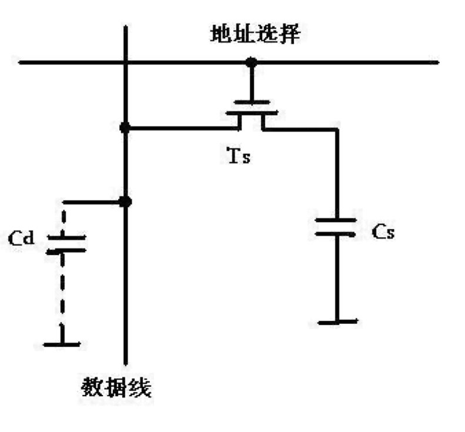

# 计算机存储器概念

## 一、计算机存储器概述

### 1.1 微信计算机中存储器的分类

### 1.2 半导体存储器的分类

### 1.3 半导体存储器的性能指标

1. 存取速度要快
2. 存储容量要打
3. 功耗要低
4. 体积要小、重量要轻
5. 可靠性要好
6. 存取操作要方便

#### 存储芯片的容量：芯片所能存储的二进制的位数

- 存储芯片容量=单元数*数据位数
- 2K*8的Intel 6116芯片容量为16Kbit/片

### 1.4 存储卡技术介绍

- CF卡
- SM卡
- MMC卡
- SD卡
- MS卡
- XD卡
- TF卡

# 半导体存储器结构与原理

## 2.1 半导体存储器的基本组成

存储体是由一系列按行/列排列的基本存储单元所组成，不同性质的半导体存储器，其基本存储单元电路有所不同。

- 地址译码器根据输入地址来选择存储单元
- I/O电路结余数据总线与被选中的单元之间，用于控制被选中单元的读出或写入
- 片选择控制电路用于控制本芯片是否被选中
- 输出驱动电驴通常是三态输出，既便与连接数据总线，又具有驱动功能。

地址译码器有两种方式：一是单译码方式或称字结构，适用于小容量存储器中；另一种是双译码，或称复合译码结构

采用双译码结构，可以减少选择线的数目。在双译码结构中，地址译码器分为两个。若每一个有n/2个输入端，他可以有$2^{n/2}$个输出状态，两个地址译码器就共有$2^{n/2} \times 2^{n/2} = n^n$个输出状态。而译码输出线却只有$2^{n/2} + 2^{n/2} = 2 \times 2^{n/2}$根

### 单译码结构

### 双译码电路

## 2.2 随机存储器RAM

### 随机存储器RAM

读写存储器，可以随时对任一存储单元进行读或写操作。

- 静态RAM
- 动态RAM

### 静态RAM

#### 静态RAM特点

1. 触发器作为基本存储电路
2. 集成度高于双极型，但低于动态RAM
3. 不需要刷新，故可省去刷新电路
4. 功耗比动态RAM高
5. 存取速度较动态RAM快
6. 易于用电池作为后备电源（RAM的一个重大问题是当电源去掉后，RAM中的信息就会丢失。为了解决这个问题，就要求当交流电源掉电时，能自动地转换到一个用电池供电的低压后备电源，以保持RAM中的信息）

### 动态RAM

#### 动态RAM特点

1. 基本存储电路用单管线路组成（靠电容存储电荷）
2. 集成度高
3. 比静态RAM的功耗更低
4. 价格比静态便宜
5. 因动态存储器靠电容来存储信息，由于总是存在着泄漏电流，故需要定时刷新。典型的是要求每隔1ms刷新一遍。	

## 2.3 只读存储器ROM

- 掩膜式ROM   
- 可编程的PROM
- 可用紫外线擦除、可编程的EPROM 

### EPROM

## 2.4 非易失读/写存储器

### 电可擦除、可编程的只读存储器（E2PROM——Electrically Erasable Programmable ROM）

- 编程与擦除所用的电流是极小的
- E2PROM的另一个优点是擦除可以按字节分别进行（不像EPROM擦除时把整个芯片的内容全变为“1”）

### 闪速存储器

- 编程可以使用字节、字和长字操作；
- 可以通过JTAG、BSL和ISP进行编程；
- 100K的擦除/编程周期；
- 数据保持时间从10年到100年不等；
- 可编程次数从100到100,000次；
- 60K空间编程时间<5秒；

# 半导体存储器接口设计

# 80x86存储器结构

