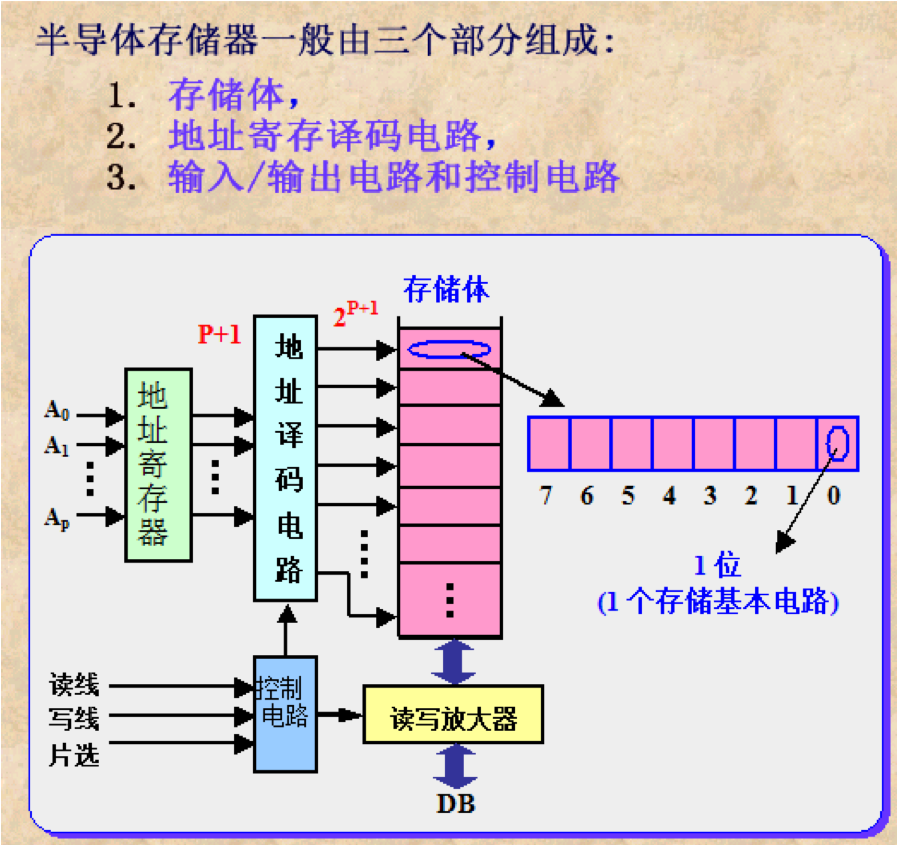

# 一、计算机存储器概念

## 1.1 微信计算机中存储器的分类

## 1.2 半导体存储器的分类

## 1.3 半导体存储器的性能指标

1. 存取速度要快
2. 存储容量要大
3. 功耗要低
4. 体积要小、重量要轻
5. 可靠性要好
6. 存取操作要方便

### 存储芯片的容量：芯片所能存储的二进制的位数

- 存储芯片容量=单元数*数据位数
- 2K*8的Intel 6116芯片容量为16Kbit/片

## 1.4 存储卡技术介绍

- CF卡
- SM卡
- MMC卡
- SD卡
- MS卡
- XD卡
- TF卡

# 二、半导体存储器结构与原理

## 2.1 半导体存储器的基本组成

存储体是由一系列按行/列排列的基本存储单元所组成，不同性质的半导体存储器，其基本存储单元电路有所不同。

- 地址译码器根据输入地址来选择存储单元
- I/O电路结余数据总线与被选中的单元之间，用于控制被选中单元的读出或写入
- 片选择控制电路用于控制本芯片是否被选中
- 输出驱动电驴通常是三态输出，既便与连接数据总线，又具有驱动功能。

地址译码器有两种方式：一是单译码方式或称字结构，适用于小容量存储器中；另一种是双译码，或称复合译码结构

采用双译码结构，可以减少选择线的数目。在双译码结构中，地址译码器分为两个。若每一个有n/2个输入端，他可以有$2^{n/2}$个输出状态，两个地址译码器就共有$2^{n/2} \times 2^{n/2} = n^n$个输出状态。而译码输出线却只有$2^{n/2} + 2^{n/2} = 2 \times 2^{n/2}$根

### 单译码结构

### 双译码电路

## 2.2 随机存储器RAM

### 随机存储器RAM

读写存储器，可以随时对任一存储单元进行读或写操作。

- 静态RAM
- 动态RAM

### 静态RAM

#### 静态RAM特点

1. 触发器作为基本存储电路
2. 集成度高于双极型，但低于动态RAM
3. 不需要刷新，故可省去刷新电路
4. 功耗比动态RAM高
5. 存取速度较动态RAM快
6. 易于用电池作为后备电源（RAM的一个重大问题是当电源去掉后，RAM中的信息就会丢失。为了解决这个问题，就要求当交流电源掉电时，能自动地转换到一个用电池供电的低压后备电源，以保持RAM中的信息）

### 动态RAM

#### 动态RAM特点

1. 基本存储电路用单管线路组成（靠电容存储电荷）
2. 集成度高
3. 比静态RAM的功耗更低
4. 价格比静态便宜
5. 因动态存储器靠电容来存储信息，由于总是存在着泄漏电流，故需要定时刷新。典型的是要求每隔1ms刷新一遍。	

## 2.3 只读存储器ROM

- 掩膜式ROM   
- 可编程的PROM
- 可用紫外线擦除、可编程的EPROM 

### EPROM

## 2.4 非易失读/写存储器

### 电可擦除、可编程的只读存储器（E2PROM——Electrically Erasable Programmable ROM）

- 编程与擦除所用的电流是极小的
- E2PROM的另一个优点是擦除可以按字节分别进行（不像EPROM擦除时把整个芯片的内容全变为“1”）

### 闪速存储器

- 编程可以使用字节、字和长字操作；
- 可以通过JTAG、BSL和ISP进行编程；
- 100K的擦除/编程周期；
- 数据保持时间从10年到100年不等；
- 可编程次数从100到100,000次；
- 60K空间编程时间<5秒；

# 三、半导体存储器接口设计

## 3.1 三种总线的连接

- **数据线**：系统的数据总线与存储器的数据线相连接。
- **地址线**：系统的地址总线一部分用于选择存储器芯片而与存储器芯片的片选信号相连接，另一部分用于选择存储器芯片内的某一存储单元而与存储器芯片的地址线引脚相连接。
- **控制线**：系统控制总线的读写控制线等直接与存储器芯片的控制线相连接。一般CPU的写信号线连接存储器芯片的写信号控制线，CPU的读信号线连接存储器芯片的输出控制信号线。

## 3.2 多种存储器芯片的组合

多片存储器芯片的组合，是为了满足CPU数据线宽度的需要。如，1024＊1的存储器芯片与8位CPU的连接。由于每片存储器芯片只有1位数据线，因此需要8片存储器芯片，才能满足CPU的8位数据线的要求，每一片存储器芯片连接1位数据线。

### 存储器芯片的并联组合

- 连接特点：8片芯片为1组，一旦选中，则同时工作，或者输入，或者输出。
- 数据线：每片存储器芯片数据线连至CPU不同位的数据线。
- 地址线：每片地址线的连接都相同，与CPU的地址线相连接。
- 控制线：每片的控制线连接都是相同。读写控制线连CPU的读写控制线。

多片存储器芯片的组合，是为了提供CPU更大的存储空间。例如，2片6264静态RAM构成16K的存储器。

- 连接特点：CPU用高位地址选择存储器芯片，用低位地址选择存储器芯片中的存储单元。同一时刻，CPU访问一个存储器芯片中的一个存储单元。
- 数据线：存储器芯片的数据线与CPU的数据线直接相连。
- 地址线：存储器芯片的地址线与CPU低位地址线直接相连，用于选择芯片内的存储单元。
- 控制线：存储器的读写控制线与CPU的读写控制线直接相连，存储器的片选信号线由高位地址线经译码产生

当一片存储器芯片无论在数据位宽度还是在存储容量的寻址范围上不能满足CPU的寻址要求时，就需要同时考虑存储器芯片的串联和并联。

- 连接特点：若干片存储器芯片组成一组，满足数据线宽度的并联，若干组串联组合满足CPU的地址范围要求。
- 数据线：组内数据线遵守并联规则，组间数据线遵守串联规则。
- 地址线：存储器芯片的地址线与CPU低位地址线直接相连，用于选择芯片内的存储单元。
- 控制线：存储器的读写控制线与CPU的读写控制线直接相连，组内存储器片选信号线合并连接至高位地址线经译码输出，不同组的片选连接不同的地址译码输出。

## 3.3 地址译码

### 地址译码的作用

地址和存储单元一一对应，CPU在存储器访问期间输出需要访问的存储单元地址，地址译码电路确定对应存储单元。

### 地址译码的一般方法

CPU输出的地址线分两部分：地址的低位部分用于选择存储器芯片内部的存储单元，地址的高位部分用于选择不同地址区域的存储器芯片。具体连接要求：CPU低位地址线部分直接连接存储器芯片的地址线，CPU高位地址线部分连接片选的地址译码器。
 
### 用于片选的地址译码器

CPU高位地址线连接译码器的输入，译码器输出连接存储器的片选输入，确定地址范围。 

### 例：用8K＊8的存储器芯片组成的16KB RAM电路，低位地址线A12－A0直接连至每一片的6264芯片的地址输入端，高位地址线经译码以后产生片选信号，分别连接到2片6264的片选输入端。

地址译码器74LS138是一个常用的3－8译码器，当地址A19－A16＝1110时，该译码器选中，也就是说，该译码器 Y7－Y0输出的地址范围为E0000H－EFFFFH。其中：当A15－A13＝000时，Y0输出有效，其地址范围为 E0000H－E1FFFH；当A15－A13＝001时，Y1输出有效，其地址范围为E2000H－E3FFFH。

## 3.4 控制信号的连接注意事项

CPU的写信号与RAM芯片的写信号相连，CPU的读信号与RAM芯片的读信号或输出控制信号相连接。如果某些RAM芯片的读写控制信号是合为一根信号线的，则可根据其电平要求连CPU的写信号线或读信号线。

# 四、80x86存储器技术

## 虚拟存储器介绍

虚拟存储管理技术，使一个进程的逻辑地址空间远大于实际的主存空间时，仍能正常地运行进程。要正确地了解虚拟存储器的概念，首先要分清进程运行时访问的地址空间和主存的实际地址空间。

目标程序中指令和数据放置的位置，称为相对地址或逻辑地址，它不同于CPU能直接访问的主存的物理地址空间。前者是逻辑上的而非物理上的存储空间，而后者是程序在执行时实际存放其指令和数据的物理空间。

在需存管理中，把一个进程访问的地址成为“虚拟地址（逻辑地址）”，而处理机可以直接访问的主存地址称为“实地址（物理地址）”。

把一个进程可访问的虚拟地址的集合成为“虚拟地址空间”；而把一个计算机所实际配置的主存成为“实地址空间（物理地址空间）”。

为了是进程能运行，就必须把虚拟地址空间中的指令和数据放入到主存的实地址空间中去，建立虚地址与实地址的映射关系，也就是要由虚拟地址转换到物理地址。这种转换由虚存管理中的动态地址映射机制来实现。

实际上，程序只需要有一部分在主存中就可以正确地执行，只需要把最近要用到的那部分程序和数据装入主存，以后要用到别的部分时，把那部分调入，而把不用的部分调出主存。这种调入和调出工作是由具有虚拟存储器功能的操作系统实现的。