# 一、微信计算机接口结构与功能

## 1.1 接口的基本结构

**CPU与外设通信特点**

- 需要有接口作为CPU与外设通讯的桥梁
- 需要有数据信息传送之前的“联络”
- 要传递的信息有三方面内容：状态、数据及控制信息

接口电路通常包含一组能够与处理器交换信息的寄存器或缓冲器，称为I/O端口。

- 数据端口：存放数据信息
- 状态端口：存放状态信息，即反应外设当前工作状态的信息
- 控制端口：存放控制信息

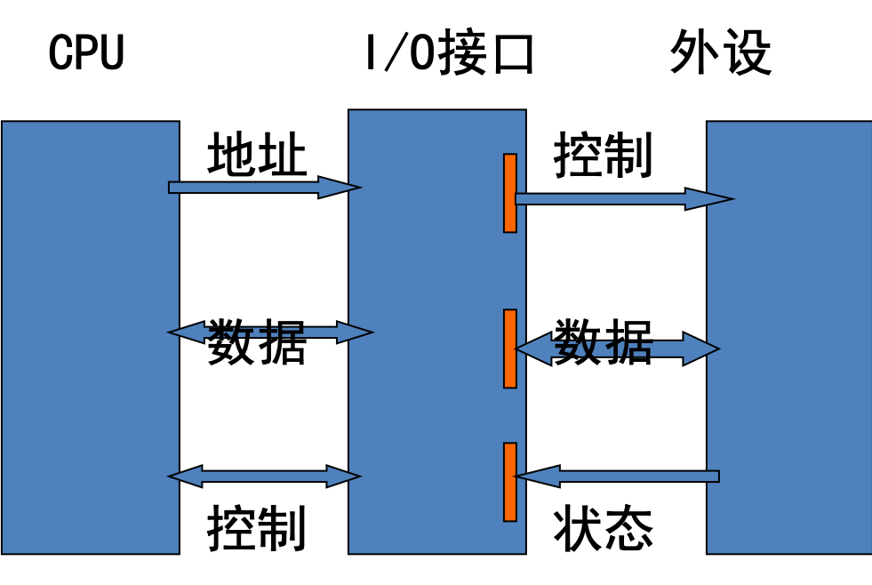

## 1.2 接口的功能

- 进行数据格式转换，如正负逻辑的转换，串行与并行数据转换等
- 状态信息的应答，以协调数据传送之前的准备工作
- 进行中断管理，提供中断信号
- 进行电平转换，如TTL电平与MOS电平间的转换
- 协调速度

--- 

- 时序控制，提供实时时钟信号
- 进行地址译码或设备选择，以便使CPU能与某一指定的外部设备通讯
  - 独立编址：I/O端口地址与存储单元地址分开编址 
  - 统一编址：存储单元和I/O端口的地址统一编址

### 独立编制

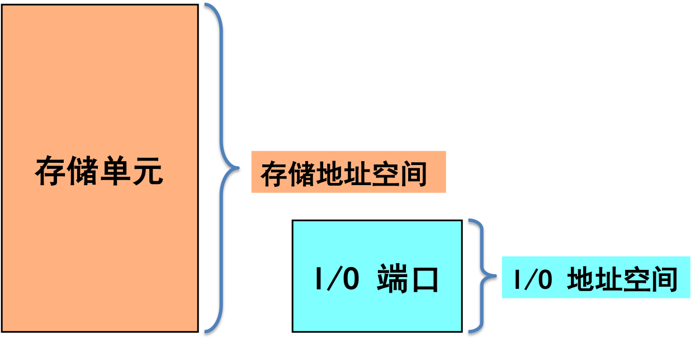

#### 这种编址方式的优点是

1. I/O端口不占用存储器地址，故不会减少用户的存储器地址空间；
2. 采用单独的I/O指令，使程序中I/O操作和其他操作层次清晰，便于理解。

### 统一编址

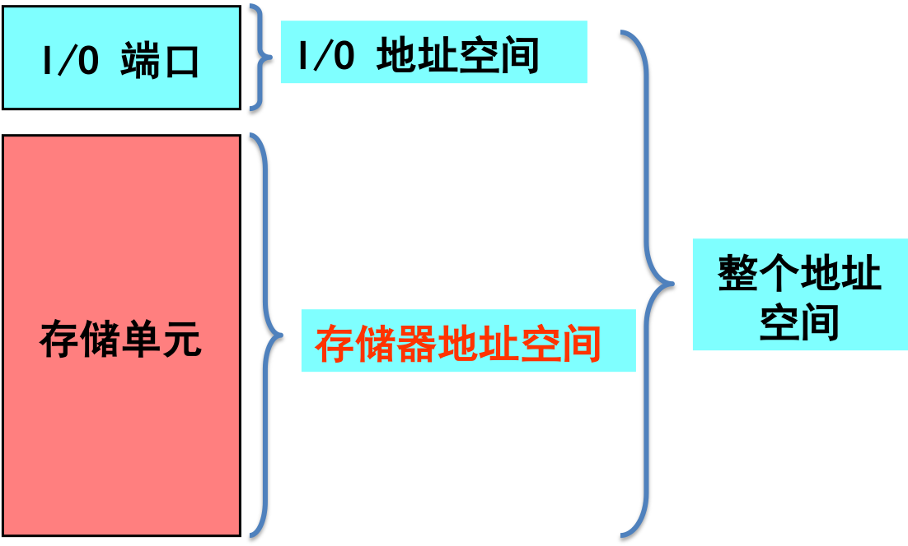

#### 这种编址方式的优点

可以用访向存储器的指令来访问I/O端口，而访问存储器的指令功能比较强，不仅有一般的传送指令，还有算术、逻辑运算指令，以及各种移位、比较指令等，并且可以实现直接对I/O端口内的数据进行处理。

#### 缺点是

由于I/O端口占用了一部分存储器地址空间，因而使用户的存储地址空间相对减小。另外不利于程序阅读。

# 二、微处理器与外设数据传输控制方式

1. 直接程序传输
2. 查询程序传输
3. 中断传输
4. DMA传输

## 2.1 直接程序传输

CPU直接与外设传送数据并不需要了解外设状态，认为外设已经准备就绪，直接与外设传送数据。

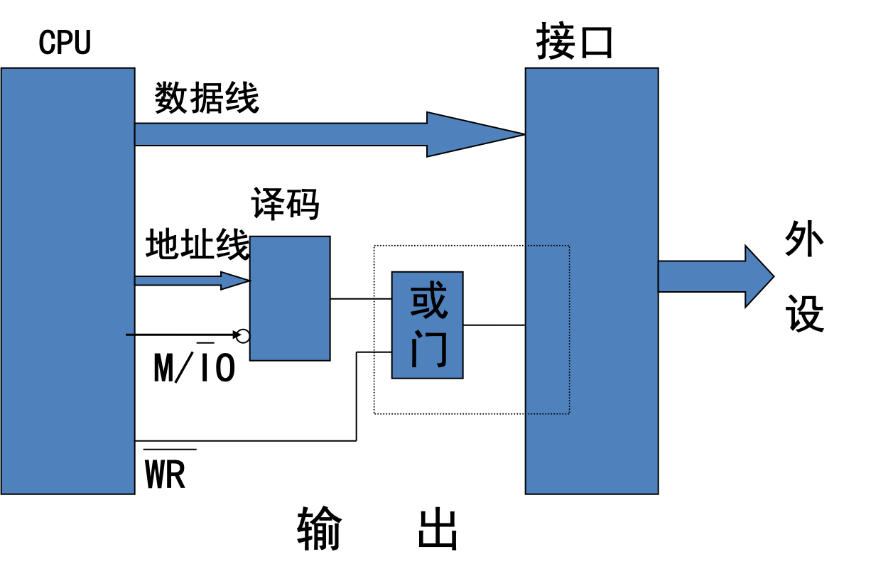
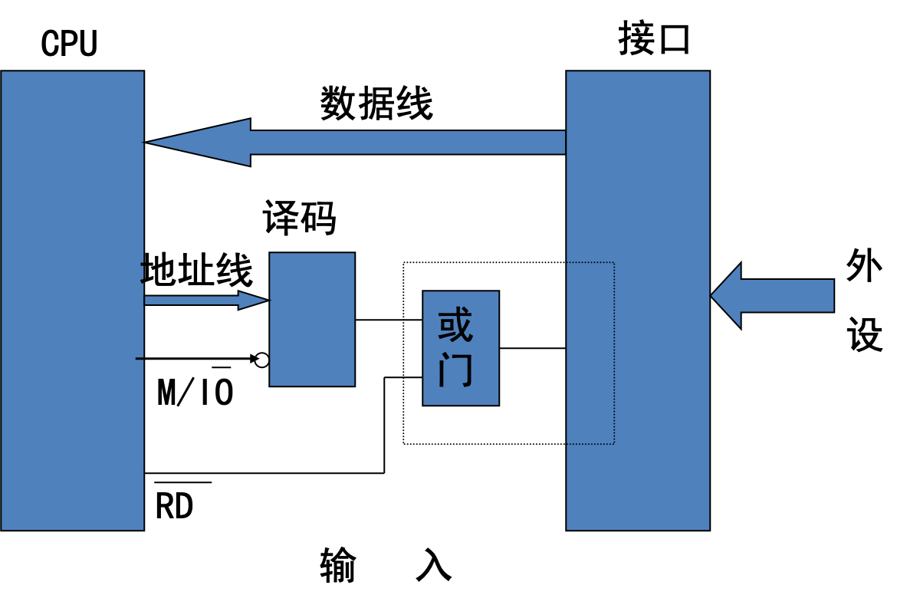

## 2.1 查询程序传输

1. 在执行输入输出前，要先查询接口中状态寄存器的状态。
2. 输入时，状态寄存器的状态指示要输入的数据是否已经准备就绪。 

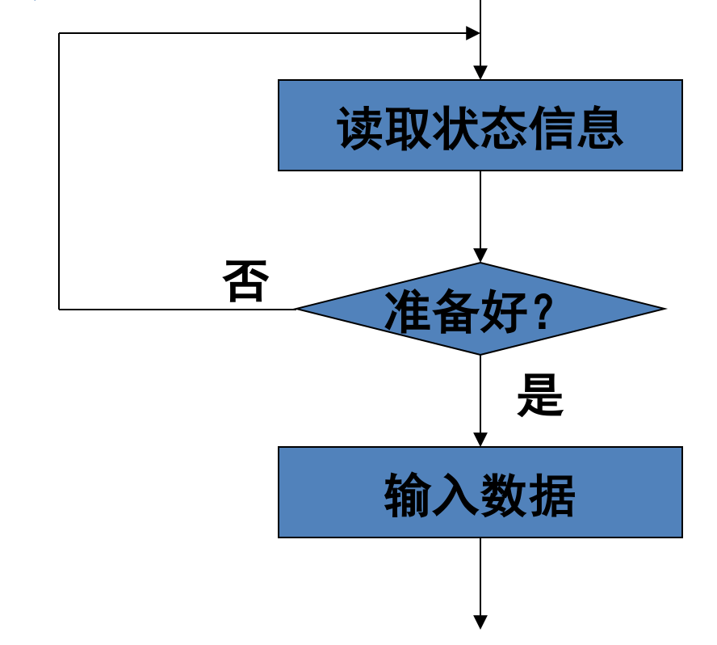

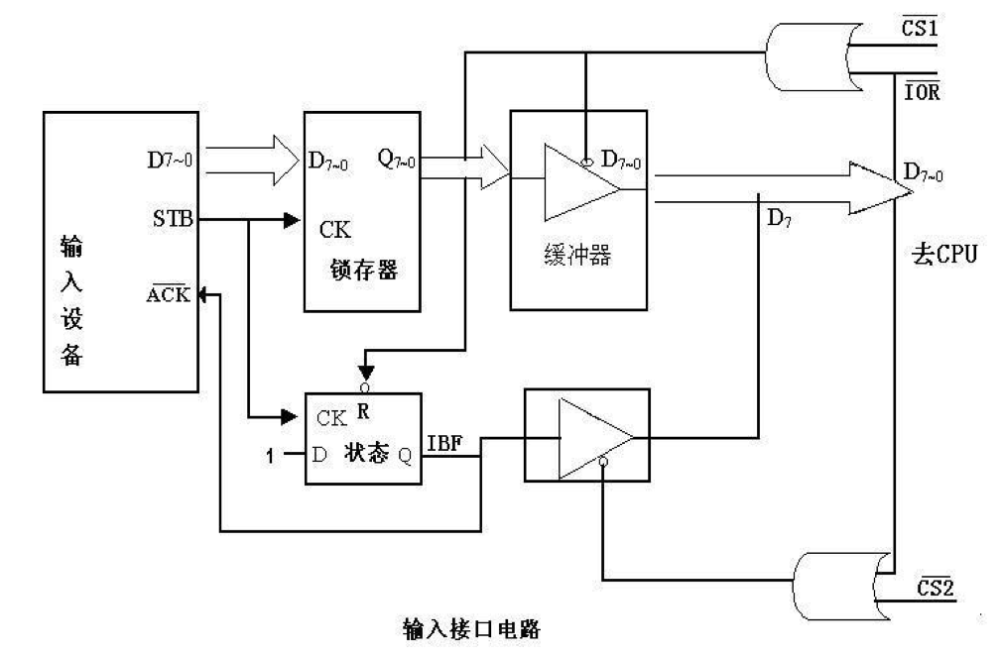

1. STB有效，(1)、输入设备数据进入锁存器；(2)、IBF 有效
2. CPU读状态端口
3. CPU读数据端口，同时清IBF

输出时，状态寄存器的状态指示输出设备是否空闲。

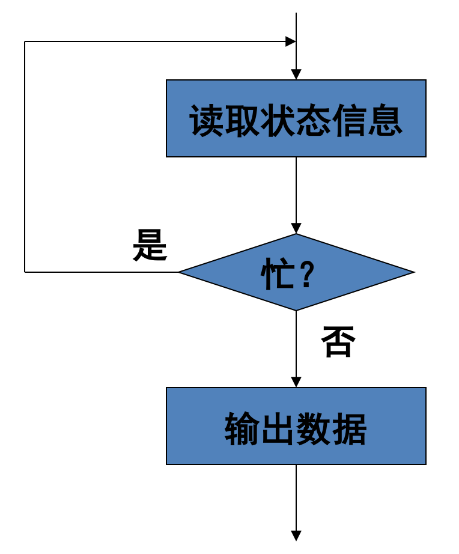
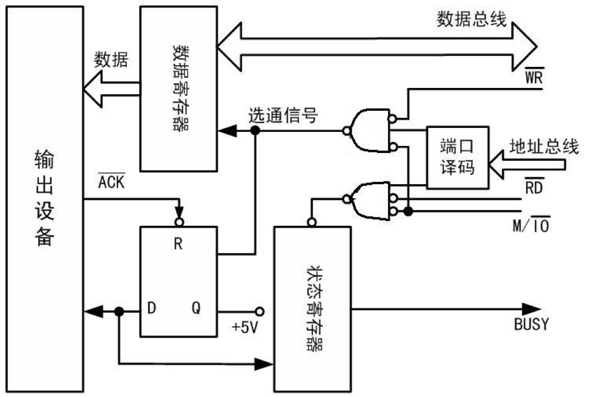

1. CPU读状态端口，查BUSY线
2. CPU写数据，(1)、数据进入数据寄存器；(2)、BUSY有效
3. 输出设备工作完毕，BUSY无效

- 优点：电路简单
- 缺点：降低CPU效率，实时性不强

## 2.3 中断传输

- 当外设作好传送准备后，主动向CPU请求中断，CPU响应中断后在中断处理程序中与外设交换数据。
- 在中断未发生时，CPU可以执行其他程序，这样可以提高CPU的利用率。

### 与程序查询方式相比，中断控制方式的数据交换具有如下特点: 

- 提高了CPU的工作效率;
- CPU具有控制外围设备服务的主动权;
- CPU可以和外设并行工作;
- 可适合实时系统对I/O处理的要求。

## 2.4 DMA传输

在高速的外设或成块交换数据的情况，采用程序控制方式进行数据的传输，是无法满足要求的。在这种情况下，采用DMA方式。

DMA方式是在外设与内存间建立起直接的通道，CPU不再直接参加外设和内存间的数据传输

当系统需要进行DMA传输时，将CPU对地址和数据及控制线的管理权交由DMA控制器进行控制，当完成了一次DMA数据传输后，再将这个控制权还给CPU，这些工作都是由硬件自动实现的，并不需要程序进行控制。

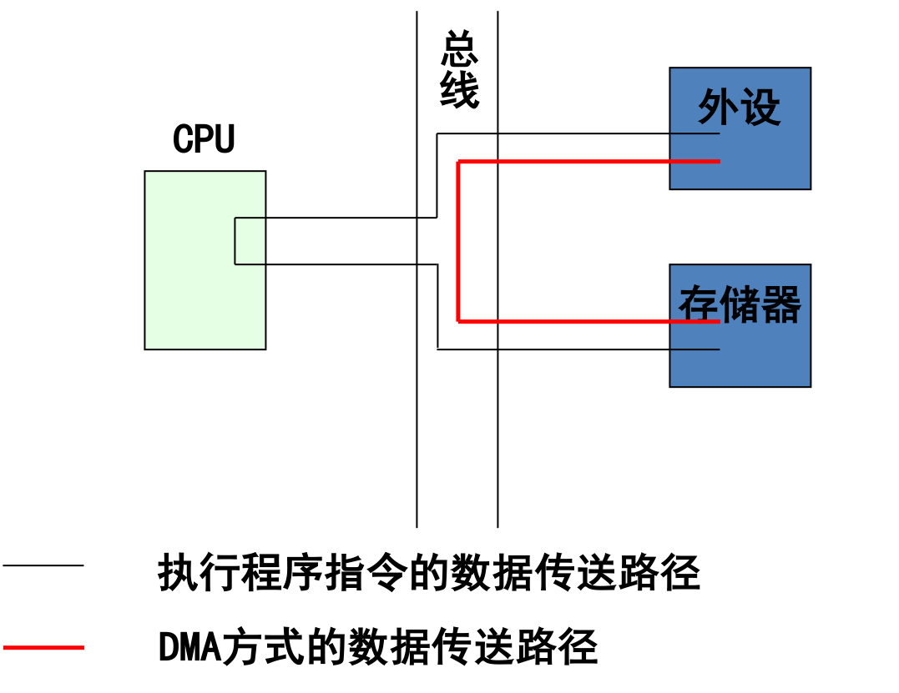

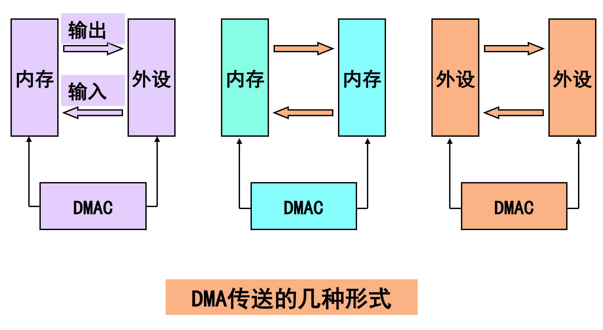

### DMA控制器的基本功能

- 能接收I/O接口的DMA请求，并向CPU发出总线请求信号
- 当CPU发出总线回答信号后，接管对总线的控制，进入DMA传送过程
- 能实现有效的寻址，即能输出地址信息并在数据传送过程中自动修改地址
- 能向存储器和I/O接口发出相应的读/写控制信号
- 能控制数据传送的字节数，控制DMA传送是否结束
- 在DMA传送结束后，能释放总线给CPU，恢复CPU对总线的控制

# 三、微型计算机的中断系统

## 3.1 中断控制方式的优点

- 实现并行工作
- 实现分时操作
- 实现实时处理
- 实现多程序或多任务工作
- 实现故障处理

## 3.2 与中断有关的术语

- 中断过程：从中断提出请求->中断响应->中断处理->中断返回这样一个完整的过程
- 中断源：引起中断的原因，可以是设备、故障等等
- 中断类型码
- 中断服务程序：CPU响应中断执行处理
- 中断向量：中断服务程序的入口地址
- 中断向量表：存放中断向量，一般存储在不易于破坏的地方
- 断点：主程序被打断的地方
- 保护现场：断点处执行中断服务程序，保护主程序执行位置
- 中断返回：返回主程序断点处
- 中段排队：在同一时段内有多个中断请求根据优先级排队

## 3.3 中断过程

在输入时，若外设的输入数据已存入寄存器；在输出时，若外设已把上一个数据输出，输出寄存器已空

- 由外设向CPU发出中断请求
- 允许CPU与外设（甚至多个外设）同时工作(中断排队)
- CPU就暂停原执行的程序，准备进入中断服务（ 中断响应）
- 转去执行输入或输出操作（中断服务）
- 待输入输出操作完成后即返回，CPU再继续执行原来的程序（中断返回）

# 四、微型计算机功能扩展总线和接口标准

## 4.1 一些常用的宗县属于

## 4.2 总线的分类

## 4.3 80x86系列微机中常用的总线和接口标准

