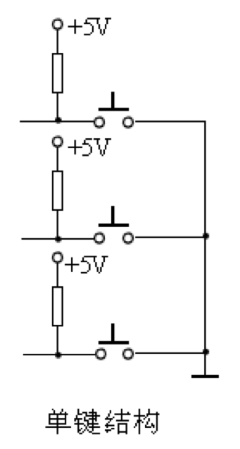
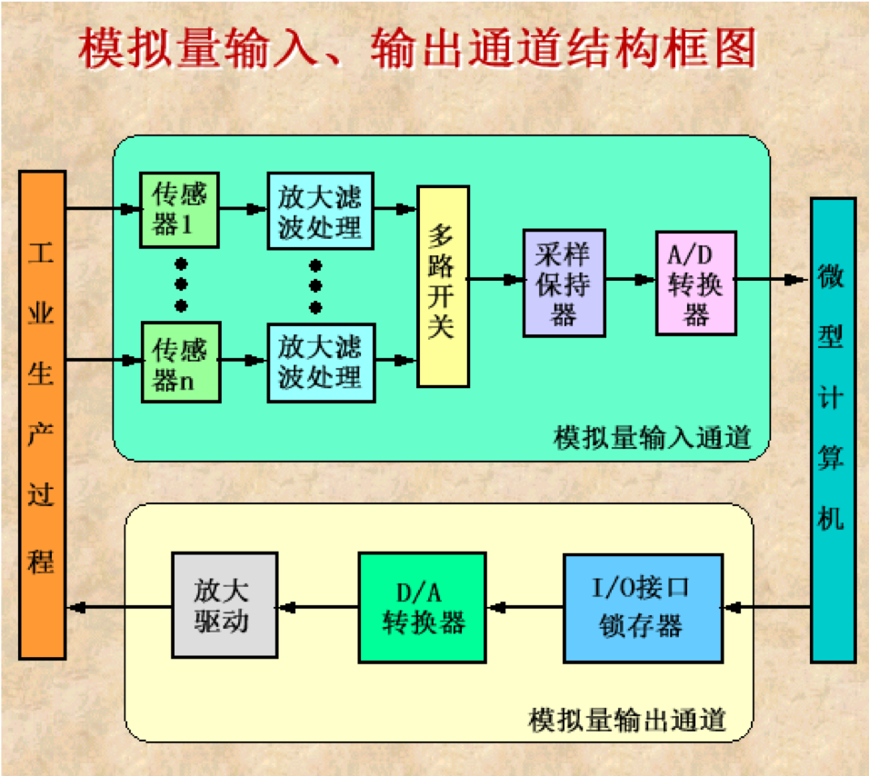

# 一、数码显示LED接口

## 1.1 LED显示器显示原理

发光二极管是一种将电能转变成光能的半导体器件，流过电流，发光二极就会发光。七段LED显示器由七个发光段构成，每段均是一个LED二极管。这7个发光段分别称为 a、b、c、d、e、f和g，通过控制不同段的点亮和熄灭，可显示16进制数字0～9和 A、B、C、D、E、F，也能显示 H、E、L、P等字符。多数7段LED显示器中实际有8个发光二极管，除7个构成7笔字形外，另外还有一个小数点Dp位段，用来显示小数。有人也把这种显示器叫做8段LED显示器。

![七段LED显示器]](./微机接口与通讯05-简单接口电路技术/七段LED显示器.png)

1. 3、8引脚为电源
2. 5(dp)显示小数点
3. 其他8个引脚显示数据

LED显示器有共阳极和共阴极两种结构。共阳极结构中，各LED二极管的阳极被连在一起，使用时要将它与十5v相连，而把各段的阴极连到器件的相应引脚上。当要点亮某一段时，只要将相应的引脚(阴极)接低电平。对于共阴极结构的LED显示器，阴极连在一起后接地，各阳极段接到器件的引脚上，要想点亮某一段时，只要将相应引脚接高电平。

## 1.2 LED显示器显示接口电路

![共阴极LED显示器接口电路]](./微机接口与通讯05-简单接口电路技术/共阴极LED显示器接口电路.png)

由图可见，CPU送来的二进制数字代码从8255A的 A口输出，并经反相驱动器驱动后与 LED相连。若要显示数字0，应使g段熄灭，其余段均点亮。为此，可编程使 PA6输出高电平(经反相后输出低电平)，其余位输出低电平(经反相后输出高电平)，即数字0的编码为01000000B＝40H，其中PA7未派用处，我们也将它置为0。同样，可求出1的编码为79H，2的编码为24H等等。将数字0～F(也可以是0～9)所对应的七段代码组成一个表，利用 XLAT指令进行查表，就可求得各数字对应的七段代码值。把要显示的数字的七段代码从8255A输出，就可点亮相应的段，显示这个数字。

## 1.3 LED显示器的驱动电路

![多路转换LED显示器的驱动电路]](./微机接口与通讯05-简单接口电路技术/多路转换LED显示器的驱动电路.png)

8255A的A口和B口都作为输出口，CPU输出的 BCD数码，经B口送到7447的4个输入端，7447的7个输出引脚并行地接到7个LED显示器的各段输入端(也称为段总线)，同名端都连在一起。每一位共阳极LED的阳极电路中都串接一个晶体管Q，晶体管起开关作用，并由8255A来控制其导通或截止。当晶体管的基极加上低电平时它便导通，使相应的LED显示器的阳极与+5V电压接通，LED 显示器才有可能点亮；基极的高电平输入使晶体管截止，+5V断开，LED显示器不能点亮。通过编程，可使各个晶体管轮流导通，让7个LED轮流点亮。但任何时候只让一个晶体管导通，即只有一个LED点亮，这样可使功耗显著降低。

# 二、键盘接口

## 2.1 单键结构

最简单的键盘如图所示，其中每个键对应I/O端口的一位。没有键闭合时，各位均处于高电平； 当有一个键按下时，就使对应位接地而成为低电平，而其它位仍为高电平。这样，CPU只要检测到某一位为“0”，便可判别出对应键已经按下。

## 2.2 矩阵结构

如图为3×3=9个键的阵列，这个矩阵分为3行3列，如果键4按下，则第1行和第1列线接通而形成通路。如果第1行线接地电位，则由于键4的闭合，会使第1列线也输出地电位。矩阵式键盘工作时，就是按行线和列线的电平来识别闭合键的

## 2.3 建码识别

键盘结构的关键是如何把键盘上的按键动作转换为相应的编码,供处理器接收,这里存在一个键码识别的问题。

### 2.3.1 行扫描法

行扫描法识别按键的基本原理是:先将所有的行线置0,读列线的值,若此时列线上的值全为1,说明无键按下。若有某位为0,则说明对应这一列上有键按下,这时改变行扫描码,使行线逐行为0,依次扫描。当读到某一列线的值为0时,就可根据此时的行扫描码和列线的值惟一地确定按键的位置,同时也就确定了该键的扫描码。

### 2.3.2 行反转法

将行线接一个数据端口，先让它工作在输出方式；将列线也接到一个数据端口，先让它工作在输入方式。程序使CPU通过输出端口往各行线上全部送低电平，然后读入列线值。如果此时有某键被按下，则必定会使某列线值为0。接着，程序再对两个端口进行方式设置，使接行线的端口改为输入方式，接列线的端口改为输出方式。并且，将刚才读得的列值从列线所接端口输出，再读取行线的输入值，那么，闭合键所在的行线值必定为0。这样，当一个键被按下时，必定可以读得一对唯一的行值和列值。与之配合，行、列线所接的数据端口应能够改变输入、输出方式。

## 2.4 AD与DA转化接口

# 三、D（数字量）/A（模拟量）转换接口

# 四、A（模拟量）/D（数字量）转换接口

