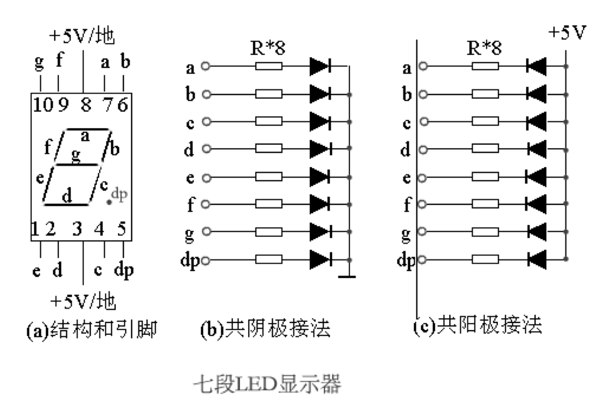
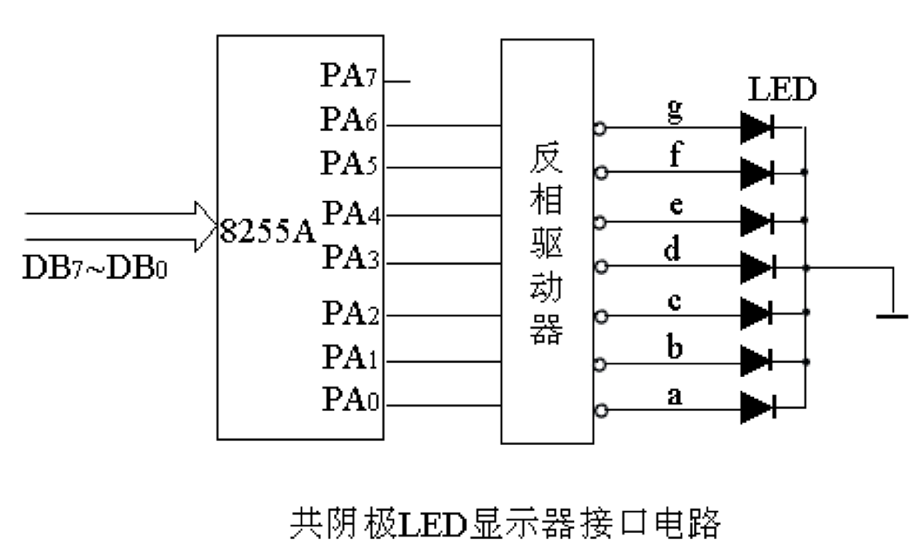
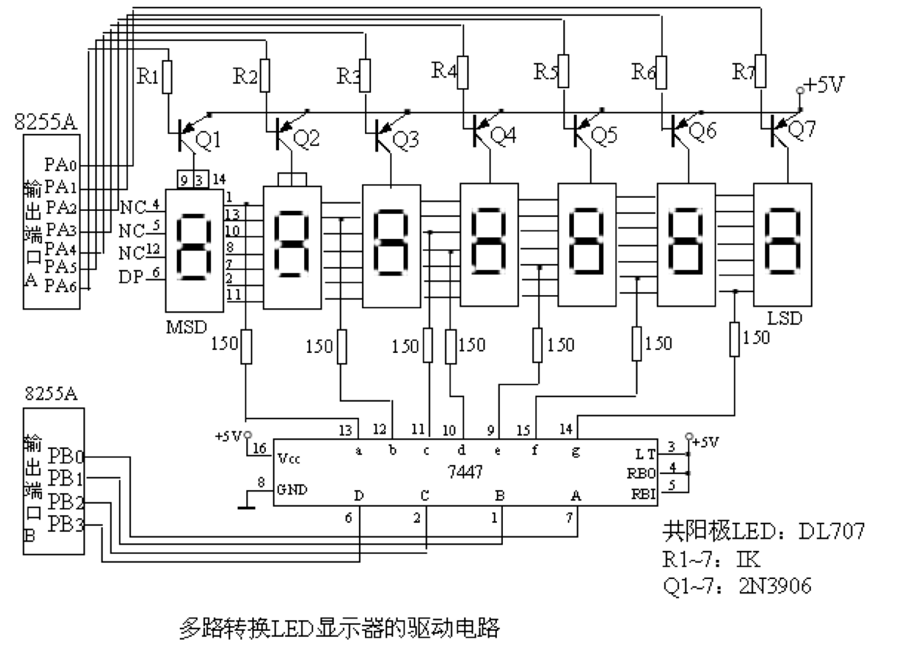
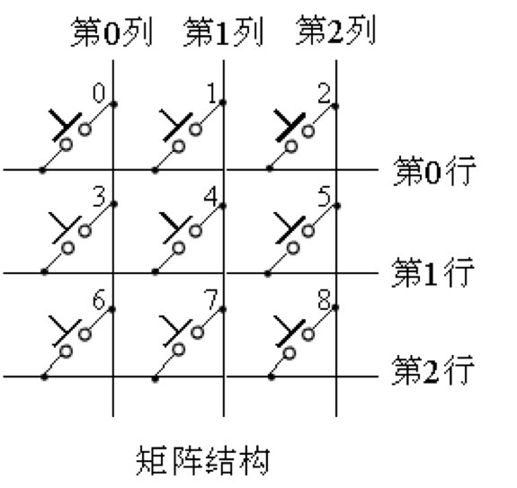
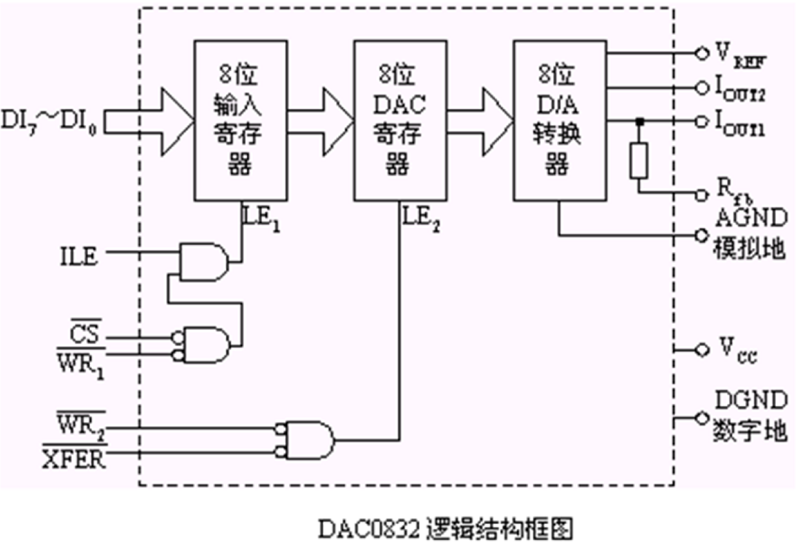
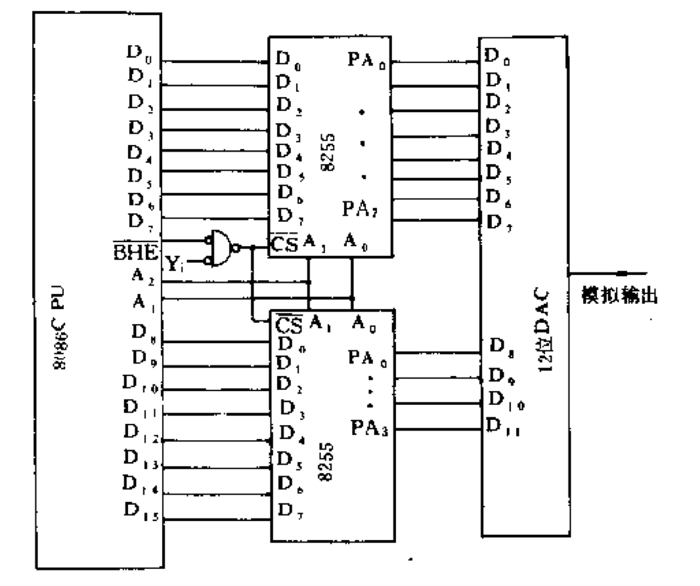
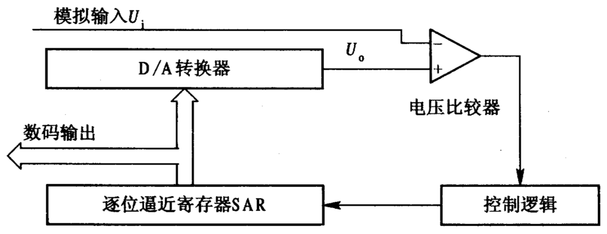
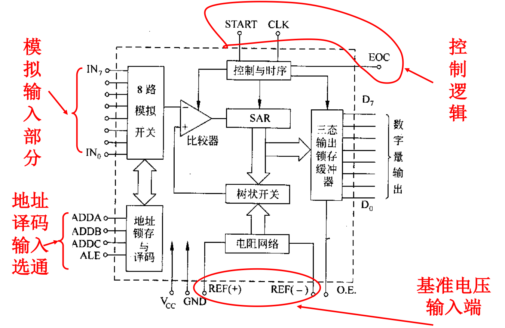
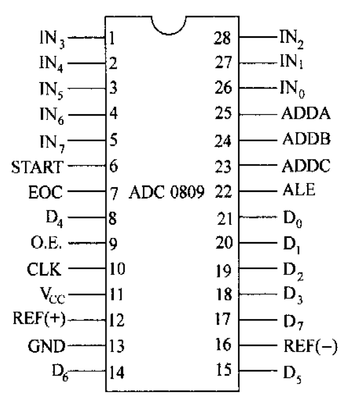
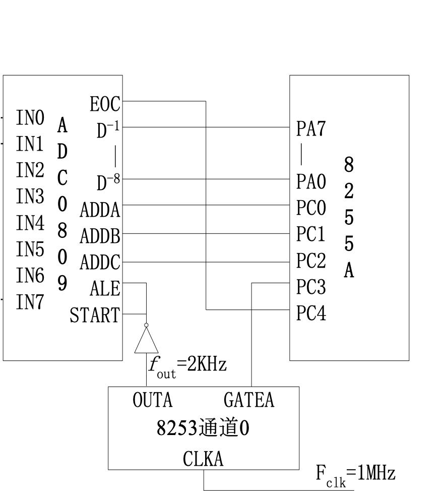

# 一、数码显示LED接口

## 1.1 LED显示器显示原理

发光二极管是一种将电能转变成光能的半导体器件，流过电流，发光二极就会发光。七段LED显示器由七个发光段构成，每段均是一个LED二极管。这7个发光段分别称为 a、b、c、d、e、f和g，通过控制不同段的点亮和熄灭，可显示16进制数字0～9和 A、B、C、D、E、F，也能显示 H、E、L、P等字符。多数7段LED显示器中实际有8个发光二极管，除7个构成7笔字形外，另外还有一个小数点Dp位段，用来显示小数。有人也把这种显示器叫做8段LED显示器。

1. 3、8引脚为电源
2. 5(dp)显示小数点
3. 其他8个引脚显示数据

LED显示器有共阳极和共阴极两种结构。共阳极结构中，各LED二极管的阳极被连在一起，使用时要将它与十5v相连，而把各段的阴极连到器件的相应引脚上。当要点亮某一段时，只要将相应的引脚(阴极)接低电平。对于共阴极结构的LED显示器，阴极连在一起后接地，各阳极段接到器件的引脚上，要想点亮某一段时，只要将相应引脚接高电平。

## 1.2 LED显示器显示接口电路

由图可见，CPU送来的二进制数字代码从8255A的 A口输出，并经反相驱动器驱动后与 LED相连。若要显示数字0，应使g段熄灭，其余段均点亮。为此，可编程使 PA6输出高电平(经反相后输出低电平)，其余位输出低电平(经反相后输出高电平)，即数字0的编码为01000000B＝40H，其中PA7未派用处，我们也将它置为0。同样，可求出1的编码为79H，2的编码为24H等等。将数字0～F(也可以是0～9)所对应的七段代码组成一个表，利用 XLAT指令进行查表，就可求得各数字对应的七段代码值。把要显示的数字的七段代码从8255A输出，就可点亮相应的段，显示这个数字。

## 1.3 LED显示器的驱动电路

8255A的A口和B口都作为输出口，CPU输出的 BCD数码，经B口送到7447的4个输入端，7447的7个输出引脚并行地接到7个LED显示器的各段输入端(也称为段总线)，同名端都连在一起。每一位共阳极LED的阳极电路中都串接一个晶体管Q，晶体管起开关作用，并由8255A来控制其导通或截止。当晶体管的基极加上低电平时它便导通，使相应的LED显示器的阳极与+5V电压接通，LED 显示器才有可能点亮；基极的高电平输入使晶体管截止，+5V断开，LED显示器不能点亮。通过编程，可使各个晶体管轮流导通，让7个LED轮流点亮。但任何时候只让一个晶体管导通，即只有一个LED点亮，这样可使功耗显著降低。

# 二、键盘接口

## 2.1 单键结构

最简单的键盘如图所示，其中每个键对应I/O端口的一位。没有键闭合时，各位均处于高电平； 当有一个键按下时，就使对应位接地而成为低电平，而其它位仍为高电平。这样，CPU只要检测到某一位为“0”，便可判别出对应键已经按下。

## 2.2 矩阵结构

如图为3×3=9个键的阵列，这个矩阵分为3行3列，如果键4按下，则第1行和第1列线接通而形成通路。如果第1行线接地电位，则由于键4的闭合，会使第1列线也输出地电位。矩阵式键盘工作时，就是按行线和列线的电平来识别闭合键的

## 2.3 建码识别

键盘结构的关键是如何把键盘上的按键动作转换为相应的编码,供处理器接收,这里存在一个键码识别的问题。

### 2.3.1 行扫描法

行扫描法识别按键的基本原理是:先将所有的行线置0,读列线的值,若此时列线上的值全为1,说明无键按下。若有某位为0,则说明对应这一列上有键按下,这时改变行扫描码,使行线逐行为0,依次扫描。当读到某一列线的值为0时,就可根据此时的行扫描码和列线的值惟一地确定按键的位置,同时也就确定了该键的扫描码。

### 2.3.2 行反转法

将行线接一个数据端口，先让它工作在输出方式；将列线也接到一个数据端口，先让它工作在输入方式。程序使CPU通过输出端口往各行线上全部送低电平，然后读入列线值。如果此时有某键被按下，则必定会使某列线值为0。接着，程序再对两个端口进行方式设置，使接行线的端口改为输入方式，接列线的端口改为输出方式。并且，将刚才读得的列值从列线所接端口输出，再读取行线的输入值，那么，闭合键所在的行线值必定为0。这样，当一个键被按下时，必定可以读得一对唯一的行值和列值。与之配合，行、列线所接的数据端口应能够改变输入、输出方式。

## 2.4 AD与DA转化接口

# 三、D（数字量）/A（模拟量）转换接口

D/A转换器是计算机或其它数字系统与模拟量控制对象之间联系的桥梁，它的任务是将离散的数字信号转换为连续变化的模拟信号。在工业控制领域中，D/A转换器是不可缺少的重要组成部分。

## 3.1 D/A转换的基本原理

数字量是由一位一位的数位构成的，每个数位都代表一定的权。

为了把一个数字量变为模拟量，必须把每一位的数码按照权来转换为对应的模拟量，再把各模拟量相加，这样，得到的总模拟量便对应于给定的数据。

D/A转换器的主要部件是电阻开关网络，通常是由输入的二进制数的各位控制一些开关，通过电阻网络，在运算放大器的输入端产生与二进制数各位的权成比例的电流，经过运算放大器相加和转换而成为与二进制数成比例的模拟电压。

## 3.2 D/A转换器技术参数

### 分辨率

这是D/A转换器对微小输入量变化敏感程度的描述。如8位D/A转换器的分辨率是1/256、10位D/A转换器的分辨率是1/1024

### 精度

精度反映D/A转换的精确程度，可分为绝对精度和相对精度

### 建立时间

建立时间也称稳定时间，是指在D/A的数字输入端加上满量程的变化（如从全“0”变为全“1”）以后，其模拟输出稳定到最终值±1/2LSB时所需的时间		

### 输出电平

不同型号的D/A转换器的输出电平相差较大。

### 线性误差

相邻两个数字量之间的差应是1LSB，即理想的转换特性应是线性的。在满量程范围内，偏离理想的转换特性的最大值称为线性误差。

### 温度系数

在规定的范围内，相应于温度每变化1℃，增益、线性度、零点及偏移（对双极性D/A）等参数的变化量。

## 3.3 典型的D/A转换器芯片-DAC0832

## 3.4 D/A转换器和微型计算机接口技术

实现D/A转换器和微型计算机接口技术的关键是数据锁存问题。有些D/A转换器芯片本身带有锁存器，但也有些D/A转换器芯片本身不带锁存器。此时一些并口芯片如8212，74LS273及可编程的并行I/O接口芯片8255A均可作为D/A转换的锁存器。

# 四、A（模拟量）/D（数字量）转换接口

A/D转换器是模拟信号源与计算机或其它数字系统之间联系的桥梁，它的任务是将连续变化的模拟信号转换为数字信号，以便计算机或数字系统进行处理、存储、控制和显示。在工业控制和数据采集及其它领域中，A/D转换器是不可缺少的重要组成部分。

**转换原理**

- 并行A/D
- 逐次逼近A/D
- 双积分A/D

逐次逼近A/D转换器

逐次逼近型的A/D转换器，其转换原理实质是逐次把设定的SAR寄存器中的数字量经D/A转换后得到电压VC，与待转换的模拟电压VX进行比较。比较时，先从SAR的最高位开始，逐次确定各位的数码应是“1”还是“0”，其工作过程如下：

转换前，先将SAR寄存器各位清零。转换开始时，控制逻辑电路先设定SAR的最高位为“1”，其余位为“0”，此试探值经D/A转换成电压VC，然后将VC与模拟输入电压VX比较。如果$VX\geq VC$，说明SAR最高位的“1”应予保留；如果VX <  VC，说明SAR的该位应予清零。然后再对SAR寄存器的次高位置“1”，依上述方法进行D/A转换和比较。如此重复上述过程，直至确定SAR寄存器的最低位为止。最后，SAR寄存器中的内容就是与输入模拟量VX相对应的二进制数字量。

## 4.1 A/D转换器的主要技术指标

### 分辨率

分辨率是指A/D转换器响应输入电压微小变化的能力。通常用数字输出的最低位（LSB）所对应的模拟输入的电平值表示。定义为转换器的满刻度与2n的比值，n是转换器的位数。

**例如当满刻度5V，使用8位转换器，分辨率为5/256,约20mV。**

### 精度

精度用来反映A/D转换器的实际输出与理论输出的偏差程度，精度可分为绝对精度和相对精度。

### 转换时间

转换时间是指A/D转换器完成一次转换所需的时间，即从启动信号开始到转换结束并得到稳定的数字输出量所需的时间。

### 电源灵敏度

电源灵敏度是指A/D转换器的供电电源的电压发生变化时，产生的转换误差。

### 量程

量程是指所能转换的模拟输入电压范围。

### 输出逻辑电平

多数A/D转换器的输出逻辑电平与TTL电平兼容。

### 工作温度范围

由于温度会对比较器、运算放大器、电阻网络等产生影响，故只在一定温度范围内才能保证额定精度指标。		
## 4.2 ADC0809

管脚说明

### ADC0809的多路转换

## 4.3 A/D转换芯片与微处理器连接

A/D转换芯片与微处理器接口时，除了要有数据信息的传送外，还应有控制信息和状态信息的联系。其工作过程是：CPU送出控制信号至A/D转换器的启动端，使A/D转换器开始转换；A/D转换需要一定的转换时间，当CPU查询到转换完成，CPU执行输入指令将A/D转换的结果读入。

## 4.4 A/D转换器与系统连接的问题

- 启动信号的供给
  - A/D转换器要求的启动信号一般有两种形式：即电平启动信号和脉冲启动信号
- 转换结束信号以及转换数据的读取
  - 程序查询方式。
  - 中断方式。
  - 固定的延迟程序方式。