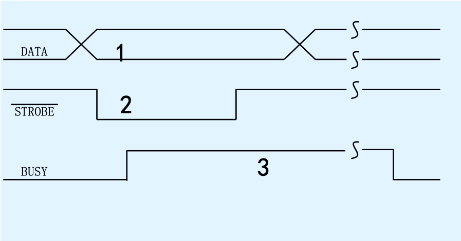
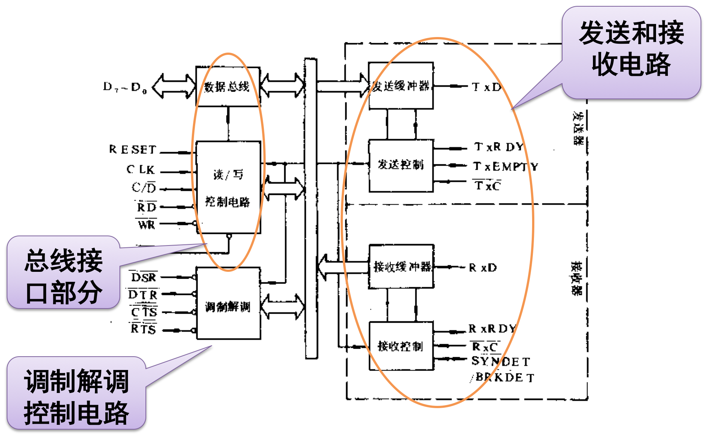

# 一、可编程计数器8253

在计算机应用中，常常要对外设的某些信号进行计数，希望计算机既能控制计数的过程又能读取计数的结果，进而作为控制或管理的决策依据。因此计数电路就成为计算机接口中一种常见类型，如果被计数的信号有准确的固定周期，就形成了定时器。因此定时器和计数器的本质都是计数器。

**8253是常用的可编程定时计数接口芯片。**

## 1.1 8253／8254外部特点与功能


### 8253的主要特点

- 有3个独立的16位计数器
- 每个计数器都可以按照二进制或BCD码进行计数
- 每个计数器的计数速率可高达2MHz（8254-2计数频率可达到10MHz）
- 每个计数器有6种工作方式，可由程序设置和改变
- 所有的输入输出引脚电平都与TTL电平兼容

## 1.2 8253内部结构与工作原理


每个计数端口有三根线与外界联系

- CLK：计数器脉冲输入
- GATE：门控信号
- OUT：计数器输出


## 1.3 8253的控制字

8253只有一个控制字，8253的一个方式控制字只决定一个计数通道的工作模式。8253的控制字格式共分为4部分，通道选择、计数器读/写方式、工作方式和计数码的选择。


## 1.4 8253的工作方式

### 方式0—计完最后一个数时中断

- 当控制字CW（Control Word）写入控制字寄存器，则使OUT输出端变低，此时计数器没有赋予初值，也没开始计数。
- 要开始计数，GATE信号必须为高电平，并在写入计数初值后，通道开始计数，在计数过程中 OUT线一直维持为低，直到计数到“0”时。OUT输出变高。

### 方式1—可编程序的单拍脉冲

当CPU写控制字之后，输出将保持为高（若原为低，则由低变高）。当CPU写完计数值后，计数器并不开始计数，直到外部门控脉冲GATE启动之后的下一个输入CLK脉冲的下降沿开始计数，输出OUT变低。因整个计数过程中，OUT都维持为低，直到计数到0，输出变为高，因此，输出为一个单拍脉冲。若外部再次触发启动，则可以再产生一个单拍脉冲。
		
### 方式2—速率发生器

当CPU输出控制字后，输出将为高。在写入计数值后，计数器将立即自动对输入时钟CLK计数。在计数过程中输出始终保持为高，直至计数器减到1时，输出将变低，经过一个CLK周期，输出恢复为高，且计数器开始重新计数。

### 方式3—方波速率发生器

方式3和方式2的输出都是周期性的，它们的主要区别是，方式3在计数过程中输出有一半时间为高，另一半时间为低。

### 方式4—软件触发选通

当写入控制字后，输出为高（原为高则保持为高，原为低则变为高）。当写入计数值后立即开始计数（相当于软件启动），当计数到0后，输出变低，经过一个输入时钟周期，输出又变高，计数器停止计数。这种方式计数也是一次性的，只有在输入新的计数值后，才能开始新的计数。

### 方式5—硬件触发选通

设置了控制字后，输出为高。在设置了计数值后，计数器并不立即开始计数，而是由门控脉冲的上升沿触发启动。当计数到0时，输出变低，经过一个CLK脉冲，输出恢复为高，停止计数。要等到下次门控脉冲的触发才能再计数。		

### 8253的工作方式小结
  
8253的六种工作方式可归为两类，一个是充当频率发生器，另一类主要是作计数器来使用。下面我们就从这个角度来讨论总结OUT和GATE门的作用。

- 与频率发生器有关的工作方式——8253有两种方式与频率发生器有关，即方式2和发生3。
  - 对OUT端，方式2提供给用户的是负脉冲，方式3提供给用户的是方波。
  - 这两种方式下，GATE信号要始终保持为高
- 与计数器有关的工作方式——对于计数器类，有方式0、1和方式4、5。启动计数器的方式有两种。
  - 一种是CPU把时间常数写入相应通道后，计数器就开始工作，我们可以称之为软件启动方式，在这种启动方式下，GATE要始终保持为高电平，所以方式0和方式4可以称为软件启动方式。
  - 另一种是硬件启动计数器，即CPU把时间常数写入计数器后，即使GATE为高电平，计数器并不工作。只有GATE发生跳变，其上升沿启动计数器工作。所以方式1和方式5就可以称为硬件启动方式。

计数器溢出时，OUT有两种输出形式，要么是电平，要么是负脉冲。前者有方式0方式1，后者有方式4和方式5。

## 1.5 8253应用举例

### 例1：现有一个高精密晶体振荡电路，输出信号是脉冲波，频率为1MHz。要求利用8253做一个秒信号发生器，其输出接一发光二极管，以0.5秒点亮，0.5秒熄灭的方式闪烁指示。设8253的通道地址为80H～86H（偶地址）。

### 解：

#### 1. 时间常数计算

这个例子要求用8253作一个分频电路，而且其输出应该是方波，否则发光二极管不可能等间隔闪烁指示。频率为1MHz信号的周期为1微妙，而1Hz信号的周期为1秒，所以分频系数N可按下式进行计算：

$N=\frac{1s}{1us}=\frac{1000000us}{1us}=1000000$

由于8253一个通道最大的计数值是65536，所以对于N＝1000000这样的大数，一个通道是不可能完成上述分频要求的。由于

$N = 1000000 = 1000 \times 1000 = N_1 \times N _2$

**即取两个计数器，采用级联方式。**

#### 2. 电路


#### 3. 工作方式选择

由于通道1要输出方波信号推动发光二极管，所以通道1应选工作方式3。对于通道0，只要能起分频作用就行，对输出波形不做要求，所以方式2和方式3都可以选用。   这样对于通道0，我们取工作方式2，BCD计数；对于通道1，我们取工作方式3，二进制计数（当然也可选BCD计数）

#### 4. 程序

```
mov al,00110101b ；通道0控制字
out 86h,al
mov al,00 ；通道0初始计数值
out 80h,al
mov al,10h
out 80h,al
mov al,01110110b ；通道1控制字
out 86h,al
mov al,0e8h ；通道1初始计数值，3E8H=1000BCD
out 82h,al
mov al,03h
out 82h,al
```

# 二、并行通信接口8255A

## 2.1 8255A内部结构与引脚定义

8255A是一种通用的可编程并行I／O接口芯片，广泛用于几乎所有系列的微型机系统中，如8086、MCS51、Z80CPU系统等。8255A具有3个带锁存或缓冲的数据端口，可与外设并行进行数据交换。用户可用程序来选择多种操作方式，通用性强。使用灵活，可为CPU与外设之间提供并行输入／输出通道。


### 2.1.1 与外设连接的管脚

8255A有三个数据端口，每个端口是8位，由此可推算与外设相连接的管脚共有24位。其中A口有PA7—PA0八个I/O引脚，B口有PB7—PB0八个I/O引脚，C口有PC7—PC0八个I/O引脚。特别地对于PC7—PC0，其中可有若干根复用线可用于“联络”信号或状态信号，其具体定义与端口的工作方式有关。


### 2.1.2 与CPU连接的管脚

包括数据线D7—D0，读写控制线和复位线RESET，以及和CPU地址线相连接的片选信号、端口地址控制线A0和A1


## 2.2 8255A的工作方式机器初始化设置

8255A有三种工作方式，他们是：

- 方式0：基本输入/输出方式
- 方式1：选通输入/输出方式
- 方式2：双向传送方式

### 方式控制字

这是一个八位的控制字，代表的信息非常丰富。上面提到8255A内部的3个端口分为A、B两组，因此方式控制字也就相应地分成两个部分，分别控制A组和B组，其格式如下:


### C口置“1”／清“0”控制字

- 置“1”又称为置位操作
- 清“0”称为复位操作  


## 2.3 8255A各工作方式的功能特点说明

### 方式0--基本输入／输出方式。

- 端口A和端口B可以通过方式选择控制字规定为输入口或者输出口；
- 端口C分为高4位(PC7～PC4) 和低4位(PC3～PC0) 两个4位端口，这两个4位端口也可由方式选择控制字分别规定为输入口或输出口。
- 这四个并行口共可构成16种不同的使用组态。
- 利用8255A的方式0进行数据传输时，由于没有规定专门的应答信号，所以这种方式常用于与简单外设之间的数据传送，如向LED显示器的输出，从二进制开关装置的输入等。

### 方式1--选通输入输出方式。

端口A或端口B仍作为数据的输入/输出，但同时规定端口C的某些位作为控制或状态信息，用作一个或两个选通端口

#### 每一个端口包含有：

- 8位的数据端口
- 3条控制线（是固定指定的，不能用程序改变）
- 提供中断逻辑

#### 任一个端口都可作为输入或输出

- 若只有一个端口工作于方式1，余下的13位，可以工作在方式0（由控制字决定）。
- 若两个端口都工作于方式1，端口C还留下两位，这两位可以由程序指定作为输入或输出，也具有置位/复位功能。

### 方式2—双向输入输出方式，使外设在单一的8位总线上，既能发送，也能接收数据。

- 工作时可用程序查询方式，也可工作于中断方式。
- 方式2只用于端口A。
- 一个8位的双向总线端口（端口A）和一个5位控制端口（端口C）。
- 输入和输出是锁存的。
- 5位控制端口是用作端口A的控制和状态信息。	

## 2.4 8255A应用举例

### 2.4.1 与打印机接口 

例：在某一8086系统中接有一个打印机，8255A作为输出接口。工作在方式0，将缓冲区BUFF内的400H个字节的ACK码送打印机打印。




#### 打印机具体工作过程如下：

1. 数据线D7—D0出现有效数据；
2. STB有效，通知打印机，接口给打印机一个数据，数据从数据线进入打印机；
3. BUSY有效，告诉接口，打印机正在打印数据。打印完毕，BUSY变为无效，表示打印结束。 

# 三、串行通信接口8251

## 3.1 串行通信接口技术的概念

### 3.1.1 串行数据

计算机与外部信息交换方式有两种：

- 并行通信：数据各位同时传送。
- 串行通信：数据和控制信息是一位接一位串行地传送下去。虽然速度会慢一些，但传送距离比并行通信长，硬件电路也相应简单些。

旧式台式机一般有两个RS－232串行口COM1和COM2，通常COM1使用的是9针D形连接器，而COM2使用的是老式的DB25针连接器。现在工控机还在使用DB9针连接器。


### 3.1.2 串行通信的实现

#### 3.1.2.1 串行通信的特点

串行通信是逐位传送数据，所以一个多位数据需要多次传送。比如一个8位的字节型数据至少需要8次传送。它有如下特点：

- 速度较慢；
- 引线少；
- 距离长。


#### 3.1.2.2 串行通信的硬件条件

在硬件上，串行通信系统的核心部件是移位寄存器，其中在发端要有一个并入串出移位寄存器，在收端要有一个串入并出移位寄存器。


#### 3.1.2.3 串行通信的同步

为了可靠的串行通信，同步信号起到至关重要的作用。在理想情况下，同步信号应该在数据信号线上出现有效数据期间的中心点有效，因为这时数据线上的数据是最稳定的。


**在典型的串行通信系统中，是不存在同步信号线的！如何实现串行通信中的数据传送的同步呢？**

### 系统从软件和硬件两方面采取了如下三个措施：

1. 设置波特率,波特率是指单位时间内传送的位数，单位是比特/秒。
2. 设置数据的传送格式，一般地串行通信在传送数据时，并不是单纯地传送数据位信息。为了使数据传送可靠，还设定了其他一些辅助位。
  
3. 设置波特率因子
   - 在异步通信方式进行通信时，发送端需要用时钟来决定每1位对应的时间长度，接收端也需要用一个时钟来测定每1位的时间长度，前一个时钟叫发送时钟，后一个时钟叫接收时钟。这两个时钟的频率可以是波特率的数倍，一般取16倍、32倍或64倍。这个倍数就称为波特率因子。

## 3.2 串行通信的实现


## 3.3 串行通信方式

1. 异步通讯：以字符为单位传送数据，用起始位和停止位标识每个字符的开始和结束字符，两次传送时间隔不固定。
2. 同步通信：异步通讯为了可靠地传送数据，在每次传送数据的同时，附加了一些标志位。在大量数据传送时，为了提高速度，就去掉这些标志，这就是同步通讯。采用同步传送，在数据块开始处要用同步字符来指示，并在发送端和接收端之间要用时钟来实现同步。

## 3.4 串行通讯中的数据传送方向

1. 半双工：每次只能有一个站发送
2. 完全双工：两个站能同时发送


## 3.5 异步接收/发送器（UART）

串行接口的基本结构主要是异步接收/发送器（UART），它不仅包括并行数据和串行数据之间的相互转换，还有检测串行通信在传送过程中可能发生错误的逻辑部件。


1. 奇偶错误：在接收时，UART检查接收到的每一个字符的“1”的个数这个标志，发出奇偶校验出错信息。
2. 帧错误:若接收到的字符格式不符合规定(如缺少停止位等)，则置位该标志，发出帧出错信息。
3. 丢失(溢出)错误:UART是一种双缓冲器结构。例如，在接收时，接收的数据先由移位寄存器移位，把串行数据变成并行数据，然后送到接收数据寄存器，由输入指令将数据送到CPU中。由于数据送到接收数据寄存器，所以即使CPU还没取走这个数据，UART也可以接收另一个新的字符。但若UABT接收到第二个字符的停止位，且要把第二个字符传送到接收数据寄存器时，CPU还没取走上一个数据，于是第一个数据会被丢失。如果UART出现这种情况就置位丢失(溢出)标志，发出丢失出错信息。

## 3.6 信号的调制和解调

由于模拟信号的传输比数字信号传输更为有效，因而可将数字信号调制成模拟信号进行传输，用解调器把接收的模拟信号再转换成数字信号

## 3.2 可编程串行通信接口芯片

### Intel 8251

8251 芯片是INTEL公司生产的大规模集成电路芯片，是与INTEL系列CPU兼容的可编程的串行通讯接口。虽然8251功能较强，但它需要外部时钟电路。因此采用8251作为接口电路时需要比较复杂的外围电路。目前流行的单片机如MCS51系列，CPU内部就集成了串行接口部件及定时器/计数器，几乎不需要外围辅助电路，使用起来非常简单，性能价格比很高，因此现在越来越多的数字化仪器仪表电路中不再采用8251而是使用单片机作为串行通信接口了。

### 3.2.1 主要基本功能

1. 可用于同步和异步传送
2. 波特率, DC－19.2K(异步)；DC－64K(同步)
3. 完全双工，双缓冲发送和接收
4. 与8080/8085CPU完全兼容

### 3.2.2 内部结构



#### 3.2.2.1 发送器 

- 数据输出线TxD
- 发送时钟 TxC
- 发送器准备好 TxRDY
- 发送器空信号 TxEMPY
-   
过程：TxRDY有效->CPU写数据到8251->8251发数据->发送完毕，TxEMPY有效

#### 3.2.2.2 接收器 

- 数据输入线RxD 
- 接收时钟 RxC	
- 接收器准备好 RxRDY
过程:  8251发数据->RxRDY有效->CPU读8251

#### 3.2.2.3 调制解调控制电路

- /DTR——数据终端准备好信号。是由825I送往外设的，表示CPU当前已经准备就绪。
- /DSR——数据设备准备好。是外设送往825l的，表示当前外设已经准备好数据。


- /RTS——请求发送信号。是8251送往外设的，表示CPU已经准备好发送。
- /CTS——清除请求发送信号。由外设送往825l的，当为低电平时，允许825l执行发送操作。


#### 3.2.2.4 读/写控制电路 


## 3.3 8251的编程

### 3.3.1 模式寄存器的格式（方式选择控制字）

时钟频率＝波特率因子×波特率


### 3.3.2 控制寄存器的格式（操作命令控制字） 


### 3.3.3 状态寄存器的格式（状态控制字（读）） 


# 四、可编程中断控制器8259A

# 五、DMA控制器8237A

