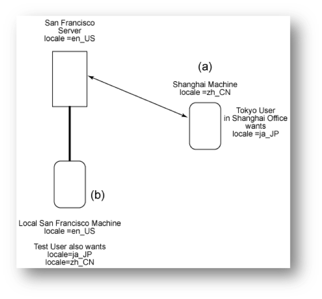
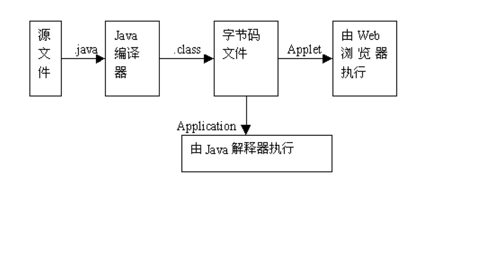
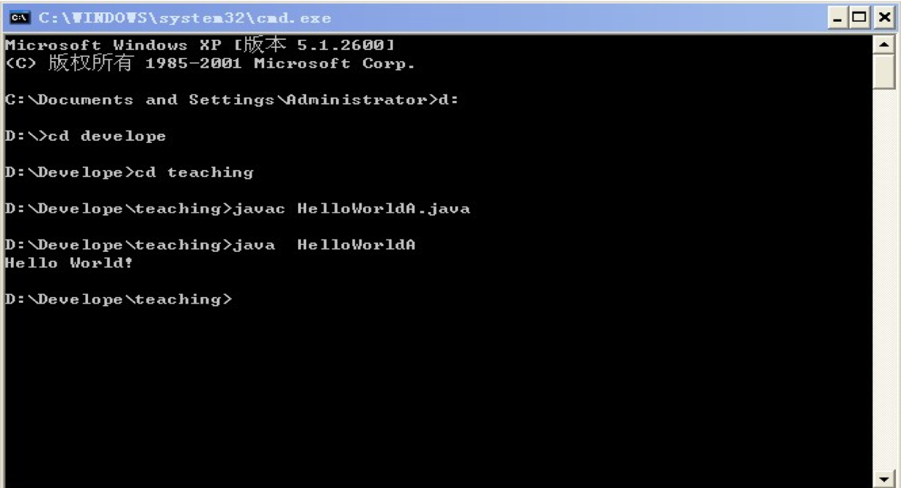

## 第一节  Java的诞生和特点

### 什么是Java?

1. Java是一种编程语言
2. Java是一种开发环境
3. Java是一种应用环境
4. Java是一种部署环境

### Java编程语言的主要目标

- 提供一种易于编程的语言
  - 消除其它语言在诸如指针运算和存储器管理方面影响健壮性的缺陷
  - 利用面向对象的概念使程序真正地成为可视化程序
  - 为使代码尽可能清晰合理、简明流畅提供了一种方法
- 提供一种解释环境
  - 提高开发速度——消除编译─链接—装载—测试周期
  - 代码可移植性——使操作系统能为运行环境做系统级调用
- 为运行不止一个活动线程的程序提供了一种方式
- 通过允许下载代码模块，从而当程序运行时也能动态支持程序改变
- 提供更好的安全性——为那些保证安全性而装载的代码模块提供了一种检查方法

### Java语言的产生

- 由美国Sun Microsystems公司研发
- 最初是为编写家电软件而开发的语言，虽然在该领域未取得成功，但由于它的诸多优点，迅速成为互联网时代的热门语言


- 1996年初发布JDK1.0版，后又推出了JDK1.1、JDK1.2、JDK1.3、JDK1.4、JDK5.0（即1.5）和JDK6.0版，目前的最新的正式版本为JDK6.0（正式名称为Java SE 6）
- JDK1.2至JDK5.0之间的版本又称为Java 2。 

### Java语言的特点

1. 易学好用
2. 支持多线程和动态
3. 具有良好的安全机制
4. 是最纯的面向对象的编程语言
5. 编程相对简单
6. 具有平台独立性（即可移植性）

*** 其中，平台独立性和安全性是Java成为目前最广泛的网络编程语言的最主要的原因**

## 第二节  Java的开发和执行环境

### Java程序的分类

Java  Application|Java  Applet|Java  Servlet 
---|---|---
独立的Java应用程序|小应用程序，通常在用户浏览器中运行|运行于Web服务器端的Java程序，可用来生成动态网页



- 其它：
  - JSP（Java Server Page）：一种用于生成动态网页的技术。
  - Java  Bean：可重用的、独立于平台的Java程序组件。

### Java的开发工具-JDK

- JDK （Java Developer’s Kit）
  - 是Sun公司提供的Java程序（如Java Application和Applet）的标准开发工具
  - 可从Oracle公司的网站上(http://java.com/zh_CN/download/index.jsp)免费下载
  - 目前最新的版本是JDK7.0
  - 不提供集成开发环境，需使用命令行来编译和运行
- JDK以开发工具包的形式发布，分为三组：
  - Java ME或J2ME(Java Platform Micro Edition)针对嵌入或手持设备的Java开发
  - Java SE或J2SE(Java Platform Standard Edition)针对个人用户或客户端的Java开发
  - Java EE或J2EE(Java Platform Enterprise Edition)针对企业或服务器端的Java开发

**注：Java EE直接支持Servlet和JSP的开发。若是Java SE的用户，还需下载其它软件（如JSWDK、JWSDP或Tomcat软件包）才能开发Servlet和JSP。**

### JDK、JRE、JVM

- JDK (Java Development Kit): Java开发集
- JRE (Java Runtime Environment):Java运行环境
- JVM (Java Virtual Machine): Java虚拟机

#### JVM

- JVM是在物理机上用软件模拟出来的虚拟机
- 字节码（class）文件包含的就是JVM的指令代码。
- 从层次结构上看，JVM层介于Java应用程序层和硬件层的中间，相当于一层软件屏蔽，将底层硬件的不一致屏蔽掉，向上层提供了相同的java运行环境。

**Java的可移植性就是通过JVM实现的**

### JVM的层次结构


### Java的开发工具–其他

- 商业化的Java集成开发工具，
- 如：
  - Java Studio Enterprise (Sun)
  - Jbuilder (Borland)
  - Jdeveloper (Oracle)
  - Visual J++ (Microsoft)
  - WebSphere Studio Application Developer (IBM)…

**这些商业化的集成开发工具使用方便，功能也更强。**


由IBM, Borland等一百多家业界知名企业组成的eclipse组织（eclipse.org）推出了免费的Java集成开发工具Eclipse，这是一个优秀的自由软件，可从eclipse的网站(www.eclipse.org)下载。

### Java的编译和运行

- Java源程序：Java源文件以.java作为后缀，可用任何文本编辑器来编辑。源程序文件后缀必须为.java
- 字节码文件：字节码文件的后缀为.class，包含的是JVM的指令代码。与其它程序设计语言不同，Java是半编译半解释的语言，先要使用编译器将源文件编译为字节码文件。JDK中的编译器为javac.exe。
- 运行java程序：对一般的java Application来说，其class文件可直接由java解释器解释执行。JDK中的解释器为java.exe。对Applet，其class文件由浏览器来运行。



## 第三节  Java程序开发步骤

### 一个简单的Java Application程序

```java
// 文件名：HelloWorldA.java 
//
// Sample HelloWorldA Application
//
class HelloWorldA {
   public static void main(String args[]) {
	System.out.println("Hello World!");
    }
}
```



**一个Java源程序是由若干个类（class）组成的。上述Java程序只有一个类，类名为HelloWorldA。在该类中有一个称为main的方法，用来实现向外界输出信息的功能。**

### Java程序的命名规则

- 如果源文件中有多个类，那么只能有一个public类；
- 如果·java 文件包括一个public类，那么源文件必须与这个public类的名字完全相同，且后缀名为.java
  - 例如在前例中的类的定义是
    - public class HelloWorldA
    - 源文件名则必须是HelloWorldA.java
- 如果源文件中没有public类，那么源文件的名字只要和某个类的名字相同，且后缀名为.java

### Java Application开发步骤

1. 编辑源程序
   - 可在记事本或其它诸如Editplus之类的文本编辑器中进行
   - 编辑完后将源文件保存，文件名必须与程序中主要类的类名相同，后缀为java
2. 编译（以JDK为例）
   - 使用Java编译器将源文件编译为字节码文件
     - javac HelloWorldA.java（回车）
   - 、生成的字节码文件名字与源文件相同，后缀为.class，且与源文件在同一目录下
   - 如有编译错误，需修改源文件后重新编译。
3. 运行（以JDK为例）
   - 使用Java解释器（java.exe）运行这个应用程序
     - 打开dos窗口，在命令行运行：
     - java HelloWorldA （回车）
     - 运行后程序会在屏幕上显示：Hello World! 

**注：Java是半编译、半解释的语言，先将源程序编译为字节码文件，再使用Java解释器装载、校验并运行字节码文件，运行时程序名（class文件名）不需要加后缀。**

### Applet的开发步骤

- 编辑和编译过程与Java Application相同
- 运行Applet程序

---

- Applet一般是在浏览器中运行的
- 在编译成功生成字节码文件后，需编制一个简单的HTML文件(设为hello.htm)，通过\<applet>标记将Applet程序包含在内。
- 使用浏览器打开该HTML文件来查看Applet（双击文件图标），或使用JDK中的appletviewer程序来运行Applet。 
  - C:\JDK1.5> appletviewer hello.html 

### 一个简单的Java Applet程序

```java
// 文件名：HelloWorldB.java 
import  java.applet.*;
import  java.awt.*;
public class HelloWorldB extends Applet {
	public void paint(Graphics g) {
		g.drawString("Hello World!",20,50);
	}
}
```

**Applet较Java Application要复杂些，必须继承特定类并实现一些特定的方法，其界面是图形化的。将在后面作详细介绍。**

### 一个包含Applet的HTML文件

```java
// 文件名：hello.htm 
<HTML>
<HEAD><TITLE>Applet Test</TITLE></HEAD>
<BODY>
<APPLET code="HelloWorldB.class"  width=300  height=80>
</APPLET>
</BODY>
</HTML>
```

**Applet对应的字节码文件由code参数给出，width和height参数分别指出Applet显示区域的宽度和高度，单位为像素**

### 常见错误原因分析

#### 编译时可能遇到的错误

javac: Command not found:

**PATH 变量未正确设置以包括javac 编译器。javac 编译器位于JDK 目录下的bin 目录。**

HelloWorldA.java: 6: Method printl(java.lang.String) not found in class java.io.PrintStream.System.out.printl ("Hello World!");    

**方法名println 出现打印错误。**

In class HelloWorldA: main must be public or static

**该错误的出现是因为关键词static 或public 被放在了包含main 方法的行之外。**

#### 运行时可能遇到的错误

can’t find class HelloWorldA （这个错误是在打印java HelloWorldA 时产生的）

**通常, 它表示在命令行中所指定的类名的拼写与filename.class 文件的拼写不同。Java 编程语言是一种大小写区别对待的语言。**

Exception in thread "main"java.lang.NoSuchMethodError: main

**这表示在定义main方法时出错**