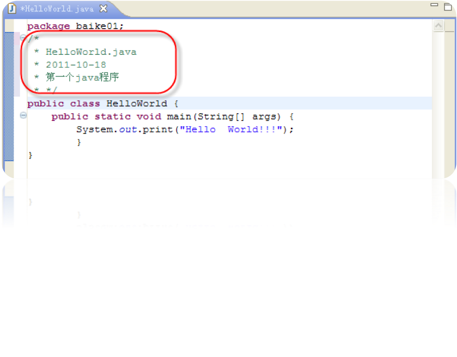

## 第一节 Java程序规范

### 源程序

```java
package ；
 // 该部分至多只有一句，必须放在源程序的第一句
import ； 
/*该部分可以有若干import语句或者没有，必须放在所有的类定义之前*/

public classDefinition；
//公共类定义部分，至多只有一个公共类的定义

classDefinition; 
//类定义部分，可以有0个或者多个类定义

interfaceDefinition; 
//接口定义部分，可以有0个或者多个接口定义
```

### 命名

为了提高程序的可读性，Sun公司推荐在Java编程时使用以下的习惯约定：

- **包名（packages）**：包名是全小写的名词，中间可以由点分隔开，如：java.awt.event 
- **类名（classes）**：有一个或若干个名词组成，开头大写，名词间的区分也用大写，其他小写。如：class  AccountBook
- **接口名（Interfaces）**：规则同类名。如：Interface  Account
- **方法名（methods）**：由一个或多个动词组成，开头小写，动词间区分用大写，其他小写。如：balanceAccount()
- **变量名**：小写字母开头，单词间用大写字母分隔，不要用下划线和$，如：currentCustomer
- **常量名**：所有字母大写，单词间用下划线区分，如：MAX_SIZE

### 注释

- **单行注释**：从"//"开始到本行结束的内容都是注释  如：//Comment on one line 
- **多行注释**：在"/*"和"*/"之间的所有内容都是注释  如：/* Comment on one or more lines */ 



文档注释：当程序员编完程序以后，可以通过JDK提供的javadoc命令，生成所编程序的API文档，而该文档中的内容主要就是从文档注释中提取的。该API文档以HTML文件的形式出现，与java帮助文档的风格与形式完全一致。凡是在"/**"和"*/"之间的内容都是文档注释。 

如：/** Document Comment */ 

### 块、分号和空白

- 一个语句是以;为终止的代码`totals=a+b+c+d+e+f；`
- 块的使用
  - 一个块是以上括号和下括号为边界的语句集合
    ```java
    {
    x=y+1;
    y=x+1;
    }
    ```
 - 一个块可被用在一个类的定义中
 - 块语句可被嵌套
- 空白：源代码元素之间允许空白，空白的数量不限。空白(包括空格、tabs 和新行)可以改善你的对源代码的视觉感受。

## 第二节 Java的基本符号

1. 操作符
2. 分隔符
3. 常量
4. 标识符
5. 关键字

### 字符集和标识符

#### 字符集

采用一种称为unicode的字符集，该字符集合是一种新的编码标准，与常见的ASCII码的区别在于： 

- unicode使用16位二进制而不是8位来表示一个字符。 
- unicode字符集中增加了许多非拉丁语字符。 

#### 标识符

- 赋予变量、类和方法的名称
- 以字母，数字，美元符号"$"，下划线"_"组成，标识符第一个字符不可用数字。
- Java语言对字母的大小写是敏感的，在语法中严格区分大小写，但无长度限制

### 关键字

### 关键字 

关键字是为特定目的而保留的保留字，Java的关键字有：

```
abstract boolean break byte case catch char class continue do double else extends false find finally float for implements import instanceof int interface long native new null package private public return short static super switch synchronized this throw true try void while 
```

**编程时不要将关键字作为自己的标识符**

## 第三节 数据类型和变量

### Java的基本数据类型

- 逻辑类:boolean
- 文本类:char
- 整数类
  - byte
  - short
  - int
  - long
- 浮点类
  - double
  - float

#### 逻辑类boolean

boolean 数据类型有两种文字值：true 和false。

```java
// 例：
boolean  truth = true；
//声明变量truth 为boolean 类型它被赋予的值为true
```

#### 文本类char

- 代表一个16-bit无符号的 Unicode 字符
- 必须包含用单引号（’’）引用的文字
- 使用下列符号：
  - ‘a’
  - ‘\t’ 一个制表符
  - ‘\u????’ 一个特殊的Unicode 字符，????应严格使用四个16 进制数进行替换

#### 文本类String

- 不是一个原始数据类型，它是一个类
- 具有用双引号引用的文字:“The quick brown fox jumped over the lazy dog.”
- 可按如下情形使用：
  - String greeting = “Good Morning!! \n”；
  - String err_meg = “ record not found !”;

#### 整数类──byte,short,int,long

- 采用三种进制──十进制、八进制和十六进制
  - 2 十进制值是2
  - 077 首位的0 表示这是一个八进制的数值
  - 0xBAAC 首位的0x 表示这是一个16 进制的数值
- 缺省时系统默认为int
- 用字母“L”和“l”定义long

**注意：所有的整型类都是带符号的整数；由于小写l 与数字1 容易混淆，所以定义long时最好采用大写的L。**

每个整数数据类型具有下列范围：

类型|所占位数|数值范围
---|---|---
byte|8 bits|$-2^7…2^7-1$
short|16 bits|$-2^{15}…2^{15}-1$
int|32 bits|$-2^{31}…2^{31}-1$
long|64 bits|$-2^{63}…2^{63}-1$

#### 浮点类——float、double

如果一个数字文字包括小数点或指数部分，或者在数字后带有字母F 或f（float）、D 或d（double），则该数字文字为浮点。系统默认为double

数的范围

数据类型|所占位数|数值范围
---|---|---
float|32 bits|$3.4e^{-038} ～3.4e^{+038}$
double|64 bits|$1.7e^{-038} ～1.7e^{+038}$

### Java的变量和常量

#### Java的变量

- 变量是java 程序中的基本存储单元
- Java的变量在使用前必须声明,如:
  - int
  - radios
  - color
- Java将为所有未置初值的类的成员变量预设初值

类型|boolean|char|byte|short
---|---|---|---|---
初值|false|\u0000（null）|(byte)0|(short)0
类型|int|long|float|double
初值|0|0L|0.0f|0.0

##### Java变量的作用域

变量的作用域指明可访问该变量的一段代码，声明一个变量的同时也就指明了变量的作用域；在一个确定的域中，变量名应该是唯一的。 

- **局部变量**：在方法或方法的一个块代码中声明，它的作用域为它所在的代码块（整个方法或方法中的某块代码） 
- **类变量**：在类中声明，而不是在类的某个方法中声明，它的作用域是整个类。 
- **方法参数**：用来传递给方法，它的作用域就是这个方法。 
- **例外处理参数**：传递给例外处理代码，它的作用域就是例外处理部分。 

#### Java的常量

用保留字final来定义，如：`final int NUM=100; `

### 数据类型的转换

- Java是一种强类型的语言，在赋值和参数传递时，都要求类型的匹配。不匹配的需类型转换。
- 类型转换有三种情况：自动转换、强制转换和使用类的方法转换。

#### 自动转换

往往低精度类型到高精度类型能自动转换。
如： byte b1=10, b2=20；int  b3=b1+b2；

#### 强制转换：高精度类型到低精度类型必须强制转换。这时数据可能会丢失部分信息。

如：`char  key=(char)(12+55)	//变量key被赋值为unicode值为67的字符'c'`

#### 方法转换

如:

```java
String  str = "123";	
int  a = Integer.parseInt(str);
// 使用Integer类的方法parseInt将String转换为对应的整数
```

不同类型数据间的优先关系如下：      

低------------------------------->高   byte,short,char-> int -> long -> float -> double

运算中，不同类型的数据先转化为同一类型，然后进行运算，转换从低级到高级。

## 第四节 数组

- 数组是有序数据的集合, 数组中的每个元素具有相同的类型
- 数组可看成是相同类型的数据按顺序组成的一种复合数据类型
- 数组名和下标可唯一地确定数组中的元素。
- 数组可分为一维数组和多维数组.
- Java的数组使用前必须先声明

### 一维数组

```java
/* 声明
格式type arrayName[ ]；或者
         type [ ]   arrayName；
*/
char s[];

// 创建：使用关键字new 创建一个数组对象
s = new char [20];

// 静态初始化
int intArray[]={1,2,3,4}; 
String stringArray[]={"abc", "How", "you"};

// 动态初始化
// 简单类型的数组
int intArray[]; 　　　　 
intArray = new int[5];
// 或者
intArray={1,2,3,4,5};
```

引用：`arrayName[index] `

index为数组下标，它可以为整型常数或表达式，下标从0开始，一直到数组的长度减1

数组都有一个属性length指明数组的长度，即数组元素的个数。

例如: intArray.length指明数组intArray的长度。

```java
/*
初始化
动态初始化
复合类型的数组
*/

String stringArray[ ];
String stringArray = new String[3];
stringArray[0]= new String(“How”);
stringArray[1]= new String(“are”);
stringArray[2]= new String(“you”);

// 或者
String stringArray[ ]=｛”How”, ”are”, ”you”};
```

**注意：所有变量的初始化(包括数组元素)是保证系统安全的基础，变量绝不能在未初始化状态使用**

### 二维数组

ava语言中，把二维数组看作是数组的数组，数组空间不是连续分配的，所以不要求二维数组每一维的大小相同。

```java
// 定义：
type arrayName[ ][ ]；
//引用：
arrayName[index1][index2]

// 非矩形数组的数组

int twoDim [][] = new int [4][];
   twoDim[0] = new int [2];
   twoDim[1] = new int [4];
   twoDim[2] = new int [6];
   twoDim[3] = new int [8];

// 每个数组有5 个整数类型的4 个数组的数组
int twoDim [][] = new int [4][5];
```

### 数组的越界

- 与C、C++不同，Java对数组元素的下标要进行越界检查以保证其安全性。
- 使用数组元素时，如果其下标超过允许的范围，则会发生数组（下标）的越界。这时，虽然程序能通过编译，但在运行时会产生一个例外（异常）：
  - 例外名为ArrayIndexOutOfBoundsException
- 所以编程时要注意检查数组下标，使之不超出允许的范围。