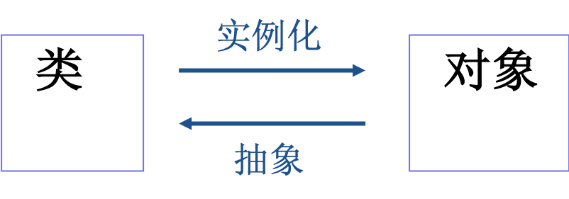

## 第一节 面向对象程序设计的基本概念

- 面向过程编程 Vs 面向对象编程
- 对象和类
- 面向对象程序设计的特点
  - 封装性（Encapsulation） 
  - 继承性（Inheritance）
  - 多态性（Polymorphism） 

### 面向过程编程 Vs 面向对象编程

- 面向过程编程
  - 传统的程序设计方法，按工作流程来编写程序，比如：Pascal、C
  - 缺点：程序往往缺乏对代码重用的支持，并且缺乏统一的接口，使得当程序的规模达到一定程度时，程序员很难控制其复杂性。
- 面向对象编程（OOP）
  - 按照现实世界的特点来管理复杂的事物，并把它们抽象为对象，每一对象具有自己的状态和行为，通过对消息的反应来完成一定的任务。
  - 克服了面向过程程序设计方法的主要缺点

### 对象和类

- 对象
  - 对象是系统中用来描述客观事物的一个实体（如汽车） ，它是构成系统的一个基本单位。
    - 事物的特性就是数据（载客数量、燃料容量、耗油均值），在编程语言中对应变量
    - 事物的行为就是方法（行驶、起动、刹车）
  - 一个对象就是变量和相关的方法的集合，其中变量表明对象的状态，方法表明对象所具有的行为。
- 类（class） 
  - 对象是一个具体的事物，例如每辆汽车都是一个不同的对象。但是多个对象常常具有一些共性，如所有的汽车都有轮子、方向盘、刹车装置等。将一类对象的共性抽象出来，就形成了类。
  - 类中定义了一类对象共有的变量和方法。
  - 把一个类实例化即生成该类的一个对象。 

**面向对象的程序设计方法就是将客观事物抽象成为“类”，并通过类的“继承”实现软件的可扩充性和可重用性。**

### 面向对象程序设计的特点

- 封装性：通过封装可以隐藏类的实现细节，也可以避免对类中数据的直接操作。类是封装的基本单元。
- 继承性：继承是对类的功能的重用和扩充。 
- 多态性：多态性是指方法的名字相同，但实现不同。

**Java是一种完全面向对象的程序设计语言，具有上述三个特点**

#### 封装性（Encapsulation） 

- 封装性就是把对象的属性和服务结合成一个独立的相同单位，并尽可能隐蔽对象的内部细节 
- 封装的目的是实现数据隐藏
  - 使我们不必关心对象的行为是如何实现的这样一些细节
  - 通过对对象的封装，实现了模块化和信息隐藏，有利于程序的可移植性和安全性，同时也利于对复杂对象的处理。
- 封装的原则（软件）：要求使对象以外的部分不能随意存取对象的内部数据（属性），从而有效的避免了外部错误对它的"交叉感染"，使软件错误能够局部化，大大减少查错和排错的难度。

#### 继承性（Inheritance）

- 特殊类的对象拥有其一般类的全部属性与服务，称作特殊类对一般类的继承。 比如轮船，客轮；人，大人。
- 在java中，通常我们称一般类为父类（superclass，超类），特殊类为子类(subclass)。
- 通过继承可实现代码的复用，大大减少了程序的工作量。

##### Java的继承机制 VS C++的继承机制

1. 在C++中支持多重继承，但Java只支持单一继承，即一个子类只能有一个父类。
2. 单继承大大降低了复杂度。
3. 在Java中可通过接口来实现多重继承。

#### 多态性（Polymorphism） 

- 对象的多态性是指在一般类中定义的属性或服务被特殊类继承之后，可以具有不同的数据类型或表现出不同的行为。
- 也就是相同的语言结构，用来表示不同类型的实体或对不同类型的实体进行操作。即“相同的界面，不同的内部实现形式”。
- Java通过方法重载(overloading method) 和方法重写(overriding method)来实现多态性。

## 第二节 Java的类

- 类的定义
- 成员变量
- 成员方法
- 方法重载
- 构造方法

### 类的定义

#### 类声明

```java
[public|abstract|final] class className [extends superclassName] [implements interfaceNameList]  { …… }
```

- 修饰符public,abstract,final 说明了类的属性
- className为类名
- superclassName为类的父类的名字
- interfaceNameList为类所实现的接口列表。

#### 类体：类具体实现的部分

类体中定义了该类所有的变量和该类所支持的方法，变量通常在方法前声明。

```java
{[public | protected | private ] [static] 　[final] [transient] [volatile] type variableName;　　　//成员变量
　 [public | protected | private ] [static]　　[final | abstract] [native] [synchronized]　　returnType methodName([paramList]) 
            [throws exceptionList]　　　{statements} 　　　　　　　//成员方法　　}
```

### 成员变量

- 声明:`[public | protected | private ] [static] [final] [transient] [volatile] type variableName; `
- 修饰符
  - static: 静态变量（类变量）；相对于实例变量
  - final: 常量
  - transient: 暂时性变量，用于对象存档
  - volatile: 贡献变量，用于并发线程的共享

### 成员方法

方法的实现包括方法声明和方法体

```java
[public | protected | private ] [static]　[final | abstract] [native] [synchronized]　returnType methodName([paramList])　　[throws exceptionList] 　　　　　　　　//方法声明　　　{statements} 　　　　　　　　　　//方法体

```

#### 方法声明中的限定词的含义

- static:类方法，可通过类名直接调用
- abstract:抽象方法，没有方法体
- final:方法不能被重写
- native:集成其它语言的代码
- synchronized:控制多个并发线程的访问 

#### 类的定义（例）

```java
class EmpInfo {
    String name;
    String designation;
    String department;
    void print() {
         System.out.println(name + " is " + designation + " at " + department);
}
}
```

**定义了一个名为EmpInfo的类，类中声明了两三个String型变量name、designation、department，并定义了一个print()方法，通过该方法对输出变量值**

#### 参数传递

- Java通过传值来传递参数
  - C语言中传递参数有传值和传指针等多种方式，而Java只有传值一种方式，所以Java中实在参数在函数调用中不会被改变。
  - 实在参数是指方法调用时实际给出的参数，而形式参数是指方法声明时给出的参数 
- 当一个对象实例作为一个参数传给方法时，实际传递的参数值是该对象的引用。 
  - 在方法调用中，如果传递的参数是一个对象，那么调用前后对象的引用不会改变，而对象的值能够被改变。

#### 方法体

1. 方法体是对方法的实现，它包括局部变量的声明以及所有合法的Java指令。
2. 方法体中声明的局部变量的作用域在该方法内部。若局部变量与类的成员变量同名，则类的成员变量被隐藏。
3. 通常Java为所有定义在类中未置初值的类的成员变量预置初值。

### 变量的分类

#### 类的成员变量

- 类中声明的变量称类的成员变量，这些变量声明在类的所有方法之外
- 类的成员变量的作用域是整个类。
- 类的成员变量可分为实例变量和类变量两种
  - 类变量是用static关键字说明的变量，除类变量外
  - 其他类的成员变量均为实例变量
- 局部变量
  - 局部变量定义在方法的内部，其作用域限于方法内，在方法执行时创建，在方法结束时消亡，所以又称临时变量或自动变量。

### 方法重载(overloading method)

同一类中有多个同名的方法，但有不同的实现

方法重载是让类以统一的方式处理不同类型数据的一种手段。

Java的方法重载，就是在类中可以创建多个方法，它们具有相同的名字，但有不同的参数和不同的实现。

调用方法时通过传递给它们的不同个数和类型的参数来决定具体使用哪个方法。

**注意：Java的方法重载要求同名的方法必须有不同的参数表，仅有返回类型不同是不足以区分两个重载的方法。**

### 构造方法(constructor) 

- 构造方法是一个特殊的方法。Java 中的每个类都有构造方法，用来初始化该类的一个对象
- 构造方法具有和类名相同的名称，而且不指出返回任何数据类型，它的缺省返回类型就是对象类型本身
- 构造方法只能由new运算符调用
- 如果在类中没有明确地给出一个构造方法，java就会自动构造一个缺省的、不带参数的构造方法（称为default constructor）并执行
  - 事实上，这个缺省的构造方法是通过调用其父类的构造方法来实现的
- Java支持构造方法的重载

#### 构造方法——程序举例

```java
class Point{
   int x,y;
   Point()    {  x=0; y=0;      }
   Point(int x,int y)    {    this.x=x;       this.y=y;   }
}

public class PointCreate {
public static void main(String args[]) {
Point p1 = new Point(10,20);
System.out.println("p1: x="+p1.x+",y="+p1.y);
Point p2 = new Point();
System.out.println("p2: x="+p2.x+",y="+p2.y);
   }
}
```

#### 构造方法——程序浅析

在程序PointCreate.java中，类point定义了有两个方法名均为point的构造方法，这是方法的重载，系统能根据不同的参数调用不同的构造方法

与构造方法相对有一种被称为析构方法的方法，它在对象消亡时被执行，可用于释放对象占用的资源，但Java中较少用到

析构方法与构造方法相反，用来在对对象进行垃圾收集前释放系统资源。Java的析构方法为finalize()，但由于Java可自动进行内存垃圾回收，所以大多数情况下可不用finalize()方法

## 第三节 Java的对象

- 对象的生成
- 对象的使用
- 对象的清除

### 类和对象的关系

- 类是对象的模板，也是对象的原型。类通过new操作符生成的实例就是对象。
- 通常通过类来创建该类的实例（即对象），然后在实例上工作。 
- 一个对象的生命周期包括生成、使用和清除。



### 对象的生成

- 对象的生成包括声明、实例化和初始化。type objectName=new type([paramlist]); 
  - 声明：type objectName ,声明并不为对象分配内存空间，而只是分配一个引用空间 
  - 实例化：运算符new为对象分配内存空间，它调用对象的构造方法，返回引用；一个类的不同对象分别占据不同的内存空间 
  - 生成：执行构造方法，进行初始化；根据参数不同调用相应的构造方法
- 举例：`Student s=new Student（”小张”,”22”,”清华大学”）；`

### 对象的使用

通过运算符“.”可以实现对变量的访问和方法的调用。变量和方法可以通过设定访问权限来限制其它对象对它的访问

- 调用对象的变量：objectReference.variable
- 调用对象的方法：objectReference.methodName([paramlist]);

### 对象的清除

当不存在对一个对象的引用时，该对象成为一个无用对象。Java的垃圾收集器自动扫描对象的动态内存区，把没有引用的对象作为垃圾收集起来并释放。

### 内存垃圾回收

Java的内存管理机制与C、C++不同，C、C++的内存资源由使用者（程序员）来释放；而Java系统具有自动 “内存垃圾回收”机制，当对象不再被引用时，Java将自动回收并释放该对象使用的内存。

Java系统中有一个名为gc(Garbage Collector)的线程，该线程会在系统空闲时自动运行，销毁不再使用的对象，收回对象所占用的内存资源；

当系统内存用尽或调用System.gc( )要求垃圾回收时，垃圾回收线程与系统同步运行

## 第四节 Java中面向对象的特性

- 封装性
- 继承性
- 多态性
- 其他

### 封装性

在Java语言中，对象就是对一组变量和相关方法的封装，其中变量表明了对象的状态，方法表明了对象具有的行为。通过对象的封装，实现了模块化和信息隐藏。通过对类的成员施以一定的访问权限，实现了类中成员的信息隐藏。 

```java
// 类的定义
class className　　{ 　　
    [public | protected | private ] [static] 　　　　　
    [final] [transient] [volatile] type　　　　　
    variableName; 　　　　　　//成员变量
　　
    [public | protected | private ] [static]　　　　　
    [final | abstract] [native] [synchronized]　　　　　
    returnType methodName([paramList])　　　　　
    [throws exceptionList]　　　　　
    {statements} //成员方法　　
}
```

- Java类和方法中的限定词提供了不同的存取控制权限（访问权限）
- 存取控制权限的含义:一个类A能存取另一个类B意味着 
  - 能建立类B的实例 
  - 能继承类B 
  - 能存取类B中的方法和变量 

#### Java类中的限定词

- private:
  - 类中限定为private的成员，只能被这个类本身访问
  - 如果一个类的构造方法声明为private,则其它类不能生成该类的一个实例
- default:类中不加任何访问权限限定的成员属于缺省的（default）访问状态，可以被这个类本身和同一个包中的类所访问
- protected:类中限定为protected的成员，可以被这个类本身、它的子类（包括同一个包中以及不同包中的子类）和同一个包中的所有其他的类访问
- public:类中限定为public的成员，可以被所有的类访问

#### Java中类的限定词的作用范围比较 

修饰符|同一个类|同一个包|不同包的子类|不同包非子类
:---:|:---:|:---:|:---:|:---:
private|X|||
default|X|X||
protected|X|X|X|
public|X|X|X|X

**X 表示有存取权限**

### 继承性

- 类继承的目的是以原有的类为基础创建新的类，从而达到代码复用的目的。
- 被继承的类称为父类。从父类派生出来的新类称子类。
- 子类不能继承父类中访问权限为private的成员变量和方法。子类可以重写父类的方法，及命名与父类同名的成员变量 
- Java只支持单重继承，不支持多重继承，所以一个类只能有一个父类。
- 创建子类`class SubClass extends SuperClass {　　…　　}`
- 成员变量的隐藏：将父类的状态转变换为自身的状态

方法重写（overriding method）：将父类的行为转变为自身行为

在Java中，子类可继承父类中的方法，而不需要重新编写相同的方法。但有时子类并不想原封不动地继承父类的方法，而是想作一定的修改，这就需要采用方法的重写。方法重写又称方法覆盖。

若子类中的方法与父类中的某一方法具有相同的方法名、返回类型和参数表，则新方法将覆盖原有的方法。

**注意：子类中重写的方法和父类中被重写的方法要具有相同的名字，相同的参数表和相同的返回类型，只是函数体不同。**

- 访问父类被隐藏的成员变量,如：super.variable
- 调用父类中被重写的方法,如：super.Method([paramlist])
- 调用父类的构造函数,如：super([paramlist]);

### 多态性

编译时多态：在编译阶段，具体调用哪个被重载的方法，编译器会根据参数的不同来静态确定调用相应的方法——方法重载。

运行时多态：由于子类继承了父类所有的属性（私有的除外），所以子类对象可以作为父类对象使用。程序中凡是使用父类对象的地方，都可以用子类对象来代替。一个对象可以通过引用子类的实例来调用子类的方法。——方法重写 

重写方法的调用原则：java运行时系统根据调用该方法的实例，来决定调用哪个方法。对子类的一个实例，如果子类重写了父类的方法，则运行时系统调用子类的方法；如果子类继承了父类的方法（未重写），则运行时系统调用父类的方法。

### 其他面向对象的属性

#### final关键字

使用final关键字修饰的类不能被其他类所继承，一个类用final 限定，往往是出于安全方面的考虑，比如java.lang.String，就是一个这样的类。

用final关键字修饰的方法不能被重写，一个方法用final限定，主要也是基于安全方面的考虑，有时，方法的实现不想被外界改变，可用final限定。

变量前如使用final关键字修饰，该变量相当于常量，其值不能被修改。

1. 习惯上变量名全用大写，单词间区分用下划线
2. 定义时必须预置初值

#### 实例成员和类成员

用static 关键字可以声明类变量和类方法，如果在声明时不用static 关键字修饰，则声明为实例变量和实例方法。

#### 实例变量 vs 类变量

每个对象的实例变量都分配内存，通过该对象来访问这些实例变量，不同的实例变量是不同的。

类变量仅在生成第一个对象时分配内存，所有实例对象共享同一个类变量，每个实例对象对类变量的改变都会影响到其它的实例对象。类变量可通过类名直接访问，无需先生成一个实例对象。

#### 实例方法 vs 类方法

实例方法可以对当前对象的实例变量进行操作，也可以对类变量进行操作，实例方法由实例对象调用

类方法不能访问实例变量，只能访问类变量。类方法可以由类名直接调用，也可由实例对象进行调用。类方法中不能使用this或super关键字

#### 类java.lang.Object 

类java.lang.Object处于java开发环境的类层次的根部，其它所有的类都是直接或间接地继承了此类。该类定义了一些最基本的状态和行为。

常用方法

- equals() ：比较两个对象(引用)是否相同
- getClass()：返回对象运行时所对应的类的表示，从而可得到相应的信息
- toString()：用来返回对象的字符串表示
- finalize()：用于在垃圾收集前清除对象
- notify(),notifyAll(),wait()：用于多线程处理中的同步。 

## 第五节 抽象类和接口

抽象类
接口


## 第六节 内部类

### 内部类的定义和使用

内部类是在一个类的内部嵌套定义的类，它可以是其它类的成员，也可以在一个语句块的内部定义，还可以在表达式内部匿名定义


内部类也称为嵌套类，是JDK1.1后才有的。可以用嵌套类联系两个逻辑上相关的类，定义格式如下

```java
class EnclosingClass{
    // ………
    class ANestedClass {  //该类为嵌套类
        // …………
    }
}
```

### 内部类的特诊

- 一般用在定义它的类或语句块之内,在外部引用它时必须给出完整的名称.名字不能与包含它的类名相同
- 可以使用包含它的类的静态和实例成员变量,也可以使用它所在方法的局部变量
- 可以定义为abstract，也可以声明为private或protected
- 若被声明为static,就变成了顶层类,不能再使用局部变量
- 若想在Inner Class中声明任何static成员,则该Inner Class必须声明为static

### 内部类的优缺点

优点：节省编译后产生的字节码文件大小

缺点：使程序结构不清楚

## 第七节 第七节 Java的包(package)

- 包(package)是类的逻辑组织形式。Java使用包将相关的类组织起来。
- 有两类包：
  - 系统包：Java系统预定义好的包，包含在系统类库中
  - 用户自定义包：用户自己定义的包
- package的命令规则是层次型的，中间用“.”分割。
  - 如：java.lang.Object 

### 系统包

系统包包含在Java类库中，每个包中都有大量与某一主题相关的系统类，可供编程使用。

java常用的包有：.

java.lang|基础包
---|---
java.util|实用工具包
java.awt|抽象窗口工具包
java.text|文本包
java.io|输入输出包
java.applet|Applet包
java.net|网络功能包

### Import语句

当使用包时，你可以使用import语句来告诉编译器到哪里去找相应的类。如：

```java
import java.io.*;
public class Example{
  FileReader fl = new FileReader("abc.txt");
      ……
}
```

- 若不用import语句，编译器就无法知道到哪里去找FileReader这个类，除非在程序中使用包含包前缀的完整类名，如java.io.FileReader。
- java.lang.*是系统自动import 的，所以该包中的String等类可直接使用。 

### 用户自定义包

用户可使用package语句自己来定义包。

包定义必须放在源文件的开头。每个源文件只能有一个包定义语句。定义在源文件中的所有类均属于这个包。例： 

```java
package myPackage;
public class Employee{
……
}   //类Employee定义在包myPackage中
// 通过 包名.类名 来引用包中的类
```

习惯上，package名用小写字母。为了避免package的重名，Sun推荐这样一套命名模式：即将URL地址反过来，再加包名。如：`cn.edu.ecnu.cs.ym.myPackage`


