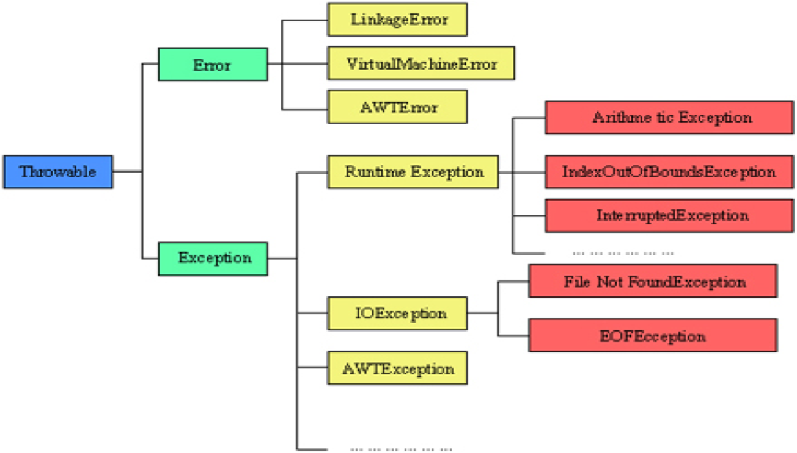

## 第一节  例外的概念

- 例外（Exception）又称异常。在Java中，它定义了程序运行中可能遇到的轻微错误或异常情况。
- 如发生下列情况时均会产生异常： 
  - 要打开的文件并不存在。
  - 网络连接不可用。 
  - 进行操作的操作数超越了指定的边界。 
  - 需要载入的类或类文件未找到。
- 当发生例外时，如果不进行处理，系统往往会终止运行。程序员可以通过自己编写有针对性的代码来对它进行处理，以让程序继续运行下去。

### 异常的一个例子

```java
public class HelloWorld{
    public static void main(String args[]){
        int i = 0;
        String greetings[] = {"Hello World!",
        "No,I mean it!","HELLO WORLD!!"};
        while(i<4){
            System.out.println(greeting[i]);
            i++;
        }
    }
}
```

该程序在运行时会产生一个例外并终止。产生的例外是：java.lang. ArrayIndexOutOfBoundsException。这是因为while循环中当i=3时下标已超出了允许的范围。

### Java的例外处理机制

- 在Java程序的执行过程中，如果出现了异常事件，就会生成一个例外对象。生成的例外对象将传递给Java运行时系统，这一例外的产生和提交过程称为抛弃(throw)例外。
- Java的例外处理机制将例外处理与正常的程序流分开，两者的代码相隔离，可使程序员专注于某一事件的处理。这样产生的代码可读性好，易于管理。
- 捕获例外：当Java运行时系统得到一个例外对象时，它将会沿着方法的调用栈逐层回溯，寻找处理这一例外的代码。找到能够处理这种类型的例外的方法后，运行时系统把当前例外对象交给这个方法进行处理，这一过程称为捕获(catch)例外。这是积极的例外处理机制。如果Java运行时系统找不到可以捕获例外的方法，则运行时系统将终止，相应的Java程序也将退出。
- 声明抛弃例外：如果一个方法并不知道如何处理所出现的例外，则可在方法声明时，声明抛弃（throws）例外。这是一种消极的例外处理机制。

## 第二节  例外对象类型

本节主要包含以下内容：


当例外发生后，系统会产生一个例外事件，生成一个例外对象。例外对象类型很多，分别与各自的类相对应。

### 例外类的层次结构

- java.lang.Throwable是所有例外类和错误类的祖先。
  - Throwable自身是java.lang.Object的子类
  - Throwable有两个主要的子类： Exception类和Error类
    - 其中Exception类是所有例外类的祖先，Error类是所有错误类的祖先
  - 在Throwable类中定义了一些方法，这些方法能够搜索与例外有关的错误信息，并指出发生例外的地方
- Exception类又有许多子类，如RuntimeException（运行时例外类）和IOException等。

### 例外类的层次结构（图）



### Error类及子类

Error类及子类对应的是一些难得发生的严重的系统内部错误,如**系统崩溃、虚拟机出错、动态链接失败、内存溢出和死循环**等情况

这一类错误一般无法恢复或不可能捕捉，将导致程序无法运行下去，而且大多数情况下运行中的Java程序也无法自身干预解决。

一旦遇到这一类情况，不大可能让程序员来处理这些情况，大多数情况下让程序终止是明智的。 

**注：程序员不需要处理Error类及子类的对象**

### RuntimeException类

运行时例外类

- 这种类型的例外无法在程序编译时检查出来，而是在程序运行中出现的。如：ArrayIndexOutOfBoundsException - 数组下标越界例外
- 运行时例外往往是程序设计中出现了Bug(问题)，导致例外的产生。这类例外对应的情况在程序正常执行时是不会发生的。
- 由于运行时例外处理起来开销较大，对这类例外，程序员可以处理它也可以不处理它。

### 其他例外

其他例外指除RuntimeException外的所有例外

这些例外往往对应程序运行中遇到的一些轻微的错误或异常情况，这一类例外由编程者处理后，程序可继续运行下去。如：

- FileNotFoundException - 文件未找到引起的例外
- IOException - 输入输出或文件读写引起的例外
- NullPointerException – 空指针例外
- SQLException - 与数据库有关的例外…

Java编译器在编译时能检查出程序中是否可能会产生这一类例外。

对于这一类例外，Java要求程序员必须进行处理，否则程序在编译时会出错。

### 一些常见的例外类

#### ArithmeticException 

算术运算错误，如除数为0而引起的，如 int i = 12/0; 

#### NullPointerException 

该例外的产生常常是因为当对象尚未创建时就去存取对象内的变量和方法。如：

```java
Date d = null; 
System.out.println(d.toString()); 
```

这里d是一个空的对象，调用其方法就产生该例外

#### ArrayIndexOutOfBoundsException 

该例外的产生往往是因为要存取的数组元素其下标超出了数组的下标范围。 

#### SecurityException 

该例外一般由浏览器产生，当浏览器发现执行的Applet试图做下列事情时，其SecurityManager类会产生这个例外： 

- 试图存取本地的文件系统 
- 试图与Applet所在服务器以外的其它服务器联系 
- 试图执行运行环境中的其他程序 

## 第三节  例外处理机制

## 第四节  用户自定义例外


