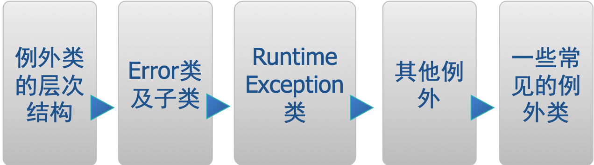

## 第一节  例外的概念

- 例外（Exception）又称异常。在Java中，它定义了程序运行中可能遇到的轻微错误或异常情况。
- 如发生下列情况时均会产生异常： 
  - 要打开的文件并不存在。
  - 网络连接不可用。 
  - 进行操作的操作数超越了指定的边界。 
  - 需要载入的类或类文件未找到。
- 当发生例外时，如果不进行处理，系统往往会终止运行。程序员可以通过自己编写有针对性的代码来对它进行处理，以让程序继续运行下去。

### 异常的一个例子

```java
public class HelloWorld{
    public static void main(String args[]){
        int i = 0;
        String greetings[] = {"Hello World!",
        "No,I mean it!","HELLO WORLD!!"};
        while(i<4){
            System.out.println(greeting[i]);
            i++;
        }
    }
}
```

该程序在运行时会产生一个例外并终止。产生的例外是：java.lang. ArrayIndexOutOfBoundsException。这是因为while循环中当i=3时下标已超出了允许的范围。

### Java的例外处理机制

- 在Java程序的执行过程中，如果出现了异常事件，就会生成一个例外对象。生成的例外对象将传递给Java运行时系统，这一例外的产生和提交过程称为抛弃(throw)例外。
- Java的例外处理机制将例外处理与正常的程序流分开，两者的代码相隔离，可使程序员专注于某一事件的处理。这样产生的代码可读性好，易于管理。
- 捕获例外：当Java运行时系统得到一个例外对象时，它将会沿着方法的调用栈逐层回溯，寻找处理这一例外的代码。找到能够处理这种类型的例外的方法后，运行时系统把当前例外对象交给这个方法进行处理，这一过程称为捕获(catch)例外。这是积极的例外处理机制。如果Java运行时系统找不到可以捕获例外的方法，则运行时系统将终止，相应的Java程序也将退出。
- 声明抛弃例外：如果一个方法并不知道如何处理所出现的例外，则可在方法声明时，声明抛弃（throws）例外。这是一种消极的例外处理机制。

## 第二节  例外对象类型

本节主要包含以下内容：



当例外发生后，系统会产生一个例外事件，生成一个例外对象。例外对象类型很多，分别与各自的类相对应。

### 例外类的层次结构

- java.lang.Throwable是所有例外类和错误类的祖先。
  - Throwable自身是java.lang.Object的子类
  - Throwable有两个主要的子类： Exception类和Error类
    - 其中Exception类是所有例外类的祖先，Error类是所有错误类的祖先
  - 在Throwable类中定义了一些方法，这些方法能够搜索与例外有关的错误信息，并指出发生例外的地方
- Exception类又有许多子类，如RuntimeException（运行时例外类）和IOException等。

### 例外类的层次结构（图）


### Error类及子类

Error类及子类对应的是一些难得发生的严重的系统内部错误,如**系统崩溃、虚拟机出错、动态链接失败、内存溢出和死循环**等情况

这一类错误一般无法恢复或不可能捕捉，将导致程序无法运行下去，而且大多数情况下运行中的Java程序也无法自身干预解决。

一旦遇到这一类情况，不大可能让程序员来处理这些情况，大多数情况下让程序终止是明智的。 

**注：程序员不需要处理Error类及子类的对象**

### RuntimeException类

运行时例外类

- 这种类型的例外无法在程序编译时检查出来，而是在程序运行中出现的。如：ArrayIndexOutOfBoundsException - 数组下标越界例外
- 运行时例外往往是程序设计中出现了Bug(问题)，导致例外的产生。这类例外对应的情况在程序正常执行时是不会发生的。
- 由于运行时例外处理起来开销较大，对这类例外，程序员可以处理它也可以不处理它。

### 其他例外

其他例外指除RuntimeException外的所有例外

这些例外往往对应程序运行中遇到的一些轻微的错误或异常情况，这一类例外由编程者处理后，程序可继续运行下去。如：

- FileNotFoundException - 文件未找到引起的例外
- IOException - 输入输出或文件读写引起的例外
- NullPointerException – 空指针例外
- SQLException - 与数据库有关的例外…

Java编译器在编译时能检查出程序中是否可能会产生这一类例外。

对于这一类例外，Java要求程序员必须进行处理，否则程序在编译时会出错。

### 一些常见的例外类

#### ArithmeticException 

算术运算错误，如除数为0而引起的，如 int i = 12/0; 

#### NullPointerException 

该例外的产生常常是因为当对象尚未创建时就去存取对象内的变量和方法。如：

```java
Date d = null; 
System.out.println(d.toString()); 
```

这里d是一个空的对象，调用其方法就产生该例外

#### ArrayIndexOutOfBoundsException 

该例外的产生往往是因为要存取的数组元素其下标超出了数组的下标范围。 

#### SecurityException 

该例外一般由浏览器产生，当浏览器发现执行的Applet试图做下列事情时，其SecurityManager类会产生这个例外： 

- 试图存取本地的文件系统 
- 试图与Applet所在服务器以外的其它服务器联系 
- 试图执行运行环境中的其他程序 

## 第三节  例外处理机制

为了让写出来的代码比较强壮(robust)，java语言要求除Error和RuntimeException之外的所有例外都能够得到处理。

通对例外的处理有两类方法：

- 捕获例外：在可能产生例外的方法中自己使用try-catch-finally语句段来捕获和处理例外
- 声明抛弃例外：如不想在当前方法中处理例外，可使用throws语句将例外递交给当前方法的调用者去处理

**究竟采用哪种形式，主要取决于程序员认为在哪里处理异常比较合适**

### 捕获例外处理


#### try

捕获例外的第一步是用try{…}选定捕获例外的范围，由try所限定的代码块中的语句在执行过程中可能会生成例外对象并抛弃

#### catch

- 每个try代码块可以伴随一个或多个catch语句，用于处理try代码块中所生成的例外事件。catch语句只需要一个形式参数指明它所能够捕获的例外类型,这个类必须是Throwable的子类,运行时系统通过参数值把被抛弃的例外对象传递给catch块
- 在catch块中是对例外对象进行处理的代码，与访问其它对象一样，可以访问一个例外对象的变量或调用它的方法。getMessage( )是类Throwable所提供的方法，用来得到有关异常事件的信息，类Throwable还提供了方法printStackTrace( )用来跟踪异常事件发生时执行堆栈的内容。 

##### catch语句的顺序

捕获例外的顺序和catch语句的顺序有关，当捕获到一个例外时，剩下的catch语句就不再进行匹配。因此，在安排catch语句的顺序时，首先应该捕获最特殊的例外，然后再逐渐一般化。也就是一般先安排子类，再安排父类

#### finally

捕获例外的最后一步是通过finally语句为例外处理提供一个统一的出口，使得在控制流转到程序的其它部分以前，能够对程序的状态作统一的管理。不论在try代码块中是否发生了异常事件，finally块中的语句都会被执行

```java
public class RewriteExceptionHelloWorld {
public static void main(String args[]) {
int  i=0;
String greetings[] = {"Hello World!", 
"No,I mean it!","HELLO WORLD!!"};

while (i < 4) {
try {
System.out.println (greetings[i]);
} catch (ArrayIndexOutOfBoundsException e){
System.out.println( "Re-setting Index Value");
i = 10;
} finally {
System.out.println("This is always printed");
}
 i++;
}
}}
```

### 声明抛弃例外

如果在一个方法中生成了一个例外，但是这一方法并不确切地知道该如何对这一异常事件进行处理，这时，一个方法就应该声明抛弃例外，使得例外对象可以从调用栈向后传播，直到有合适的方法捕获它为止

#### 抛出例外

抛出例外就是产生例外对象的过程，首先要生成例外对象，例外或者由虚拟机生成，或者由某些类的实例生成，也可以在程序中生成。在方法中，抛出例外对象是通过throw语句实现

**可以抛出的例外必须是Throwable或其子类的实例**

声明抛弃例外是在一个方法声明中的throws子句中指明的

`public int read () throws IOException{…}`

throws子句中同时可以指明多个例外，之间由逗号隔开

`public static void main(String args[]) throws 　　IOException,IndexOutOfBoundsException {…}`

## 第四节  用户自定义例外

### 用户也可自定义例外。

自定义的例外类必须继承Exception类，其它跟一般的类定义一样，可以包括变量，构造方法和方法。

系统预定义的例外是在满足一定的条件时由系统自动产生的，而用户自定义例外不会自动产生，可用throw语句来产生自定义例外类型的一个实例，如：

`throw new ServerTimedOutException(“Could not connect”,80);`

### 自定义例外的例子

```java
public class ServerTimedOutException extends Exception {
		private String reason;
		private int port;
		public ServerTimedOutException(String reason,int port) {
			this.reason = reason;
			this.port = port;
		}
		public String getReason() {
			return reason;
		}
		public int getPort() {
			return port;
		}
	}
```

### 使用自定义例外

```java
public void connectMe(String serverName)  throws
	  ServerTimedOutException {
		int success;
		int portToConnect=80;
		success = open(serverName,portToConnect);
		if (success == -1) {
			throw new ServerTimedOutException(
			“Could not connect”,80);
		}
	}
```

**connectMe()方法中调用open()方法试图去连接服务器，若服务器未给出响应，返回值为-1，则产生上述自定义例外。**

### 例外处理的嵌套

```java
// 例外处理中允许嵌套，如：
try {
	  connectMe(defaultServer);
} catch (ServerTimedOutException e) {
	  System.out.println(“Server timed out,trying alternate”);
	  try {
		connectMe(alternateServer);
	  } catch (ServerTimeOutException e1) {
		 System.out.println(“No Server currently available”);
	  }
}
```

**另外，在catch段中也可只对例外进行部分处理，然后throw给上一层调用者。**