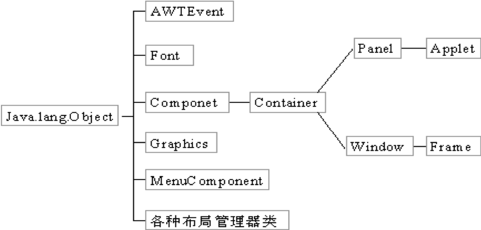
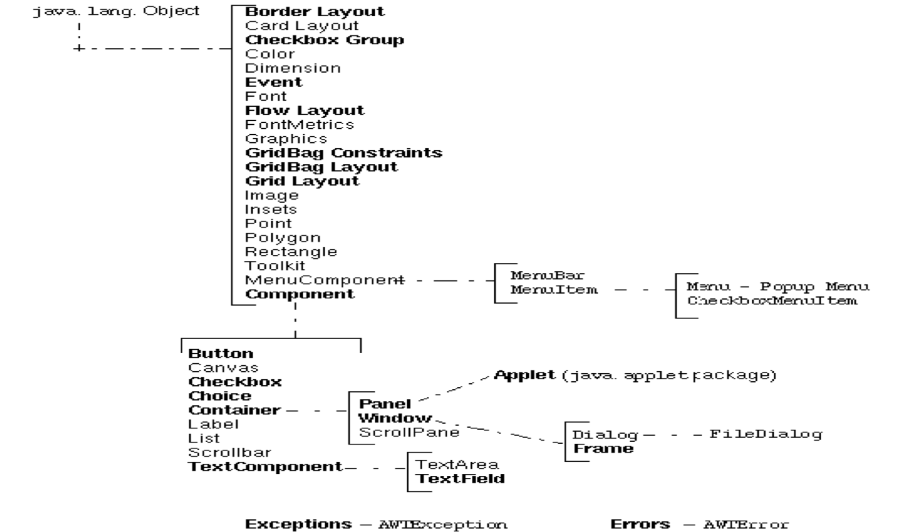
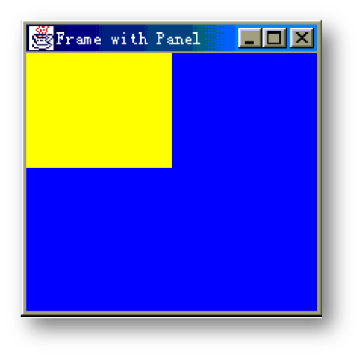
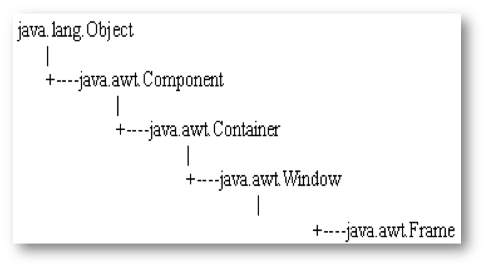
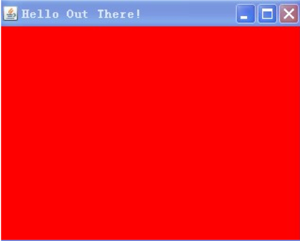
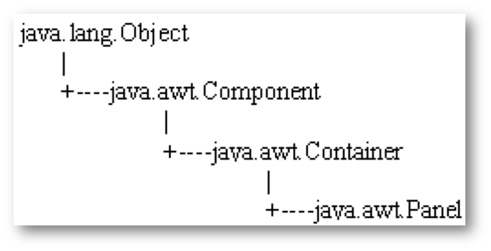
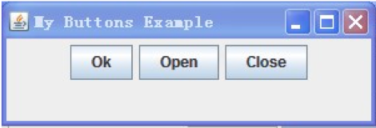
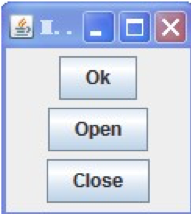
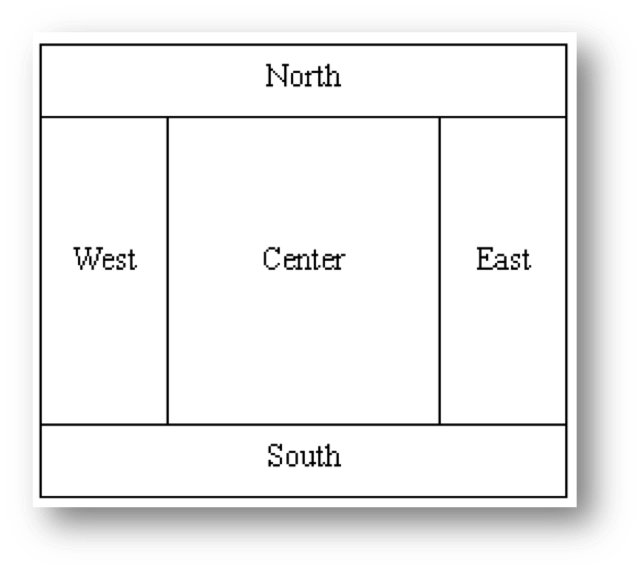
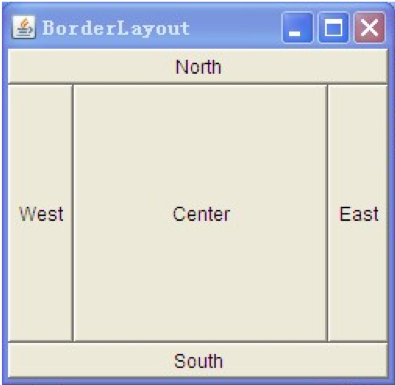

## 第一节 AWT概述

抽象窗口工具包AWT(Abstract Windowing Toolkit)，是Java提供的用来建立和设置Java的图形用户界面的工具集，可用于Java的applet和applications中。

AWT由Java中的java.awt包提供，里面包含了许多可用来建立与平台无关的图形用户界面(GUI)的类：用户界面组件、事件处理模型、图形和图像工具、布局管理器和数据传送类等组件。

### AWT的特点

由于Java是一种独立于平台的程序设计语言，但GUI却往往是依赖于特定平台的，Java采用了相应的技术使得AWT能提供给应用程序独立于机器平台的接口，这保证了同一程序的GUI在不同机器上运行具有类似的外观（不一定完全一致）。

Java1.0的AWT(旧AWT)和Java1.1以后的AWT(新AWT)有着很大的区别，新的AWT克服了旧AWT的很多缺点，在设计上有较大改进，使用也更方便，这里主要介绍新的AWT，但在Java1.1及以后版本中旧的AWT的程序也可运行。 

### AWT与Swing

- AWT是Java早期提供的图形用户界面包，提供了基本的图形组件和图形用户界面构成机制，但组件的种类不多，功能也受到限制。
- Swing是Sun公司后期推出的图形用户界面包。它基于AWT，并在以下方面作了改进：
  - Swing组件可以为不同的平台制定统一的外观和交互方式
  - 组件比AWT更丰富，使用更方便
  - 扩展了AWT中的方法和接口

**这一章主要介绍AWT，Swing组件的用法与AWT相似。**

### AWT中类的层次结构



**在AWT中，所有能在屏幕上显示的组件(component)对应的类，均是抽象类Component的子类或子孙类。**



### 组件和容器

Java的图形用户界面的基本组成部分是组件，组件是一个可以以图形化的方式显示在屏幕上并能与用户进行交互的对象

组件不能独立地显示出来，必须将组件放在一定的容器中才可以显示出来

类java.awt.Component是许多组件类的父类，Component类中封装了组件通用的方法和属性，如图形的组件对象、大小、显示位置、前景色和背景色、边界、可见性等，因此许多组件类也就继承了Component类的成员方法和成员变量，相应的成员方法包括： 

- getComponentAt(int x, int y)
- getFont()
- getForeground()
- getName()
- getSize()
- paint(Graphics g)
- repaint()
- update()
- setVisible(boolean b)
- setSize(Dimension d)
- setName(String name) 

容器(Container)也是一个类，实际上是Component的子类，因此容器本身也是一个组件，具有组件的所有性质，但是它的主要功能是容纳其它组件和容器。

布局管理器（LayoutManager）：每个容器都有一个布局管理器，当容器需要对某个组件进行定位或判断其大小尺寸时，就会调用其对应的布局管理器。

在程序中安排组件的位置和大小时，应该注意:

1. 容器中的布局管理器负责各个组件的大小和位置，因此用户无法在这种情况下设置组件的这些属性。如果试图使用Java 语言提供的setLocation()，setSize()，setBounds() 等方法，则都会被布局管理器覆盖
2. 如果用户确实需要亲自设置组件大小或位置，则应取消该容器的布局管理器，方法为：`setLayout(null)；`

## 第二节 常用容器

### Container类

- Container类是Component的子类，Container的中文意思为容器，它允许其它的组件(Component)加入其中，可以容纳多个组件，并使它们成为一个整体。
- 容器可以简化图形化界面的设计，以整体结构来布置界面。所以容器都可以通过add（）方法向容器中添加组件。
- 加入的Container的组件本身也允许是Container类型，即允许多层嵌套的层次结构。
- Container类在将组件以合适的形式安排在屏幕上时很有用，它有两个子类，Panel和Window。
  - Window可独立于其他Container而存在，它主要有两个子类：Frame和Dialog。

**Frame和Panel是最常用的两个Container。**

### Frame和Panel（图）



图中蓝色区域是一个Frame对象，Frame左上角黄色的区域是一个Panel对象。

### 常用容器Frame



- 一般要生成一个窗口，通常是用Window的子类Frame来进行实例化，而不是直接用到Window类。Frame的外观就像我们平常在windows系统下见到的窗口，有标题、边框、菜单、大小等等
- 每个Frame的对象实例化以后，都是没有大小和不可见的，因此必须调用setSize( )来设置大小，调用setVisible(true)来设置该窗口为可见的
- AWT在实际的运行过程中是调用所在平台的图形系统，因此同样一段AWT程序在不同的操作系统平台下运行所看到的图形系统是不一样的

```java
import java.awt.*;
public class MyFrame extends Frame{
     public static void main(String args[ ]){
	MyFrame fr = new MyFrame("Hello Out There!"); //构造方法
	fr.setName(args[0]);
	fr.setSize(200,200); //设置Frame的大小，缺省为（0，0）
	fr.setBackground(Color.red); //设置Frame的背景，缺省为红色
	fr.setVisible(true); //设置Frame为可见，缺省为不可见
	String str;
	str=fr.getName();
	System.out.println(str);
    }
    public MyFrame (String str){
	super(str); //调用父类的构造方法
    }
}
```



该程序能创建一个背景为红色的Frame, 其标题内容为“Hello Out There!"。

在此例中，Frame对象调用了若干方法：

- setSize()方法用于设置Frame长和宽，单位为像素
- setBackgroud()方法用于设置Frame的背景色，参数是Color类型的对象，有一些预定义的常量，如Color.blue、Color.red等
- setVisible()方法如参数为true，显示当前对象；为false，则隐藏当前对象
- 上述三个方法均是从其祖先类Component中继承的

### 常用容器Panel



象Frame一样，也可将各类组件放入Panel中，放入的组件也可以是Panel类型。
Panel缺省的布局管理器为Flow Layout。
一旦Panel对象建立后，必须加到Window或Frame对象中才能成为可见的。这可用Container类的add()方法来完成。如：

- Panel pan = new Panel();
- pan.setSize(100,100);
- pan.setBackground(Color.yellow);
- fr.add(pan); //这里fr为一个Frame对象

### 图形的布局

Container中组件的位置和大小一般是由布局管理器(layout manager)来决定的。

- 在Container中保存了一个指向特定布局管理器实例的引用，当Container需要设置和调整组件时就会激活对应的布局管理器。
- 布局管理器能完全控制Container内的组件，它能根据实际屏幕的大小计算并定义各组件对象合适的大小。
- 正是因为Container中组件的大小和位置通常由布局管理器负责，所以一般用户不用自己来设置它，即使设置了也会被布局管理器的设置所覆盖。

### 自行设置组件大小和位置

如果用户确实想自己控制组件的大小和位置，需要做以下几步：

- 首先使默认的布局管理器失效，如：setLayout(null); 
- 随后就可用component的setLocation()、setSize() 或setBounds()方法来设置它们在Container中的位置和大小。

值得注意的是，这种直接设置往往导致与平台有关，所以一般建议通过使用布局管理器来安排组件。

## 第三节 常用布局管理器

为了实现跨平台的特性并且获得动态的布局效果，Java将容器内的所有组件安排给一个“布局管理器”负责管理，如：排列顺序，组件的大小、位置，当窗口移动或调整大小后组件如何变化等功能授权给对应的容器布局管理器来管理，不同的布局管理器使用不同算法和策略，容器可以通过选择不同的布局管理器来决定布局。

Java中主要包含以下几种布局管理器：

- Flow Layout 是Panel和Applet缺省的布局管理器 
- Border Layout 是Window和Dialog缺省的布局管理器，也是Frame缺省的布局管理器 
- Grid Layout 
- Card Layout 
- GridBag Layout

**这一节主要介绍前三种布局管理器。**

### Flow Layout

- FlowLayout 是Panel，Applet的缺省布局管理器
- 其组件的放置规律是从上到下、从左到右进行放置，如果容器足够宽，第一个组件先添加到容器中第一行的最左边，后续的组件依次添加到上一个组件的右边，如果当前行已放置不下该组件，则放置到下一行的最左边
- 构造方法
  - FlowLayout(FlowLayout.RIGHT,20,40);　　/*第一个参数表示组件的对齐方式，指组件在这一行中的位置是居中对齐、居右对齐还是居左对齐，第二个参数是组件之间的横向间隔，第三个参数是组件之间的纵向间隔，单位是象素。*/
  - FlowLayout(FlowLayout.LEFT); 　　//居左对齐，横向间隔和纵向间隔都是缺省值5个象素
  - FlowLayout(); 　　//缺省的对齐方式居中对齐，横向间隔和纵向间隔都是缺省值5个象素

### Flow Layout举例—myButtons.java

```java
import java.awt.*;
public class myButtons {
    public static void main(String args[]){
        Frame f = new Frame(); 
        f.setLayout(new FlowLayout());
        Button button1 = new Button("Ok");
        Button button2 = new Button("Open");
        Button button3 = new Button("Close");
        f.add(button1);
        f.add(button2);
        f.add(button3);
        f.setSize(300,100); 
        f.setVisible(true);
    }
}
```




### Flow Layout举例

当容器的大小发生变化时，用FlowLayout管理的组件会发生变化，其变化规律是：组件的大小不变，但是相对位置会发生变化。例如上图中有三个按钮都处于同一行，但是如果把该窗口变窄，窄到刚好能够放下一个按钮，则第二个按钮将折到第二行，第三个按钮将折到第三行。按钮"Open"本来在按钮"OK"的右边，但是现在跑到了下面，所以说"组件的大小不变，但是相对位置会发生变化"

### Border Layout

BorderLayout 是Window，Frame和Dialog的缺省布局管理器。BorderLayout布局管理器把容器分成5个区域：North，South，East，West和Center，每个区域只能放置一个组件。各个区域的位置及大小如下图所示：



```java
import java.awt.*;
public class buttonDir {
    public static void main(String args[]){
       Frame f = new Frame("BorderLayout");
       f.setLayout(new BorderLayout());
       f.add("North", new Button("North"));//第一个参数表示把按钮添加到容器的North区域
       f.add("South", new Button("South"));//第一个参数表示把按钮添加到容器的South区域
       f.add("East", new Button("East"));//第一个参数表示把按钮添加到容器的East区域
       f.add("West", new Button("West"));//第一个参数表示把按钮添加到容器的West区域
       f.add("Center", new Button("Center"));//第一个参数表示把按钮添加到容器的Center区域
       f.setSize(200,200);
       f.setVisible(true);
    }
}
```



在使用BorderLayout的时候，如果容器的大小发生变化，其变化规律为：组件的相对位置不变，大小发生变化。例如容器变高了，则North、South区域不变，West、Center、East区域变高；如果容器变宽了，West、East区域不变，North、Center、South区域变宽。不一定所有的区域都有组件，如果四周的区域（West、East、North、South区域）没有组件，则由Center区域去补充，但是如果Center区域没有组件，则保持空白

### Border Layout的构造方法

- BorderLayout():不带参数的构造方法，对应Container中的组件间没有间距 
- BorderLayout(int hgap,int vgap):构造方法的参数hgap和vgap分别对应组件间水平和垂直方向的间距，单位为像素。 

对应Border Layout布局管理器的五个区域，一般每个区域只能放置一个组件。若在一个区域中放置多个组件，则只有最后加上的那个是可见的。

### Grid Layout

- Grid Layout中文称为网格布局管理器，它对应的类为java.awt.GridLayout
- Grid Layout布局管理器可以建立一个有多行和多列的网格布局，然后将组件按一定的次序（从左到右，从上到下）在网格中进行排列
- 当Grid Layout布局管理器对应的窗口发生变化时，内部组件的相对位置并不变化，只有大小发生变化 
- Grid Layout布局管理器总是忽略组件原有的大小，它把每个组件的大小设置成相同的

#### Grid Layout的构造方法

- GridLayout() :缺省建立一行的布局，每个组件占居一列 
- GridLayout(int rows, int cols) :建立指定行和列的布局，参数rows和cols分别对应行数和列数，这是最常用的一个构造方法 
- GridLayout(int rows, int cols, int hgap, int vgap) :建立指定行列数和间距的布局，参数rows和cols分别对应行数和列数， hgap和vgap分别对应水平和垂直间距，单位为像素。

### 其它布局管理器

#### Card Layout （卡片布局管理器） 

- CardLayout布局管理器能够帮助用户处理两个以至更多的成员共享同一显示空间，它把容器分成许多层，每层的显示空间占据整个容器的大小，但是每层只允许放置一个组件，当然每层都可以利用Panel来实现复杂的用户界面。牌布局管理器（CardLayout）就象一副叠得整整齐齐的扑克牌一样，有54张牌，但是你只能看见最上面的一张牌，每一张牌就相当于牌布局管理器中的每一层
- 可以使用add()方法把卡片加到Card Layout中，然后使用CardLayout类中的first()、next()等方法根据需要切换到新的卡片

### GridBag 布局管理器

- 复杂布局可以放在网格中
- 单个组件可以采用其最佳大小
- 一个组件能扩展成不止一个单元

### 容器的嵌套

在复杂的图形用户界面设计中，为了使布局更加易于管理，具有简洁的整体风格，一个包含了多个组件的容器本身也可以作为一个组件加到另一个容器中去，容器中再添加容器，这样就形成了容器的嵌套。 

## 小结

- Frame是一个顶级窗口。Frame的缺省布局管理器为BorderLayout
- Panel 无法单独显示，必须添加到某个容器中。 Panel 的缺省布局管理器为FlowLayout
- 当把Panel 作为一个组件添加到某个容器中后，该Panel 仍然可以有自己的布局管理器。因此，可以利用Panel 使得BorderLayout 中某个区域显示多个组件，达到设计复杂用户界面的目的 
- 如果采用无布局管理器 setLayout(null)，则必须使用setLocation(),setSize(),setBounds()等方法手工设置组件的大小和位置，此方法会导致平台相关，不鼓励使用