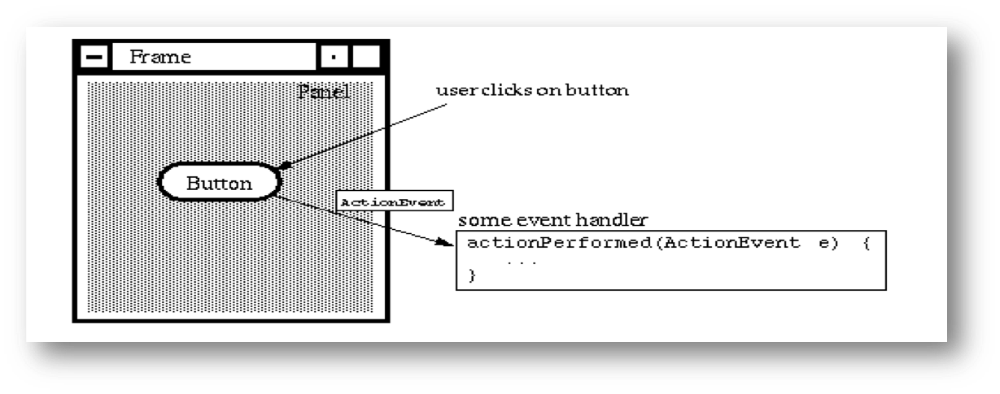
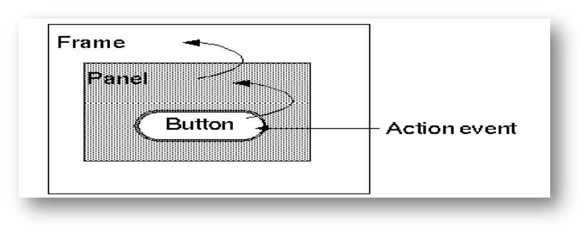
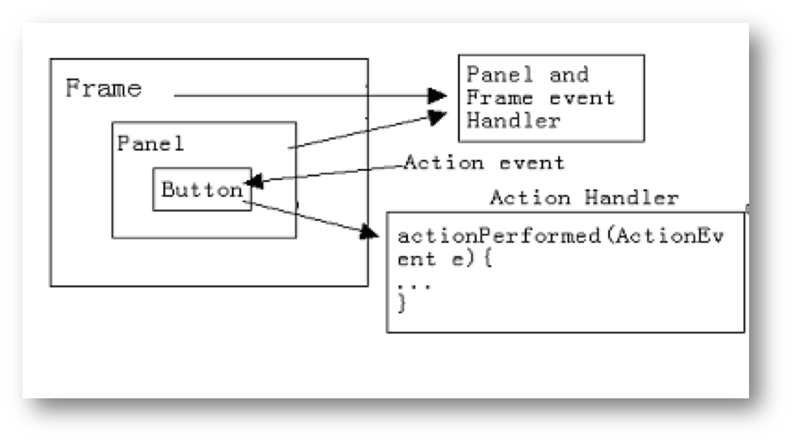
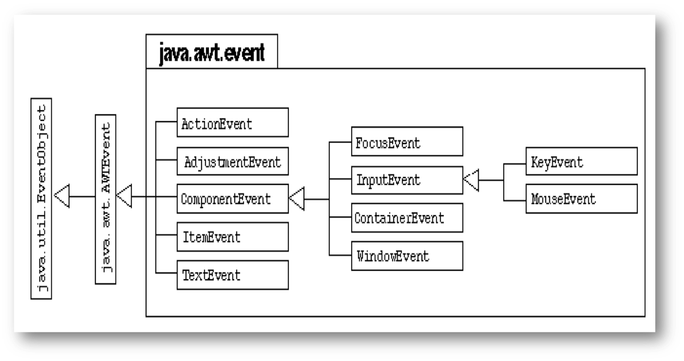

## 第一节 事件模型的概念

### 什么是事件

- 事件（event）：用户对界面操作在java语言上的描述，以类的形式出现
- 事件源（event source）：是一个事件产生者
- 事件处理者（event handler）：接收事件对象并对其进行处理的对象 



### Java的事件模型

#### 层次模型——早期的事件模型

层次模型是Java早期的事件模型，在JDK1.0中采用

**工作原理**：当事件产生时，它先被送往产生该事件的组件，如事件在这里未被处理，它就会被自动送往该组件的Container，如Container也未对事件进行处理，则还会递交给该Container的上一层Container（如有的话）



- 优点:简单，而且非常适合面向对象的编程环境
- 缺点：
  - 事件只能由产生这个事件的组件或包含这个组件的容器处理
  - 为了处理事件，必须定义接收这个事件的组件的子类，或者在基容器创建handleEvent()方法

**这种模型已被新的事件模型所取代。**

#### 委托代理模型

委托代理模型(Delegation model)，是JDK1.1之后采用的事件模型

- **工作原理**：一个组件如要响应某一事件，必须先登记(register)与该事件有关的一个或多个被称为listeners的类，这些类包含了相应的方法能接受事件并对事件进行处理。
- 操作步骤
  - 组件调用addXXXListener()方法来登记相应的Listener（XXX代表Listener类型）
  - 该方法的参数是一个实施了相应Listener的类的实例，在实例中定义了相应的事件处理方法。
  - 当组件产生事件时，特定的事件处理方法会被自动执行。

---

- 在委托代理模型中，事件的产生者和事件的处理者分离开来了，它们可以是不同的对象。事件的产生者是这个组件；事件的处理者则是那些listener，它们是一些实施了Listener接口的类。当事件传到登记的listener时，该listener中必须有相应的方法来接受这种类型的事件并对它进行处理。
- 一个组件如没有登记的listeners，则它产生的事件就不会被传递。
- 委托代理模型较好地解决了层次模型中的问题，并提供了对Java Bean的支持。

**注：虽然JDK的新版本也支持旧的层次模型，但层次模型和委托代理模型不能在程序中混用。**



##### 委托代理模型——TestButton.java

```java
import java.awt.*;
import java.awt.event.*; 
     public class TestButton {	
        public static void main(String args[]){
	Frame f = new Frame("Test");
	Button b = new Button("Press Me!");
	b.addActionListener(new ButtonHandler());//添加事件监听器
                    f.setLayout(new FlowLayout()); //设置布局管理器
                    f.add(b);
                    f.setSize(200,100);
	f.setVisible(true);}
     }
     class ButtonHandler implements ActionListener {
          public void actionPerformed(ActionEvent e){
	System.out.println("Action occurred"); 
	System.out.println("Button's label is:"+e.getActionCommand()); 
      //本接口只有一个方法，因此事件发生时，系统会自动调用本方法，需要做的操作就把代码写在则个方法里。
         }
     }
```

- 浅析
  - Button 类有一个addActionListner(ActionListener)方法
  - AddActionListner 接口定义了一个方法actionPerformed，用来接收一个ActionEvent
  - 创建一个Button 对象时，这个对象可以通过使用addActionListener 方法注册为ActionEvents 的监听者。调用这个方法时带有一个实现了ActionListener 接口的类的参数
  - 在Button 对象上用鼠标进行点击时，将发送一个ActionEvent 事件。这个ActionEvent 事件会被使用addActionListener()方法进行注册的所有ActionListener 的actionPerformed()方法接收。
  - ActionEvent 类的getActionCommand()方法返回与动作相关联的命令名称。以按钮的点击动作为例，将返回Button 的标签。
- 优点：
  - 事件不会被意外地处理
  - 有可能创建并使用适配器 (adapter)类对事件动作进行分类
  - 委托模型有利于把工作分布到各个类中
- 缺点：不容易将JDK1.0 代码移植到JDK1.1上

## 第二节 事件的分类和处理

- 概述
- 常用接口类
  - ActionListener
  - MouseMotionListener
  - MouseListener
  - WindowListener

### 事件类的层次结构



### 事件类

- java.util.EventObject类是所有事件对象的基础父类，所有事件都是由它派生出来的。
- AWT的相关事件继承于java.awt.AWTEvent类，这些AWT事件分为两大类：
- 低级事件：指基于组件和容器的事件，当一个组件上发生事件，如：鼠标的进入，点击，拖放等，或组件的窗口开关等，触发了组件事件。 
- 高级事件：基于语义的事件，它可以不和特定的动作相关联，而依赖于触发此事件的类，如在TextField中按Enter键会触发ActionEvent事件,滑动滚动条会触发AdjustmentEvent事件，或是选中项目列表的某一条就会触发ItemEvent事件。

#### 低级事件

- ComponentEvent：组件事件：组件尺寸的变化，移动
- ContainerEvent：容器事件：组件增加，移动
- WindowEvent：窗口事件：关闭窗口，窗口闭合，图标化
- FocusEvent：焦点事件：焦点的获得和丢失
- KeyEvent:键盘事件：键按下、释放
- MouseEvent:鼠标事件：鼠标单击，移动

### 高级事件

- ActionEvent：动作事件：按钮按下，TextField 中按Enter键
- AdjustmentEvent：调节事件：在滚动条上移动滑块以调节数值
- ItemEvent：项目事件：选择项目，不选择“项目改变”
- TextEvent：文本事件，文本对象改变

### 事件监听器

- 每类事件都有对应的事件监听器，监听器是接口，根据动作来定义方法。 
- AWT的组件类中提供注册和注销监听器的方法：
  - 注册监听器：`public void add<ListenerType> (<ListenerType> listener);`
  - 注销监听器：`public void remove<ListenerType> (<ListenerType> listener);`
- 所有AWT事件及其相应的监听器接口表

#### 多监听者

- 多监听者可以使一个程序的不相关部分执行同样的动作
- 事件发生时，所有被注册的监听者的处理器都会被调用

#### ActionListener

- Button或TextField对象可以登记ActionListener以响应鼠标键击事件
- 使用addActionListener()方法来登记ActionListener，方法的参数为一个实施了ActionListener接口的类的实例。该实例是事件的处理者。
- ActionListener中定义了一个actionPerformed(ActionEvent)方法
- 事件处理者必须重写actionPerform()方法，在其中加入事件处理代码。当事件产生时，系统会自动调用该方法，并将ActionEvent类型的事件对象作为参数传入，程序中可利用该对象的方法。

#### MouseMotionListener

- MouseMotionListener主要用于获取和处理鼠标移动的事件
- 它包含了两个方法：
  - mouseDragged(MouseEvent e)：对应鼠标拖动(dragging)的事件(在移动中按下鼠标键)
  - mouseMoved(MouseEvent e)：对应鼠标的移动（鼠标键未按下）
  - 即使你只对鼠标的拖动感兴趣，该接口中的两个方法也都必须实施，只是具体实现可为空。

**所有组件类都能登记MouseMotionListener**

由MouseListener接口包含5个方法，可以处理5类事件

1. mouseEntered(MouseEvent e)当鼠标进入组件区域时
2. mouseExited (MouseEvent e)当鼠标退出组件区域时
3. mousePressed (MouseEvent e)当在组件区域有鼠标键按下时
4. mouseReleased (MouseEvent e)当在组件区域鼠标键处于释放状态时
5. mouseClicked (MouseEvent e)组件区域键击鼠标时

**MouseListener()能被所有组件类所登记**

#### WindowListener

- WindowListener接口定义了7个方法，用于登记与窗口有关的事件
- windowClosing(WindowEvent e)
  - 对应窗口关闭事件，如用户点击窗口右上方的关闭图标。
- 其他方法：
  - windowOpened()，windowClosed()
  - windowIconified()，windowDeiconified()
  - windowActivated()，windowDeactivated() 

### 事件的处理

委托代理模型中事件的处理过程一般如下：

- 要响应事件的组件对象调用addXXXListener()方法登记相应的Listener
- 编写事件处理程序

可以写一个实施对应Listener的类，在类中重写感兴趣的事件方法，在方法中加入事件处理代码。该类的实例可作为addXXXListener()方法的参数。

或在当前类中实施相应的Listener接口，在当前类中重写感兴趣的事件方法并加入事件处理代码。而addXXXListener()的参数使用this关键字，代表当前对象。

当事件产生时，系统自动会调用对应的事件方法，事件对象作为方法的参数传入，处理时可利用其方法

## 第三节 事件适配器（EventAdapter）

### 引入事件适配器的原因

前面提到，对于实施了各类Listener接口的类，必须实现该Listener中定义的所有方法，即使对有些方法不感兴趣，也一定要实施它们，虽然方法的内容可为空。

对于一些方法定义较多的接口，如MouseListener，五个方法都要实现，使编程者感到麻烦。

为方便程序员，Java定义了一些实施了这些接口的类，统称为事件处理接口类(Event Adapters)

它们实现了接口的全部方法，但方法体均为空。程序员如继承了这些类，只要在里面重写感兴趣的方法即可。

### 常用事件适配器

- MouseAdapter——对应MouseListener 
- MouseMotionAdapter——对应MouseMotionListener
- WindowAdapter——对应WindowListener
- ComponentAdapter——对应ComponentListener 
- ContainerAdapter——对应ContainerListener 
- FocusAdapter——对应FocusListener 
- KeyAdapter——对应KeyListener 

**ActionListener中因只定义了一个actionPerformed()方法，所以没有对应的事件处理接口类。**

### 事件处理接口类的例子

```java
import java.awt.*;
import java.awt.event.*;
public class MouseClickHandler extends 	MouseAdapter {
	//假设用户只对鼠标键击事件感兴趣 
	public void mouseClicked(MouseEvent e) {
		//事件处理程序..
	}
}
```

**通过继承MouseAdapter类，相当于间接实施了MouseListener接口，并继承了该接口的5个方法，但实现为空。**

### 处理窗口关闭事件

在第七章的一些例子中，程序产生的窗口不能自动关闭，主要是程序中没有对应的事件处理代码。以下代码可关闭程序当前的窗口。 

```java
import java.awt.event.*;
class WinListener extends WindowAdapter {
  public void windowClosing(WindowEvent e) {
    System.exit(0); //System类的exit()方法可结束程序，关闭程序窗口，参数0为返回值，表示正常退出
  }
}
```
**若f是窗口对应的对象，可用语句f.addWindowListener(new WinListener()) 将Listener加入。**

### 用内部类实现事件处理

- 内部类（inner class）是被定义于另一个类中的类，使用内部类的主要原因是由于
  - 一个内部类的对象可访问外部类的成员方法和变量，包括私有的成员
  - 实现事件监听器时，采用内部类、匿名类编程非常容易实现其功能
  - 编写事件驱动程序，内部类很方便
- 关于内部类的使用方法可以参见示例程序中InnerClass.java

### 匿名类（Anonymous Class）

当一个内部类的类声名只是在创建此类对象时用了一次，而且要产生的新类需继承于一个已有的父类或实现一个接口，才能考虑用匿名类，由于匿名类本身无名，因此它也就不存在构造方法，它需要显示地调用一个无参的父类的构造方法，并且重写父类的方法。所谓的匿名就是该类连名字都没有，只是显示地调用一个无参的父类的构造方法。

关于内部类的使用方法可以参见示例程序中AnonymousClass.java