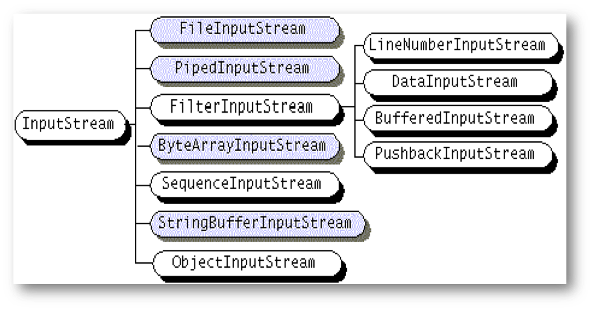

## 第一节 流的概念

流（stream）概念源于UNIX中管道(pipe)

在UNIX中，管道是一条不间断的字节流，用来实现程序或进程间的通信，或读写外围设备、外部文件等。

一个流，必有源端和目的端，它们可以是计算机内存的某些区域，也可以是磁盘文件，甚至可以是Internet上的某个URL

根据流的方向，流可分为**输入流**和**输出流**。

- **输入流**：用户可以从输入流中读取信息，但不能写它
- **输出流**：只能往输入流写，而不能读它 

**可将流的源端和目的端看成是字节的生产者和消费者。**

### 读输入流

- 在java中，程序可以打开一个输入流并读。
  - 输入流的信息源可以位于文件，内存或网络套接字(socket)等地方，类型可以是包括对象，字符，图象，声音在内的任何类型。
- 一旦打开输入流后，程序就可从输入流串行地读数据。过程一般如下： 
  - open a stream
  - while more information
  - read information
  - close the stream

#### 读输入流（图）

### 写输出流

- 在Java中，程序也能通过打开一个输出流并顺序地写入数据来将信息送至目的端。 
- 往输出流写数据的过程一般如下： 
  - open a stream
  - while more information
  - write information
  - close the stream

#### 写输出流（图）

### 节点流和过滤器流

根据流的源端和目的端对象类型的不同可分为两类流：

- 节点流(node stream)：这类流直接从某个指定的位置（如磁盘文件或内存区域）读或写
- 过滤器流(filters) ：
  - 除节点流以外的其它流
  - 过滤器输入流往往是以其它输入流作为它的输入源，经过过滤或处理后再以新的输入流的形式提供给用户
  - 过滤器输出流的原理也类似

## 第二节 Java的字节流

根据操作对象类型的不同，流又可分为两大类： 字符流和字节流。

- 字节流将流看成是由字节组成的
- 字符流将流看成是由字符组成的

Java的字符采用unicode码，字符的宽度为16位二进制

字符流是后来才推出的，可用于处理字符的输入和输出

**java.io包中包含了Java常用的字节流、字符流对应的类**

### 字节流类的层次结构（输入流）

### 字节流类的层次结构（输出流）

### InputStream

InputStream是所有字节输入流类的祖先

该类是一个抽象类，其方法包括： 

- int read()读取一个字节，返回值为所读的字节说对应的0至255之间的整数或-1，-1代表遇到了流的结束。
- int read(byte b[])数读取多个字节，放置到字节数组b中，通常读取的字节数量为b的长度，返回值为实际读取的字节的数量或-1(遇到了流结束)。 
- int read(byte b[],int off,int len)读取len个字节，放置到以下标off开始字节数组b中，返回值为实际读取的字节的数量

InputStream还有一些其它方法，如： 

- void close() 流操作完毕后必须关闭 
- int available() 报告流中直接可读的字节数
- long skip(long n) 读指针跳过n个字节不读，返回值为实际跳过的字节数量 
- void mark( int readlimit) 记录当前读指针所在位置，readlimit表示读指针读出readlimit个字节后所标记的指针位置才失效

### OutputStream

OutputStream是所有字节输出流的祖先。

OutputStream类的主要方法包括： 

- void write(int)将参数对应的字节写入到流中
- void write(byte[])将参数对应的字节数组写入到流中
- void write(byte b[],int off,int len)把字节数组b中从下标off开始，长度为len的字节写入流中
- void close() 关闭输出流
- void flush() 强行将写入缓冲区中剩余的数据写入

**注意：由于操作系统通常采用缓冲来提高输入输出的效率，程序写入流的内容可能会先存在输出缓冲区中，等累计到一定数量后才真正写入磁盘。上述两个方法能将残留在输出缓冲区的数据强制写入磁盘。对流的写操作完成后一般要使用这两个方法之一。**

### FileInputStream

属于节点流、字节输入流，可用于文件操作

流的源端为磁盘文件，其构造方法允许通过文件的路径名来构造相应的流。如： 

`FileInputStream infile = new FileInputStream("myfile.dat");`

将文件名为myfile.dat的磁盘文件构造为字节输入流对象infile。这样，对文件的读操作就转化为对流的读操作。

**注意：要构造FileInputStream流，其对应的文件必须存在并且是可读的。**

### FileOutputStream

属于节点流、字节输出流，可用于文件操作

流的目的端为磁盘文件，构造方法允许通过文件的路径名来构造相应的流。如： 

`FileOutputStream outfile = new   FileOutputStream("results.dat");`

将磁盘文件results.dat与字节输出流对象outfile相对应。这样，对文件的写操作就转化为对流的写操作。

**注意：构造FileOutputStream对象时，如参数给出的输出文件不存在，则新创建；若已存在，该文件必须是可覆盖的。**

### DataInputStream/DataOutputStream

- DataInputStream
  - 字节输入流、过滤器流，允许程序从流中读入Java的基本数据类型
  - 如readInt()、readChar()等
- DataOutputStream
  - 字节输出流、过滤器流，允许程序将一个基本数据类型的Java数据写入流中
  - 如writeInt()、writeChar()等

**这两个流中还提供了相应的方法允许程序按与机器无关的格式读写Java数据，可用于网络上的数据传输。`readUTF()/writeUTF()`**

## 第三节 Java的字符流

## 第四节 Java的文件操作 

