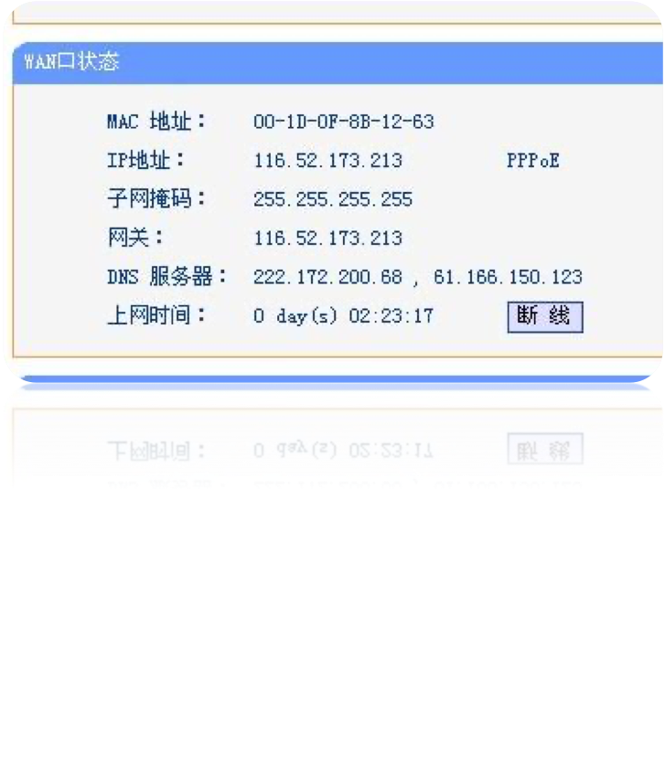
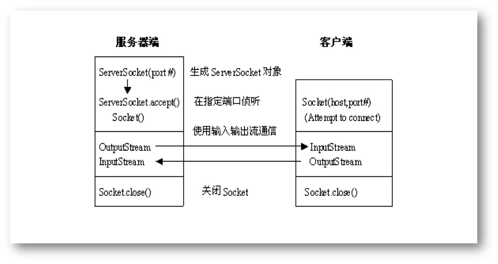

## 第一节 网络通信的一些概念

- 协议的概念
- TCP/IP协议
- IP地址
- 端口号
- Socket
- 服务程序与客户程序

### 协议的概念

协议是计算机网络中的一个基本概念，是指为进行网络中的数据交换而建立的规则、标准或约定

协议保证了计算机之间能有条不紊地交换数据

通常复杂的网络采用分层结构，每一层有不同的协议，网络各层及其协议的集合，称为网络的体系结构。

### TCP/IP协议

TCP/IP实际上是一组协议集，包括网络层的IP协议，运输层的TCP协议、UDP协议及应用层的多个协议

是目前应用最广泛的协议，互联网Internet就采用TCP/IP协议集

协议集中，IP协议提供网络层无连接的服务，上面的传输层有两种选择：TCP协议提供面向连接的可靠的服务，而UDP协议提供无连接的不可靠的服务。

### IP地址

使用IP地址可以唯一地标识互联网上的某一台主机

目前使用的是版本４的IP地址（IPv4），它使用32bit即４个字节来表示一个地址

通常用点分十进制法来表示IP地址，即每个字节用其等效十进制数来表示，数字间用点区分

如：202.120.80.1



IP地址包括网络号和主机号两部分。共有五类IP地址（A-E类）

由于IP地址数量有限，IPv6（IP版本６)中使用128bit来表示一个IP地址

### 端口号

引入端口号是为了区分不同的应用程序

- 在网络上，很多应用程序都使用TCP协议或UDP协议与其他机器上的应用程序进行通信，IP地址只能标识互联网上的某一台主机，但多任务系统一台主机上往往运行了多个应用程序，将应用程序与端口号绑定，就可以通过端口号来区分应用程序
- 端口号对应16位bit，取值范围为范围从0到65535
- 在实际应用中，小于1024的端口号常被系统保留，用于一些预定义的服务，如端口21用于FTP协议，端口25用于EMAIL，Web服务缺省的端口号为80。 

### Socket

端口号与主机的IP地址合起来，就构成了Socket（又称套接字），它能在全网范围内唯一标识某个主机的某个端口。

Socket是一个三元组，包括协议、地址、端口号。在协议固定为TCP/IP的前提下，Socket可看成是一个二元组，包含IP地址和端口号。

套接字Socket接口最早是在BSD UNIX上实现的，是应用最广泛的一套应用程序接口，Java中也采用了它 。

### 服务程序和客户程序

使用TCP/IP协议的网络应用程序分为服务程序和客户程序两类 。

- 服务程序：通常为其他主机提供服务
- 客户程序：主动向服务程序发送连接请求 ，并使用服务程序提供的服务

一般客户程序可以任意选择其进行通信的端口的端口号，而服务程序（特别是一些众所周知的服务）往往使用较固定的端口号。 

## 第二节 使用socket编程

- 与Socket相关的类
- 使用Socket通信的流程
- ServerSocket的构造方法和方法
- Socket的构造方法和方法
- 例题
  - 服务程序
  - 客户程序
  - 说明

### 与Socket相关的类

在Java中，TCP/IP socket的连接是由java.net包中的类来实现的。

#### ServerSocket类

对应服务器端的socket对象

服务程序通过ServerSocket等待客户程序通过网络发来的连接请求，并根据请求执行相应的操作。

#### Socket类

对应客户端的Socket对象

可看成是连接通信双方的管道的一端

### 使用Socket通信的流程图



### 使用Socket通信的流程

1. 首先，服务程序构造一个ServerSocket对象，该对象在指定端口上侦听是否有来自客户程序的连接请求，如有且同意建立连接，就会新建一个新的Socket端口与客户程序建立连接。（原来的端口继续侦听新的请求）
2. 客户程序通过构造Socket对象向给定的服务程序（给定主机名/IP地址和端口号）发送连接请求并建立连接。
3. Socket连接建立后，可通过getInputStream()和getOutputStream()方法分别得到字节输入、输出流
   1. 对通信双方来说，一方的输入流相当于另一方的输出流，往输出流写就相当于发送数据给对方；读输入流即接收对方发来的数据
   2. 客户程序和服务程序的通信转化为对输入流和输出流的读和写
4. 最后，通信结束，关闭Socket。

### ServerSocket的构造方法和方法

#### ServerSocket的构造方法

- ServerSocket(int port) 
  - 能在指定端口上构造一个ServerSocket类。若端口号为0，则表示任意空闲的端口都可以。
  - 如果构造失败，构造方法会产生一个IOException例外。
- accept()  ：侦听是否有客户程序向该Socket发来的连接请求，如有，打开一个新的Socket并与该程序建立连接。该方法要等到新连接建立后才返回，返回值为新打开的Socket。
- close()：关闭ServerSocket
- getInetAddress()：返回该ServerSocket对应的本地IP地址
- getLocalPort()：返回当前ServerSocket在侦听的端口号
- toString()：返回包含当前ServerSocket地址和端口号信息的字符串

#### Socket的构造方法和方法

#### Socket的构造方法

Socket(String hostname, int port)　

能构造一个连接指定主机、指定端口的Socket。

该构造方法可能产生UnknownHostException和IOException，使用时要加上例外处理。

#### Socket的方法

- close() 关闭Socket
- getInetAddress() 返回当前Socket的
- InputStreamgetInputStream() 返回当前Socket的InputStream
- getLocalAddress()返回Socket所连接的本地主机的IP地址
- getLocalPort() 返回Socket所连接的本地端口号
- getOutputStream() 返回当前Socket的OutputStream
- getPort() 返回Socket所连接的远程主机的端口号
- toString() 返回当前Socket 对象对应的String

### 例题

#### 服务程序

```java
import java.net.*;
import java.io.*;
public class SimpleServer {
  public static void main(String args[]) {
	ServerSocket s = null;
	Socket s1;
	String sendString = “Hello Net World!”;
	OutputStream s1out;
	DataOutputStream dos;
// Register your service on port 5432
  try  {
	s = new ServerSocket(5432);
  } catch (IOException e) {}
// Run the listen/accept loop forever
while (true) {
  try {
	// Wait here and listen for a connection
	s1 = s.accept();
	// Get a communication stream for socket
	s1out = s1.getOutputStream();
	dos = new DataOutputStream(s1out);
	// Send your String
	// UTF provides machine-independent format)
	dos.writeUTF(sendString);
	// Close the connection,but not the server socket
	s1out.close();
	s1.close();
  } catch (IOException e) {}
}}}
```

#### 客户程序

```java
import java.net.*;
import java.io.*;
public class SimpleClient {
  public static void main(String args[]) throws IOException {
	int c;
	Socket s1;
	InputStream s1In;
	DataInputStream dis;
	s1 = new Socket(“linux01”,5432);
	s1In = s1.getInputStream();
	dis = new DataInputStream(s1In);
	String st = new String(dis.readUTF());
	System.out.println(st);
	s1In.close();	s1.close();
}}
```

#### 说明

服务程序构造了一个ServerSocket类的对象s在指定的端口侦听来自客户程序的连接请求，一旦收到并同意连接的话，系统就会另外分配一个Socket来与客户程序建立连接并通信，因为原来的ServerSocket还要继续侦听新的连接请求。

因为数据是通过网络传递的，考虑到通信两端的机器可能会有不同的数据格式，所以例题中将要发送的数据先转化为与平台无关的网络编码格式(UTF-8)再在网上传输。接收方收到后再转换为本地的数据格式。

DataOuputStream的writeUTF()方法能将本地的数据格式转化为UTF-8格式后写入流

DataInputStream的readUTF()方法能读出流中以UTF-8编码的数据并转化为本地的数据格式

## 第三节 使用URL编程

- URL的概念
- URL的构造方法
- URL的方法
- 从URL中读数据
- 与URL建立连接
- 通过URL连接读数据

### URL的概念

URL是Uniform Resource Locator的简称，中文译为统一资源定位器。

URL可看成是Internet上某一资源的地址。

- URL
  - 协议名
  - 资源名
    - 主机名
    - 文件路径号
    - 端口号
    - 业内参照

Java程序也使用URL来定位Internet上的资源。

在java.net包中就有一个URL类，用来表示一个URL地址。

### 一个URL的例子

http://www.myweb.com:80/sample.html#top

- 协议名：这里，http为协议名，其他可用的协议还有FTP, Gopher, File等。
- 资源名：”:”的后半部分为资源名，该例的资源名包括以下几部分：
  - 主机名(www.myweb.com) -- 资源所在的主机的名字，也可是IP地址
  - 端口号(80) -- 指出连接到主机的哪个端口，Web服务缺省为80
  - 文件路径名(sample.html) -- 指出要访问文件的路径名
  - 页内参照(#top) -- 用来标识Web页中的某一指定位置（可选项）

### URL的构造方法

#### URL(String)

使用参数给定的字符串构造一个URL对象。

#### URL(URL, String)

构造一个URL对象。第一个参数给出的是基准URL，第二个参数给出相对于基准URL的要访问文件的相对路径。

当给出的参数无法构造一个URL对象或给出的协议类型未知时，URL的构造方法会产生一个MalformedURLException。

### URL的方法

URL类提供了许多方法来获得URL对象的信息：

- String  getProtocol()：返回URL的协议标识符
- String  getHost()返回URL的主机名
- int  getPort()返回URL的端口号
- String  getFile()返回URL对应的文件路径名
- String  getRef()返回URL对应的页内参照
  
### 从URL中读数据

```java
import java.net.*;
import java.io.*;
public class URLReader {
    public static void main(String[] args) 
		throws Exception {
	URL yahoo = new URL("http://www.yahoo.com/");
	BufferedReader in = new BufferedReader(
	    new InputStreamReader(yahoo.openStream()));
	String inputLine;
	while ((inputLine = in.readLine()) != null)
	    System.out.println(inputLine);
	in.close();
}  }
```

### 例题说明 - 从URL读数据

- 一旦建立了URL对象，就能调用URL类的openStream()方法来得到一个字节输入流，通过它程序员能够很方便地读入该URL的内容。
  - openStream()方法返回的是一个InputStream类型的对象。
- 上面的例子能读入雅虎站点(www.yahoo.com)首页的内容(HTML形式的文本)并将其在本机的标准输出上显示。

注:如果上述程序在设有防火墙的局域网内运行，需要使用下列命令行选项：

`java  -Dhttp.proxyHost = proxyhost  [-Dhttp.proxyPort = portNumber] URLReader`

### 与URL建立连接

- 除了直接调用URL的方法得到输入流外，也可以先与指定的URL建立连接，然后再从连接中得到输入或输出流。
- 可使用URL类中的openConnection()的方法来建立连接。如：
    ```java
    try {
        URL yahoo = new URL("http://www.yahoo.com/");
        yahoo.openConnection();
    } catch (MalformedURLException e) {     // new URL() failed
        ……
    } catch (IOException e) {               // openConnection() failed
        ……
    }
    ```
- 一旦连接建立成功，Java程序与指定的URL之间就建立起一条通信链路，openConnection()方法会返回一个URLConnection类型的对象。
- 如果因为某些原因（如服务器关机）导致连接建立失败，该方法就会产生一个IOException。

### 通过URL连接读数据

```java
import java.net.*;
import java.io.*;
public class URLConnectionReader {
    public static void main(String[] args) throws Exception {
        URL yahoo = new URL("http://www.yahoo.com/");
        URLConnection yc = yahoo.openConnection();
        BufferedReader in = new BufferedReader(
                                new InputStreamReader(
                                yc.getInputStream()));
        String inputLine;
        while ((inputLine = in.readLine()) != null) 
            System.out.println(inputLine);
        in.close();
}  }
```

### 例题说明-通过URL连接读数据

连接建立成功后，利用URLConnection对象的getInputStream()方法可得到相应的输入流，通过它可读入对应URL的内容。

该程序的功能与上一个例子相同。读URL中的数据可采用上述两种方法中的任一种，但建立URL连接后还能利用URLConnection对象进行其他操作，如往URL中写数据。