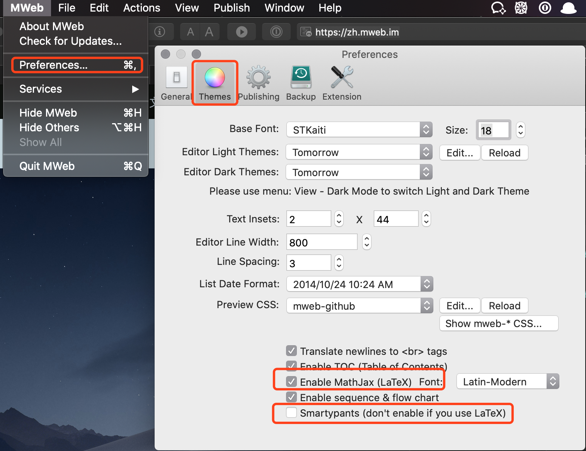

# 软件工程本科学习笔记

## TODO List

- [ ] 整合到个人博客Hexo
- [ ] PPT改名
- [ ] PPT整合
- [ ] PPT打包
http://www.xiaoyinka.com/pages/8cfbefff-c0ac-4a40-ad36-70f64ffc3b94
## 使用说明

克隆本项目：`git clone git@github.com:GloomyNAN/cs.git`到本地

### 使用方式

本项目使用LaTeX公式编写，如需要预览及编辑可选已下几种方式

1. vscode:安装[vscode](https://code.visualstudio.com/)，安装`Markdown All in One`插件
2. Mac平台安装[MWeb](https://zh.mweb.im)软件，设置如下图
   
3. Windows平台安装[typora](https://www.typora.io)(此软件也支持MAC平台)
3. 其他平台可以参考[mathjax](https://www.mathjax.org)

## 目录（按照课程编号，会逐步迭代）

### 01-离散数学

- [01-集合论](./01-离散数学/离散数学01-集合论.md)
- [02-命题逻辑](./01-离散数学/离散数学02-命题逻辑.md)
- [03-一阶逻辑](./01-离散数学/离散数学03-一阶逻辑.md)

### 02-C语言

### 03-计算机原理

- [01-计算机系统概论](./03-计算机原理/计算机原理01-计算机系统概论.md)
- [02-运算方法和运算器](./03-计算机原理/计算机原理02-运算方法和运算器.md)
- [03-内存存储器](./03-计算机原理/计算机原理03-内存存储器.md)

### 04-数据结构

### 05-面向对象技术及C++

### 06-操作系统

### 07-现代软件工程

### 08-多媒体技术及应用

### 09-数据库系统

### 10-计算机网络与网络工程

### 11-微机接口与通讯

### 12-编译原理

### 13-网络程序设计

### 14-网络程序设计

# License

MIT GloomyNAN
